# Fitting models and displaying output

``` r
library(ameras)
#> Loading required package: nimble
#> nimble version 1.4.2 is loaded.
#> For more information on NIMBLE and a User Manual,
#> please visit https://R-nimble.org.
#> 
#> Attaching package: 'nimble'
#> The following object is masked from 'package:stats':
#> 
#>     simulate
#> The following object is masked from 'package:base':
#> 
#>     declare
```

## Introduction

All functionality of the package is included in the function `ameras`.
This vignette demonstrates the basic functionality and the generated
output.

### Example data

The included example dataset contains 3,000 individuals with 10 exposure
replicates `V1`-`V10`, binary covariates `X1` and `X2` and risk
modifiers `M1` and `M2`, and outcomes of all types (`Y.gaussian`,
`Y.binomial`, `Y.poisson`, `status`, `time`, `Y.multinomial`,
`Y.clogit`, and `setnr`).

``` r
data(data, package="ameras")
head(data)
#>    Y.gaussian Y.binomial Y.poisson       time status setnr Y.clogit
#> 1 -0.32647093          0         0 0.30276565      0     1        0
#> 2 -0.18734036          1         0 0.19735142      1     1        1
#> 3  0.08404044          0         2 0.30276565      0     1        0
#> 4  0.22432504          0         0 0.23602584      1     1        0
#> 5 -0.46317255          0         0 0.30276565      0     2        0
#> 6 -1.41036573          0         0 0.07838133      1     2        0
#>   Y.multinomial X1 X2 M1 M2         V1         V2         V3         V4
#> 1             3  0  0  0  1 0.42868043 0.61542487 0.41960219 0.49265549
#> 2             2  1  0  1  0 0.73321154 0.35512449 0.41876478 0.49235658
#> 3             2  0  0  1  0 0.70369712 0.43407408 1.04115924 0.79882088
#> 4             3  0  0  1  0 0.01845324 0.01373367 0.02733303 0.01912686
#> 5             3  1  0  0  0 0.39389441 0.40087181 0.61932032 0.51715526
#> 6             2  1  1  1  0 0.01493158 0.02335143 0.01828983 0.02705350
#>           V5         V6         V7         V8         V9        V10
#> 1 0.31363762 0.42218455 0.42464021 0.29630858 0.38211182 0.45751570
#> 2 0.49515815 0.56837639 0.61126842 0.67723449 0.53361810 0.49393510
#> 3 0.66613754 0.72346942 0.64077434 0.79894534 0.98278177 1.06068250
#> 4 0.01917956 0.03056413 0.01536966 0.02135999 0.01548655 0.01596626
#> 5 0.36440322 0.60255525 0.47512525 0.52567606 0.53391825 0.56026531
#> 6 0.02298922 0.02399258 0.01890339 0.02094013 0.02303085 0.02091743
```

There are exposure replicates are in columns `V1`-`V10`, so define
`dosevars` as follows:

``` r
dosevars <- paste0("V", 1:10)
```

## Linear regression & displaying output

Now we fit all methods to the data through one function call:

``` r
set.seed(12345)
fit.ameras.linreg <- ameras(Y="Y.gaussian", dosevars=dosevars, X=c("X1","X2"), data=data, 
                            family="gaussian", methods=c("RC", "ERC", "MCML", "FMA", "BMA"), 
                            niter.BMA = 5000, nburnin.BMA = 1000, CI=c("wald.orig","percentile"))
#> Note: BMA may require extensive computation time in the order of multiple hours
#> Fitting RC
#> Fitting ERC
#> Fitting MCML
#> Fitting FMA
#> Fitting BMA
#> Defining model
#> Building model
#> Setting data and initial values
#> Running calculate on model
#>   [Note] Any error reports that follow may simply reflect missing values in model variables.
#> Checking model sizes and dimensions
#>   [Note] This model is not fully initialized. This is not an error.
#>          To see which variables are not initialized, use model$initializeInfo().
#>          For more information on model initialization, see help(modelInitialization).
#> Compiling
#>   [Note] This may take a minute.
#>   [Note] Use 'showCompilerOutput = TRUE' to see C++ compilation details.
#> Compiling
#>   [Note] This may take a minute.
#>   [Note] Use 'showCompilerOutput = TRUE' to see C++ compilation details.
#> running chain 1...
#> |-------------|-------------|-------------|-------------|
#> |-------------------------------------------------------|
#> running chain 2...
#> |-------------|-------------|-------------|-------------|
#> |-------------------------------------------------------|
```

The output is a list object with a `call` component, and one component
for each method, each being a list:

``` r
str(fit.ameras.linreg)
#> List of 6
#>  $ call: language ameras(data = data, family = "gaussian", Y = "Y.gaussian", dosevars = dosevars,      X = c("X1", "X2"), methods =| __truncated__ ...
#>  $ RC  :List of 8
#>   ..$ coefficients     : Named num [1:5] -1.362 0.481 -0.519 1.166 1.108
#>   .. ..- attr(*, "names")= chr [1:5] "(Intercept)" "X1" "X2" "dose" ...
#>   ..$ sd               : Named num [1:5] 0.0367 0.0405 0.0497 0.0204 0.0143
#>   .. ..- attr(*, "names")= chr [1:5] "(Intercept)" "X1" "X2" "dose" ...
#>   ..$ vcov             : num [1:5, 1:5] 1.34e-03 -8.36e-04 -4.86e-04 -4.15e-04 1.55e-09 ...
#>   .. ..- attr(*, "dimnames")=List of 2
#>   .. .. ..$ : chr [1:5] "(Intercept)" "X1" "X2" "dose" ...
#>   .. .. ..$ : chr [1:5] "(Intercept)" "X1" "X2" "dose" ...
#>   ..$ CI               :'data.frame':    5 obs. of  2 variables:
#>   .. ..$ lower: num [1:5] -1.434 0.401 -0.616 1.126 1.08
#>   .. ..$ upper: num [1:5] -1.29 0.56 -0.421 1.206 1.136
#>   ..$ convergence.optim: int 0
#>   ..$ counts.optim     : Named num [1:2] 509 1
#>   .. ..- attr(*, "names")= chr [1:2] "function" "gradient"
#>   ..$ loglik           : num -4563
#>   ..$ runtime          : chr "0.3 seconds"
#>  $ ERC :List of 8
#>   ..$ coefficients     : Named num [1:5] -1.361 0.48 -0.519 1.165 1.106
#>   .. ..- attr(*, "names")= chr [1:5] "(Intercept)" "X1" "X2" "dose" ...
#>   ..$ sd               : Named num [1:5] 0.0366 0.0404 0.0497 0.0204 0.0142
#>   .. ..- attr(*, "names")= chr [1:5] "(Intercept)" "X1" "X2" "dose" ...
#>   ..$ vcov             : num [1:5, 1:5] 1.34e-03 -8.34e-04 -4.85e-04 -4.14e-04 1.53e-06 ...
#>   .. ..- attr(*, "dimnames")=List of 2
#>   .. .. ..$ : chr [1:5] "(Intercept)" "X1" "X2" "dose" ...
#>   .. .. ..$ : chr [1:5] "(Intercept)" "X1" "X2" "dose" ...
#>   ..$ CI               :'data.frame':    5 obs. of  2 variables:
#>   .. ..$ lower: num [1:5] -1.433 0.4 -0.616 1.125 1.078
#>   .. ..$ upper: num [1:5] -1.289 0.559 -0.421 1.205 1.134
#>   ..$ convergence.optim: int 0
#>   ..$ counts.optim     : Named num [1:2] 546 9
#>   .. ..- attr(*, "names")= chr [1:2] "function" "gradient"
#>   ..$ loglik           : num -4559
#>   ..$ runtime          : chr "121.1 seconds"
#>  $ MCML:List of 8
#>   ..$ coefficients     : Named num [1:5] -1.28 0.484 -0.517 1.079 1.138
#>   .. ..- attr(*, "names")= chr [1:5] "(Intercept)" "X1" "X2" "dose" ...
#>   ..$ sd               : Named num [1:5] 0.0371 0.0416 0.0511 0.0199 0.0147
#>   .. ..- attr(*, "names")= chr [1:5] "(Intercept)" "X1" "X2" "dose" ...
#>   ..$ CI               :'data.frame':    5 obs. of  2 variables:
#>   .. ..$ lower: num [1:5] -1.353 0.402 -0.617 1.04 1.109
#>   .. ..$ upper: num [1:5] -1.207 0.565 -0.417 1.118 1.167
#>   ..$ vcov             : num [1:5, 1:5] 1.38e-03 -8.83e-04 -5.14e-04 -3.98e-04 -1.91e-08 ...
#>   .. ..- attr(*, "dimnames")=List of 2
#>   .. .. ..$ : chr [1:5] "(Intercept)" "X1" "X2" "dose" ...
#>   .. .. ..$ : chr [1:5] "(Intercept)" "X1" "X2" "dose" ...
#>   ..$ convergence.optim: int 0
#>   ..$ counts.optim     : Named num [1:2] 555 7
#>   .. ..- attr(*, "names")= chr [1:2] "function" "gradient"
#>   ..$ loglik           : num -4646
#>   ..$ runtime          : chr "0.7 seconds"
#>  $ FMA :List of 6
#>   ..$ coefficients       : Named num [1:5] -1.28 0.484 -0.517 1.079 1.138
#>   .. ..- attr(*, "names")= chr [1:5] "(Intercept)" "X1" "X2" "dose" ...
#>   ..$ sd                 : Named num [1:5] 0.0373 0.0418 0.0512 0.0202 0.0147
#>   .. ..- attr(*, "names")= chr [1:5] "(Intercept)" "X1" "X2" "dose" ...
#>   ..$ CI                 :'data.frame':  5 obs. of  2 variables:
#>   .. ..$ lower: num [1:5] -1.353 0.402 -0.618 1.04 1.109
#>   .. ..$ upper: num [1:5] -1.206 0.565 -0.417 1.119 1.166
#>   ..$ included.replicates: int [1:10] 1 2 3 4 5 6 7 8 9 10
#>   ..$ included.samples   : int 100006
#>   ..$ runtime            : chr "1.4 seconds"
#>  $ BMA :List of 7
#>   ..$ coefficients       : Named num [1:5] -1.28 0.483 -0.517 1.079 1.139
#>   .. ..- attr(*, "names")= chr [1:5] "(Intercept)" "X1" "X2" "dose" ...
#>   ..$ sd                 : Named num [1:5] 0.038 0.0424 0.0525 0.0202 0.015
#>   .. ..- attr(*, "names")= chr [1:5] "(Intercept)" "X1" "X2" "dose" ...
#>   ..$ CI                 :'data.frame':  5 obs. of  2 variables:
#>   .. ..$ lower: num [1:5] -1.351 0.402 -0.623 1.039 1.111
#>   .. ..$ upper: num [1:5] -1.208 0.567 -0.417 1.118 1.168
#>   ..$ Rhat               :'data.frame':  5 obs. of  2 variables:
#>   .. ..$ Rhat : num [1:5] 1 1.01 1 1 1.02
#>   .. ..$ n.eff: num [1:5] 871 822 800 800 744
#>   ..$ samples            :List of 2
#>   .. ..$ chain1: num [1:400, 1:6] -1.32 -1.27 -1.33 -1.29 -1.33 ...
#>   .. .. ..- attr(*, "dimnames")=List of 2
#>   .. .. .. ..$ : NULL
#>   .. .. .. ..$ : chr [1:6] "(Intercept)" "X1" "X2" "dose" ...
#>   .. ..$ chain2: num [1:400, 1:6] -1.3 -1.29 -1.23 -1.3 -1.26 ...
#>   .. .. ..- attr(*, "dimnames")=List of 2
#>   .. .. .. ..$ : NULL
#>   .. .. .. ..$ : chr [1:6] "(Intercept)" "X1" "X2" "dose" ...
#>   ..$ included.replicates: int [1:10] 1 2 3 4 5 6 7 8 9 10
#>   ..$ runtime            : chr "72.7 seconds"
#>  - attr(*, "class")= chr "amerasfit"
```

Access the results for e.g. regression calibration as follows:

``` r
fit.ameras.linreg$RC
#> $coefficients
#> (Intercept)          X1          X2        dose       sigma 
#>  -1.3622239   0.4807463  -0.5187877   1.1660368   1.1075696 
#> 
#> $sd
#> (Intercept)          X1          X2        dose       sigma 
#>  0.03665711  0.04045137  0.04971981  0.02039612  0.01429864 
#> 
#> $vcov
#>               (Intercept)            X1            X2          dose
#> (Intercept)  1.343744e-03 -8.358763e-04 -4.863064e-04 -4.154402e-04
#> X1          -8.358763e-04  1.636314e-03 -1.376614e-05  1.526165e-05
#> X2          -4.863064e-04 -1.376614e-05  2.472060e-03 -2.443289e-05
#> dose        -4.154402e-04  1.526165e-05 -2.443289e-05  4.160019e-04
#> sigma        1.547510e-09 -1.113334e-08  8.801421e-09  2.066810e-09
#>                     sigma
#> (Intercept)  1.547510e-09
#> X1          -1.113334e-08
#> X2           8.801421e-09
#> dose         2.066810e-09
#> sigma        2.044510e-04
#> 
#> $CI
#>                  lower      upper
#> (Intercept) -1.4340719 -1.2903760
#> X1           0.4014616  0.5600310
#> X2          -0.6162385 -0.4213368
#> dose         1.1260604  1.2060132
#> sigma        1.0795443  1.1355949
#> 
#> $convergence.optim
#> [1] 0
#> 
#> $counts.optim
#> function gradient 
#>      509        1 
#> 
#> $loglik
#> [1] -4563.325
#> 
#> $runtime
#> [1] "0.3 seconds"
```

For a summary of results, use `summary` (note that `Rhat` and `n.eff`
only apply to BMA results):

``` r
summary(fit.ameras.linreg)
#> Call:
#> ameras(data = data, family = "gaussian", Y = "Y.gaussian", dosevars = dosevars, 
#>     X = c("X1", "X2"), methods = c("RC", "ERC", "MCML", "FMA", 
#>         "BMA"), CI = c("wald.orig", "percentile"), nburnin.BMA = 1000, 
#>     niter.BMA = 5000)
#> 
#> Total run time: 196.2 seconds
#> 
#> Runtime in seconds by method:
#> 
#>  Method Runtime
#>      RC     0.3
#>     ERC   121.1
#>    MCML     0.7
#>     FMA     1.4
#>     BMA    72.7
#> 
#> Summary of coefficients by method:
#> 
#>  Method        Term Estimate      SE CI.lowerbound CI.upperbound Rhat  n.eff
#>      RC (Intercept)  -1.3622 0.03666       -1.4341       -1.2904   NA     NA
#>      RC          X1   0.4807 0.04045        0.4015        0.5600   NA     NA
#>      RC          X2  -0.5188 0.04972       -0.6162       -0.4213   NA     NA
#>      RC        dose   1.1660 0.02040        1.1261        1.2060   NA     NA
#>      RC       sigma   1.1076 0.01430        1.0795        1.1356   NA     NA
#>     ERC (Intercept)  -1.3611 0.03660       -1.4328       -1.2893   NA     NA
#>     ERC          X1   0.4795 0.04041        0.4003        0.5587   NA     NA
#>     ERC          X2  -0.5188 0.04969       -0.6162       -0.4214   NA     NA
#>     ERC        dose   1.1649 0.02038        1.1250        1.2049   NA     NA
#>     ERC       sigma   1.1062 0.01425        1.0783        1.1342   NA     NA
#>    MCML (Intercept)  -1.2803 0.03714       -1.3530       -1.2075   NA     NA
#>    MCML          X1   0.4837 0.04156        0.4022        0.5651   NA     NA
#>    MCML          X2  -0.5171 0.05108       -0.6173       -0.4170   NA     NA
#>    MCML        dose   1.0790 0.01993        1.0400        1.1181   NA     NA
#>    MCML       sigma   1.1378 0.01469        1.1090        1.1666   NA     NA
#>     FMA (Intercept)  -1.2803 0.03732       -1.3534       -1.2065   NA     NA
#>     FMA          X1   0.4837 0.04181        0.4017        0.5652   NA     NA
#>     FMA          X2  -0.5173 0.05124       -0.6183       -0.4172   NA     NA
#>     FMA        dose   1.0792 0.02015        1.0397        1.1187   NA     NA
#>     FMA       sigma   1.1377 0.01467        1.1091        1.1664   NA     NA
#>     BMA (Intercept)  -1.2796 0.03797       -1.3511       -1.2077 1.00 871.00
#>     BMA          X1   0.4831 0.04240        0.4024        0.5668 1.01 822.00
#>     BMA          X2  -0.5169 0.05254       -0.6226       -0.4172 1.00 800.00
#>     BMA        dose   1.0788 0.02024        1.0386        1.1176 1.00 800.00
#>     BMA       sigma   1.1391 0.01503        1.1108        1.1685 1.02 744.00
```

To extract model coefficients and compare between methods, use `coef`:

``` r
coef(fit.ameras.linreg)
#>                     RC        ERC       MCML        FMA        BMA
#> (Intercept) -1.3622239 -1.3610557 -1.2802532 -1.2803273 -1.2796163
#> X1           0.4807463  0.4795308  0.4836506  0.4836869  0.4830670
#> X2          -0.5187877 -0.5188299 -0.5171452 -0.5173188 -0.5169488
#> dose         1.1660368  1.1649227  1.0790214  1.0791951  1.0787855
#> sigma        1.1075696  1.1062486  1.1377732  1.1377321  1.1391166
```

To produce traceplots and density plots for BMA results, use
`traceplot`:

``` r
traceplot(fit.ameras.linreg)
```

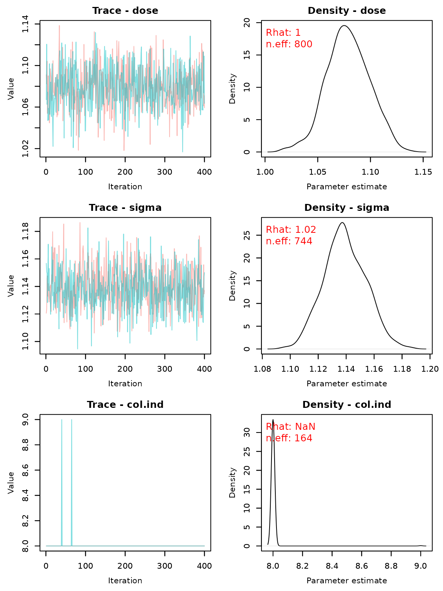

## Logistic regression

To fit a logistic regression model, the syntax is very similar. However,
`ameras` offers three functional forms for modeling the exposure-outcome
relationship. Here, we will illustrate the standard exponential
relationship `doseRRmod="EXP"`. For more information, see the vignette
[Relative risk
models](https://ameras.sanderroberti.com/articles/relativeriskmodels.md).

First, we fit models including a quadratic exposure term by setting
`deg=2`.

``` r
set.seed(33521)
fit.ameras.logreg <- ameras(Y="Y.binomial", dosevars=dosevars, X=c("X1","X2"), data=data, 
                            family="binomial", deg=2, doseRRmod = "EXP", 
                            methods=c("RC", "ERC", "MCML", "FMA", "BMA"), niter.BMA = 5000, 
                            nburnin.BMA = 1000, CI=c("wald.orig","percentile"))
#> Note: BMA may require extensive computation time in the order of multiple hours
#> Fitting RC
#> Fitting ERC
#> Fitting MCML
#> Fitting FMA
#> Fitting BMA
#> Defining model
#> Building model
#> Setting data and initial values
#> Running calculate on model
#>   [Note] Any error reports that follow may simply reflect missing values in model variables.
#> Checking model sizes and dimensions
#>   [Note] This model is not fully initialized. This is not an error.
#>          To see which variables are not initialized, use model$initializeInfo().
#>          For more information on model initialization, see help(modelInitialization).
#> Compiling
#>   [Note] This may take a minute.
#>   [Note] Use 'showCompilerOutput = TRUE' to see C++ compilation details.
#> Compiling
#>   [Note] This may take a minute.
#>   [Note] Use 'showCompilerOutput = TRUE' to see C++ compilation details.
#> running chain 1...
#> |-------------|-------------|-------------|-------------|
#> |-------------------------------------------------------|
#> running chain 2...
#> |-------------|-------------|-------------|-------------|
#> |-------------------------------------------------------|
#> Warning in ameras.bma(family = family, dosevars = dosevars, data = data, :
#> WARNING: Potential problems with MCMC convergence, consider using longer chains
```

``` r
summary(fit.ameras.logreg)
#> Call:
#> ameras(data = data, family = "binomial", Y = "Y.binomial", dosevars = dosevars, 
#>     X = c("X1", "X2"), methods = c("RC", "ERC", "MCML", "FMA", 
#>         "BMA"), deg = 2, doseRRmod = "EXP", CI = c("wald.orig", 
#>         "percentile"), nburnin.BMA = 1000, niter.BMA = 5000)
#> 
#> Total run time: 140.9 seconds
#> 
#> Runtime in seconds by method:
#> 
#>  Method Runtime
#>      RC     0.3
#>     ERC    79.8
#>    MCML     1.0
#>     FMA     3.0
#>     BMA    56.8
#> 
#> Summary of coefficients by method:
#> 
#>  Method         Term Estimate      SE CI.lowerbound CI.upperbound Rhat   n.eff
#>      RC  (Intercept) -0.94461 0.08409     -1.109439      -0.77979   NA      NA
#>      RC           X1  0.44552 0.07667      0.295254       0.59579   NA      NA
#>      RC           X2 -0.33376 0.09601     -0.521945      -0.14557   NA      NA
#>      RC         dose  0.37904 0.10388      0.175441       0.58265   NA      NA
#>      RC dose_squared  0.01943 0.02750     -0.034468       0.07334   NA      NA
#>     ERC  (Intercept) -0.93189 0.08533     -1.099136      -0.76464   NA      NA
#>     ERC           X1  0.44998 0.07678      0.299496       0.60046   NA      NA
#>     ERC           X2 -0.33924 0.09614     -0.527664      -0.15081   NA      NA
#>     ERC         dose  0.33858 0.10745      0.127985       0.54917   NA      NA
#>     ERC dose_squared  0.03528 0.02841     -0.020409       0.09097   NA      NA
#>    MCML  (Intercept) -0.91147 0.08356     -1.075241      -0.74770   NA      NA
#>    MCML           X1  0.44619 0.07674      0.295784       0.59660   NA      NA
#>    MCML           X2 -0.34431 0.09625     -0.532951      -0.15567   NA      NA
#>    MCML         dose  0.31654 0.10412      0.112472       0.52061   NA      NA
#>    MCML dose_squared  0.03800 0.02774     -0.016375       0.09237   NA      NA
#>     FMA  (Intercept) -0.91244 0.08386     -1.076771      -0.74789   NA      NA
#>     FMA           X1  0.44619 0.07686      0.295520       0.59764   NA      NA
#>     FMA           X2 -0.34400 0.09627     -0.533249      -0.15610   NA      NA
#>     FMA         dose  0.31871 0.10523      0.114880       0.52709   NA      NA
#>     FMA dose_squared  0.03735 0.02816     -0.018766       0.09172   NA      NA
#>     BMA  (Intercept) -0.90779 0.08101     -1.056223      -0.74279 1.03  214.00
#>     BMA           X1  0.44552 0.07775      0.286128       0.59552 1.01  370.00
#>     BMA           X2 -0.34361 0.09652     -0.529598      -0.15370 1.00 1242.00
#>     BMA         dose  0.30658 0.09894      0.102541       0.49441 1.08   92.00
#>     BMA dose_squared  0.04134 0.02564     -0.007435       0.09729 1.11  105.00
```

``` r
coef(fit.ameras.logreg)
#>                       RC         ERC        MCML         FMA         BMA
#> (Intercept)  -0.94461327 -0.93188863 -0.91146831 -0.91243544 -0.90778810
#> X1            0.44552273  0.44997904  0.44619209  0.44619391  0.44552058
#> X2           -0.33375991 -0.33923955 -0.34430935 -0.34400234 -0.34360534
#> dose          0.37904346  0.33857980  0.31654277  0.31870705  0.30657532
#> dose_squared  0.01943381  0.03528262  0.03799845  0.03735107  0.04134337
```

``` r
traceplot(fit.ameras.logreg)
```

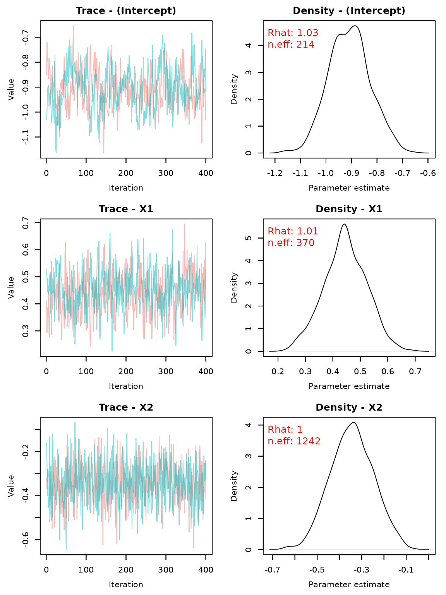

Without the quadratic term (`deg=1`):

``` r
set.seed(3521216)
fit.ameras.logreg.lin <- ameras(Y="Y.binomial", dosevars=dosevars, X=c("X1","X2"), data=data, 
                                family="binomial", deg=1, doseRRmod = "EXP", 
                                methods=c("RC", "ERC", "MCML", "FMA", "BMA"), niter.BMA = 5000, 
                                nburnin.BMA = 1000, CI=c("wald.orig","percentile"))
#> Note: BMA may require extensive computation time in the order of multiple hours
#> Fitting RC
#> Fitting ERC
#> Fitting MCML
#> Fitting FMA
#> Fitting BMA
#> Defining model
#> Building model
#> Setting data and initial values
#> Running calculate on model
#>   [Note] Any error reports that follow may simply reflect missing values in model variables.
#> Checking model sizes and dimensions
#>   [Note] This model is not fully initialized. This is not an error.
#>          To see which variables are not initialized, use model$initializeInfo().
#>          For more information on model initialization, see help(modelInitialization).
#> Compiling
#>   [Note] This may take a minute.
#>   [Note] Use 'showCompilerOutput = TRUE' to see C++ compilation details.
#> Compiling
#>   [Note] This may take a minute.
#>   [Note] Use 'showCompilerOutput = TRUE' to see C++ compilation details.
#> running chain 1...
#> |-------------|-------------|-------------|-------------|
#> |-------------------------------------------------------|
#> running chain 2...
#> |-------------|-------------|-------------|-------------|
#> |-------------------------------------------------------|
```

``` r
summary(fit.ameras.logreg.lin)
#> Call:
#> ameras(data = data, family = "binomial", Y = "Y.binomial", dosevars = dosevars, 
#>     X = c("X1", "X2"), methods = c("RC", "ERC", "MCML", "FMA", 
#>         "BMA"), deg = 1, doseRRmod = "EXP", CI = c("wald.orig", 
#>         "percentile"), nburnin.BMA = 1000, niter.BMA = 5000)
#> 
#> Total run time: 117.9 seconds
#> 
#> Runtime in seconds by method:
#> 
#>  Method Runtime
#>      RC     0.2
#>     ERC    63.8
#>    MCML     0.7
#>     FMA     1.6
#>     BMA    51.6
#> 
#> Summary of coefficients by method:
#> 
#>  Method        Term Estimate      SE CI.lowerbound CI.upperbound Rhat  n.eff
#>      RC (Intercept)  -0.9760 0.07190       -1.1169       -0.8351   NA     NA
#>      RC          X1   0.4460 0.07667        0.2957        0.5963   NA     NA
#>      RC          X2  -0.3359 0.09596       -0.5240       -0.1478   NA     NA
#>      RC        dose   0.4471 0.04101        0.3668        0.5275   NA     NA
#>     ERC (Intercept)  -0.9898 0.07216       -1.1312       -0.8483   NA     NA
#>     ERC          X1   0.4533 0.07667        0.3030        0.6036   NA     NA
#>     ERC          X2  -0.3437 0.09609       -0.5320       -0.1554   NA     NA
#>     ERC        dose   0.4632 0.04086        0.3831        0.5433   NA     NA
#>    MCML (Intercept)  -0.9725 0.07154       -1.1127       -0.8323   NA     NA
#>    MCML          X1   0.4469 0.07674        0.2965        0.5973   NA     NA
#>    MCML          X2  -0.3467 0.09618       -0.5352       -0.1582   NA     NA
#>    MCML        dose   0.4498 0.04105        0.3693        0.5302   NA     NA
#>     FMA (Intercept)  -0.9725 0.07138       -1.1131       -0.8333   NA     NA
#>     FMA          X1   0.4472 0.07664        0.2975        0.5981   NA     NA
#>     FMA          X2  -0.3465 0.09602       -0.5347       -0.1580   NA     NA
#>     FMA        dose   0.4497 0.04101        0.3697        0.5302   NA     NA
#>     BMA (Intercept)  -0.9791 0.06869       -1.1235       -0.8492 1.03 386.00
#>     BMA          X1   0.4555 0.07669        0.3098        0.6074 1.00 482.00
#>     BMA          X2  -0.3486 0.09589       -0.5382       -0.1523 1.02 882.00
#>     BMA        dose   0.4523 0.04042        0.3743        0.5292 1.03 518.00
```

``` r
coef(fit.ameras.logreg.lin)
#>                     RC        ERC       MCML        FMA        BMA
#> (Intercept) -0.9759817 -0.9897555 -0.9724854 -0.9725462 -0.9791394
#> X1           0.4459778  0.4533083  0.4468997  0.4471557  0.4555060
#> X2          -0.3358992 -0.3436867 -0.3467298 -0.3465319 -0.3485601
#> dose         0.4471346  0.4632116  0.4497526  0.4497072  0.4522620
```

``` r
traceplot(fit.ameras.logreg.lin)
```


## Poisson regression

Again, we first fit models including a quadratic exposure term by
setting `deg=2`.

``` r
set.seed(332101)
fit.ameras.poisson <- ameras(Y="Y.poisson", dosevars=dosevars, X=c("X1","X2"), data=data, 
                             family="poisson", deg=2, doseRRmod = "EXP", 
                             methods=c("RC", "ERC", "MCML", "FMA", "BMA"), niter.BMA = 5000, 
                             nburnin.BMA = 1000, CI=c("wald.orig","percentile"))
#> Note: BMA may require extensive computation time in the order of multiple hours
#> Fitting RC
#> Fitting ERC
#> Fitting MCML
#> Fitting FMA
#> Fitting BMA
#> Defining model
#> Building model
#> Setting data and initial values
#> Running calculate on model
#>   [Note] Any error reports that follow may simply reflect missing values in model variables.
#> Checking model sizes and dimensions
#>   [Note] This model is not fully initialized. This is not an error.
#>          To see which variables are not initialized, use model$initializeInfo().
#>          For more information on model initialization, see help(modelInitialization).
#> Compiling
#>   [Note] This may take a minute.
#>   [Note] Use 'showCompilerOutput = TRUE' to see C++ compilation details.
#> Compiling
#>   [Note] This may take a minute.
#>   [Note] Use 'showCompilerOutput = TRUE' to see C++ compilation details.
#> running chain 1...
#> |-------------|-------------|-------------|-------------|
#> |-------------------------------------------------------|
#> running chain 2...
#> warning: logProb of data node Y[247]: logProb less than -1e12.
#> warning: logProb of data node Y[676]: logProb less than -1e12.
#> warning: logProb of data node Y[833]: logProb less than -1e12.
#> warning: logProb of data node Y[1635]: logProb less than -1e12.
#> |-------------|-------------|-------------|-------------|
#> |-------------------------------------------------------|
```

``` r
summary(fit.ameras.poisson)
#> Call:
#> ameras(data = data, family = "poisson", Y = "Y.poisson", dosevars = dosevars, 
#>     X = c("X1", "X2"), methods = c("RC", "ERC", "MCML", "FMA", 
#>         "BMA"), deg = 2, doseRRmod = "EXP", CI = c("wald.orig", 
#>         "percentile"), nburnin.BMA = 1000, niter.BMA = 5000)
#> 
#> Total run time: 69.3 seconds
#> 
#> Runtime in seconds by method:
#> 
#>  Method Runtime
#>      RC     0.3
#>     ERC     1.9
#>    MCML     1.5
#>     FMA     3.5
#>     BMA    62.1
#> 
#> Summary of coefficients by method:
#> 
#>  Method         Term Estimate       SE CI.lowerbound CI.upperbound Rhat  n.eff
#>      RC  (Intercept) -1.09456 0.048655      -1.18992      -0.99920   NA     NA
#>      RC           X1  0.49070 0.041922       0.40853       0.57287   NA     NA
#>      RC           X2 -0.37625 0.055638      -0.48530      -0.26719   NA     NA
#>      RC         dose  0.61976 0.040375       0.54062       0.69889   NA     NA
#>      RC dose_squared -0.03849 0.007566      -0.05332      -0.02366   NA     NA
#>     ERC  (Intercept) -1.09068 0.048474      -1.18569      -0.99567   NA     NA
#>     ERC           X1  0.49180 0.042008       0.40946       0.57414   NA     NA
#>     ERC           X2 -0.37855 0.055639      -0.48760      -0.26950   NA     NA
#>     ERC         dose  0.61138 0.039328       0.53430       0.68847   NA     NA
#>     ERC dose_squared -0.03626 0.007177      -0.05033      -0.02220   NA     NA
#>    MCML  (Intercept) -1.07519 0.046954      -1.16722      -0.98316   NA     NA
#>    MCML           X1  0.49897 0.041918       0.41681       0.58113   NA     NA
#>    MCML           X2 -0.37711 0.055643      -0.48617      -0.26805   NA     NA
#>    MCML         dose  0.60089 0.034218       0.53383       0.66796   NA     NA
#>    MCML dose_squared -0.03644 0.005719      -0.04764      -0.02523   NA     NA
#>     FMA  (Intercept) -1.07542 0.047056      -1.16736      -0.98339   NA     NA
#>     FMA           X1  0.49896 0.041800       0.41696       0.58065   NA     NA
#>     FMA           X2 -0.37716 0.055479      -0.48601      -0.26864   NA     NA
#>     FMA         dose  0.60138 0.035163       0.53336       0.67123   NA     NA
#>     FMA dose_squared -0.03656 0.005998      -0.04836      -0.02519   NA     NA
#>     BMA  (Intercept) -1.07944 0.044741      -1.16649      -0.99362 1.02 215.00
#>     BMA           X1  0.49801 0.039956       0.42219       0.57163 1.03 435.00
#>     BMA           X2 -0.38167 0.055527      -0.49101      -0.27220 1.00 800.00
#>     BMA         dose  0.60805 0.035663       0.54553       0.68040 1.03  87.00
#>     BMA dose_squared -0.03798 0.006215      -0.05048      -0.02715 1.03  79.00
```

``` r
coef(fit.ameras.poisson)
#>                       RC         ERC        MCML         FMA        BMA
#> (Intercept)  -1.09455980 -1.09068092 -1.07519346 -1.07541780 -1.0794372
#> X1            0.49070108  0.49179875  0.49897425  0.49895993  0.4980120
#> X2           -0.37624508 -0.37854805 -0.37711401 -0.37715581 -0.3816682
#> dose          0.61975742  0.61138406  0.60089474  0.60137955  0.6080481
#> dose_squared -0.03849039 -0.03626348 -0.03643505 -0.03656317 -0.0379750
```

``` r
traceplot(fit.ameras.poisson)
```

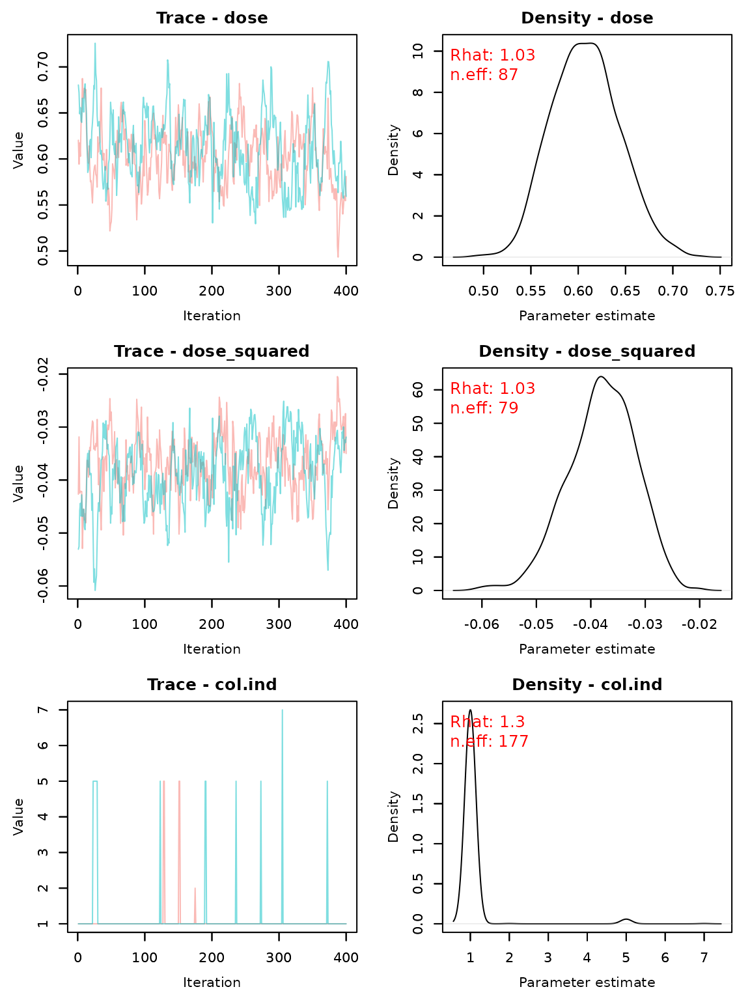

Without the quadratic term (`deg=1`):

``` r
set.seed(24252)
fit.ameras.poisson.lin <- ameras(Y="Y.poisson", dosevars=dosevars, X=c("X1","X2"), data=data, 
                                 family="poisson", deg=1, doseRRmod = "EXP", 
                                 methods=c("RC", "ERC", "MCML", "FMA", "BMA"), niter.BMA = 5000, 
                                 nburnin.BMA = 1000, CI=c("wald.orig","percentile"))
#> Note: BMA may require extensive computation time in the order of multiple hours
#> Fitting RC
#> Fitting ERC
#> Fitting MCML
#> Fitting FMA
#> Fitting BMA
#> Defining model
#> Building model
#> Setting data and initial values
#> Running calculate on model
#>   [Note] Any error reports that follow may simply reflect missing values in model variables.
#> Checking model sizes and dimensions
#>   [Note] This model is not fully initialized. This is not an error.
#>          To see which variables are not initialized, use model$initializeInfo().
#>          For more information on model initialization, see help(modelInitialization).
#> Compiling
#>   [Note] This may take a minute.
#>   [Note] Use 'showCompilerOutput = TRUE' to see C++ compilation details.
#> Compiling
#>   [Note] This may take a minute.
#>   [Note] Use 'showCompilerOutput = TRUE' to see C++ compilation details.
#> running chain 1...
#> |-------------|-------------|-------------|-------------|
#> |-------------------------------------------------------|
#> running chain 2...
#> |-------------|-------------|-------------|-------------|
#> |-------------------------------------------------------|
```

``` r
summary(fit.ameras.poisson.lin)
#> Call:
#> ameras(data = data, family = "poisson", Y = "Y.poisson", dosevars = dosevars, 
#>     X = c("X1", "X2"), methods = c("RC", "ERC", "MCML", "FMA", 
#>         "BMA"), deg = 1, doseRRmod = "EXP", CI = c("wald.orig", 
#>         "percentile"), nburnin.BMA = 1000, niter.BMA = 5000)
#> 
#> Total run time: 62.5 seconds
#> 
#> Runtime in seconds by method:
#> 
#>  Method Runtime
#>      RC     0.2
#>     ERC     0.7
#>    MCML     0.7
#>     FMA     2.0
#>     BMA    58.9
#> 
#> Summary of coefficients by method:
#> 
#>  Method        Term Estimate      SE CI.lowerbound CI.upperbound Rhat  n.eff
#>      RC (Intercept)  -0.9650 0.04127       -1.0458       -0.8841   NA     NA
#>      RC          X1   0.5054 0.04195        0.4232        0.5876   NA     NA
#>      RC          X2  -0.3640 0.05560       -0.4730       -0.2550   NA     NA
#>      RC        dose   0.4204 0.01346        0.3940        0.4468   NA     NA
#>     ERC (Intercept)  -0.9667 0.04134       -1.0477       -0.8856   NA     NA
#>     ERC          X1   0.5049 0.04202        0.4226        0.5873   NA     NA
#>     ERC          X2  -0.3667 0.05559       -0.4756       -0.2577   NA     NA
#>     ERC        dose   0.4222 0.01361        0.3955        0.4489   NA     NA
#>    MCML (Intercept)  -0.9173 0.04048       -0.9967       -0.8380   NA     NA
#>    MCML          X1   0.5129 0.04231        0.4300        0.5958   NA     NA
#>    MCML          X2  -0.3579 0.05582       -0.4674       -0.2485   NA     NA
#>    MCML        dose   0.3823 0.01231        0.3581        0.4064   NA     NA
#>     FMA (Intercept)  -0.9174 0.04044       -0.9969       -0.8384   NA     NA
#>     FMA          X1   0.5121 0.04257        0.4284        0.5950   NA     NA
#>     FMA          X2  -0.3584 0.05587       -0.4680       -0.2496   NA     NA
#>     FMA        dose   0.3826 0.01255        0.3585        0.4077   NA     NA
#>     BMA (Intercept)  -0.9180 0.04041       -0.9935       -0.8378 1.00 301.00
#>     BMA          X1   0.5100 0.04121        0.4248        0.5896 1.01 364.00
#>     BMA          X2  -0.3581 0.05584       -0.4661       -0.2460 1.00 800.00
#>     BMA        dose   0.3833 0.01343        0.3561        0.4087 1.01 371.00
```

``` r
coef(fit.ameras.poisson.lin)
#>                     RC        ERC       MCML        FMA        BMA
#> (Intercept) -0.9649529 -0.9666735 -0.9173445 -0.9173785 -0.9179930
#> X1           0.5054270  0.5049256  0.5129102  0.5120519  0.5099994
#> X2          -0.3639707 -0.3666592 -0.3579466 -0.3583942 -0.3581445
#> dose         0.4204226  0.4222084  0.3822723  0.3826304  0.3833150
```

``` r
traceplot(fit.ameras.poisson.lin)
```


## Proportional hazards regression

Proportional hazards regression uses the same syntax, with `Y` the 0-1
status variable and `exit` for the exit time variable. In case of left
truncation, entry times can be specified through the `entry` argument.
Note that BMA fits a piecewise constant baseline hazard `h0` as the
proportional hazards model is not directly supported. By default, the
observed time interval is divided into 10 intervals using quantiles of
the observed event times among cases. This number of such intervals can
be specified through the `prophaz.numints.BMA` argument. The BMA output
contains the `prophaz.numints.BMA+1` cutpoints defining the intervals in
addition to `h0`.

Again, we first fit models including a quadratic exposure term by
setting `deg=2`.

``` r
set.seed(332120000)
fit.ameras.prophaz <- ameras(Y="status", exit="time", dosevars=dosevars, X=c("X1","X2"), 
                             data=data, family="prophaz", deg=2, doseRRmod = "EXP", 
                             methods=c("RC", "ERC", "MCML", "FMA", "BMA"), niter.BMA = 5000, 
                             nburnin.BMA = 1000, CI=c("wald.orig","percentile"))
#> Note: BMA may require extensive computation time in the order of multiple hours
#> Fitting RC
#> Fitting ERC
#> Warning in ameras.rc(family = family, dosevars = dosevars, data = data, :
#> WARNING: Hessian was not invertible or inverse was not positive definite,
#> variance matrix could not be obtained
#> Fitting MCML
#> Fitting FMA
#> Fitting BMA
#> Defining model
#> Building model
#> Setting data and initial values
#> Running calculate on model
#>   [Note] Any error reports that follow may simply reflect missing values in model variables.
#> Checking model sizes and dimensions
#>   [Note] This model is not fully initialized. This is not an error.
#>          To see which variables are not initialized, use model$initializeInfo().
#>          For more information on model initialization, see help(modelInitialization).
#> Compiling
#>   [Note] This may take a minute.
#>   [Note] Use 'showCompilerOutput = TRUE' to see C++ compilation details.
#> Compiling
#>   [Note] This may take a minute.
#>   [Note] Use 'showCompilerOutput = TRUE' to see C++ compilation details.
#> running chain 1...
#> warning: logProb of data node zeros[7]: logProb less than -1e12.
#> warning: logProb of data node zeros[17]: logProb less than -1e12.
#> warning: logProb of data node zeros[71]: logProb less than -1e12.
#> warning: logProb of data node zeros[247]: logProb less than -1e12.
#> warning: logProb of data node zeros[267]: logProb less than -1e12.
#> warning: logProb of data node zeros[270]: logProb less than -1e12.
#> warning: logProb of data node zeros[433]: logProb less than -1e12.
#> warning: logProb of data node zeros[509]: logProb less than -1e12.
#> warning: logProb of data node zeros[620]: logProb less than -1e12.
#> warning: logProb of data node zeros[676]: logProb less than -1e12.
#> warning: logProb of data node zeros[716]: logProb less than -1e12.
#> warning: logProb of data node zeros[833]: logProb less than -1e12.
#> warning: logProb of data node zeros[1074]: logProb less than -1e12.
#> warning: logProb of data node zeros[1517]: logProb less than -1e12.
#> warning: logProb of data node zeros[1566]: logProb less than -1e12.
#> warning: logProb of data node zeros[1635]: logProb less than -1e12.
#> warning: logProb of data node zeros[1755]: logProb less than -1e12.
#> warning: logProb of data node zeros[1827]: logProb less than -1e12.
#> warning: logProb of data node zeros[1991]: logProb less than -1e12.
#> warning: logProb of data node zeros[1997]: logProb less than -1e12.
#> warning: logProb of data node zeros[2021]: logProb less than -1e12.
#> warning: logProb of data node zeros[2237]: logProb less than -1e12.
#> warning: logProb of data node zeros[2339]: logProb less than -1e12.
#> warning: logProb of data node zeros[2395]: logProb less than -1e12.
#> warning: logProb of data node zeros[2530]: logProb less than -1e12.
#> warning: logProb of data node zeros[2559]: logProb less than -1e12.
#> warning: logProb of data node zeros[2562]: logProb less than -1e12.
#> warning: logProb of data node zeros[2655]: logProb less than -1e12.
#> warning: logProb of data node zeros[2671]: logProb less than -1e12.
#> warning: logProb of data node zeros[2715]: logProb less than -1e12.
#> warning: logProb of data node zeros[2733]: logProb less than -1e12.
#> warning: logProb of data node zeros[2743]: logProb less than -1e12.
#> warning: logProb of data node zeros[2771]: logProb less than -1e12.
#> warning: logProb of data node zeros[2824]: logProb less than -1e12.
#> warning: logProb of data node zeros[2971]: logProb less than -1e12.
#> |-------------|-------------|-------------|-------------|
#> |-------------------------------------------------------|
#> running chain 2...
#> warning: logProb of data node zeros[1635]: logProb less than -1e12.
#> warning: logProb of data node zeros[2907]: logProb less than -1e12.
#> |-------------|-------------|-------------|-------------|
#> |-------------------------------------------------------|
```

``` r
summary(fit.ameras.prophaz)
#> Call:
#> ameras(data = data, family = "prophaz", Y = "status", dosevars = dosevars, 
#>     X = c("X1", "X2"), exit = "time", methods = c("RC", "ERC", 
#>         "MCML", "FMA", "BMA"), deg = 2, doseRRmod = "EXP", CI = c("wald.orig", 
#>         "percentile"), nburnin.BMA = 1000, niter.BMA = 5000)
#> 
#> Total run time: 635.8 seconds
#> 
#> Runtime in seconds by method:
#> 
#>  Method Runtime
#>      RC     0.3
#>     ERC   526.9
#>    MCML     0.7
#>     FMA     2.1
#>     BMA   105.8
#> 
#> Summary of coefficients by method:
#> 
#>  Method         Term  Estimate      SE CI.lowerbound CI.upperbound Rhat  n.eff
#>      RC           X1  0.629674 0.08485       0.46338      0.795971   NA     NA
#>      RC           X2 -0.423116 0.11150      -0.64165     -0.204584   NA     NA
#>      RC         dose  0.587614 0.08915       0.41289      0.762339   NA     NA
#>      RC dose_squared -0.033682 0.01807      -0.06910      0.001741   NA     NA
#>     ERC           X1  0.636755      NA            NA            NA   NA     NA
#>     ERC           X2 -0.422042      NA            NA            NA   NA     NA
#>     ERC         dose  0.295488      NA            NA            NA   NA     NA
#>     ERC dose_squared -0.003357      NA            NA            NA   NA     NA
#>    MCML           X1  0.629162 0.08518       0.46221      0.796110   NA     NA
#>    MCML           X2 -0.425156 0.11196      -0.64460     -0.205715   NA     NA
#>    MCML         dose  0.590217 0.08046       0.43252      0.747910   NA     NA
#>    MCML dose_squared -0.038038 0.01523      -0.06789     -0.008184   NA     NA
#>     FMA           X1  0.624536 0.08542       0.45624      0.791452   NA     NA
#>     FMA           X2 -0.433644 0.11160      -0.65267     -0.215490   NA     NA
#>     FMA         dose  0.594196 0.07841       0.44136      0.749143   NA     NA
#>     FMA dose_squared -0.038945 0.01454      -0.06778     -0.010701   NA     NA
#>     BMA           X1  0.631447 0.08479       0.47316      0.794891 1.02 311.00
#>     BMA           X2 -0.432579 0.11574      -0.66168     -0.220190 1.02 740.00
#>     BMA         dose  0.579261 0.07815       0.42939      0.725369 1.00  89.00
#>     BMA dose_squared -0.036336 0.01514      -0.06570     -0.006216 1.00  82.00
#>     BMA        h0[1]  0.331844 0.05060       0.24512      0.437053 1.01 350.00
#>     BMA        h0[2]  0.354968 0.05515       0.25388      0.474837 1.00 457.00
#>     BMA        h0[3]  0.274038 0.04421       0.19646      0.367043 1.00 341.00
#>     BMA        h0[4]  0.304833 0.04870       0.22042      0.413868 1.00 426.00
#>     BMA        h0[5]  0.324187 0.05181       0.22952      0.430266 1.01 452.00
#>     BMA        h0[6]  0.410268 0.06456       0.29767      0.541362 1.01 300.00
#>     BMA        h0[7]  0.275961 0.04233       0.20322      0.366353 1.00 467.00
#>     BMA        h0[8]  0.319488 0.04863       0.22558      0.427560 1.00 417.00
#>     BMA        h0[9]  0.279575 0.04103       0.20429      0.360305 1.00 358.00
#>     BMA       h0[10]  0.317120 0.04949       0.23321      0.431447 1.01 288.00
```

``` r
coef(fit.ameras.prophaz)
#>                       RC          ERC        MCML         FMA         BMA
#> X1            0.62967434  0.636754979  0.62916199  0.62453646  0.63144657
#> X2           -0.42311583 -0.422041734 -0.42515576 -0.43364414 -0.43257946
#> dose          0.58761408  0.295487972  0.59021691  0.59419590  0.57926053
#> dose_squared -0.03368205 -0.003356734 -0.03803829 -0.03894528 -0.03633593
#> h0[1]                 NA           NA          NA          NA  0.33184446
#> h0[2]                 NA           NA          NA          NA  0.35496760
#> h0[3]                 NA           NA          NA          NA  0.27403811
#> h0[4]                 NA           NA          NA          NA  0.30483271
#> h0[5]                 NA           NA          NA          NA  0.32418664
#> h0[6]                 NA           NA          NA          NA  0.41026813
#> h0[7]                 NA           NA          NA          NA  0.27596111
#> h0[8]                 NA           NA          NA          NA  0.31948789
#> h0[9]                 NA           NA          NA          NA  0.27957458
#> h0[10]                NA           NA          NA          NA  0.31712022
```

The BMA output now contains the intervals with piecewise constant
baseline hazards, corresponding to the estimates `h0`:

``` r
fit.ameras.prophaz$BMA$prophaz.timepoints
#> NULL
```

``` r
traceplot(fit.ameras.prophaz)
```

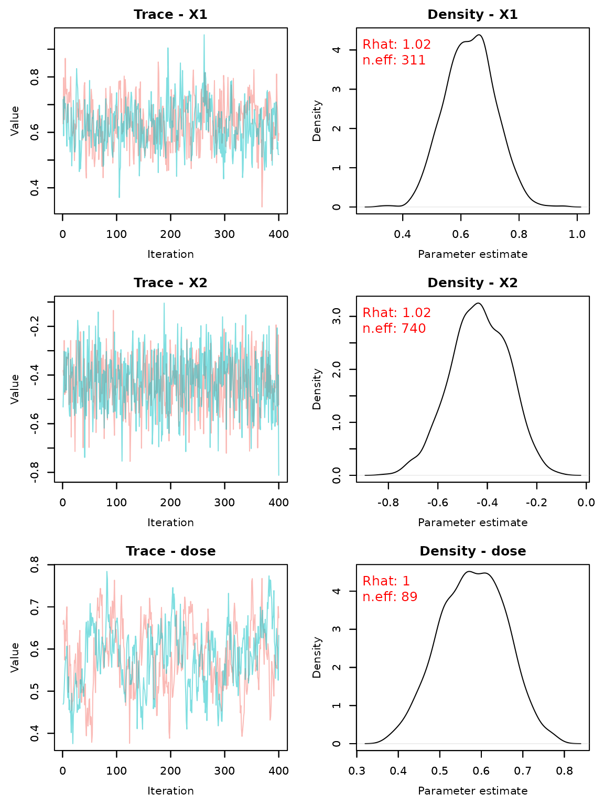

Without the quadratic term (`deg=1`):

``` r
set.seed(24978252)
fit.ameras.prophaz.lin <- ameras(Y="status", exit="time", dosevars=dosevars, X=c("X1","X2"), 
                                 data=data, family="prophaz", deg=1, doseRRmod = "EXP", 
                                 methods=c("RC", "ERC", "MCML", "FMA", "BMA"), niter.BMA = 5000, 
                                 nburnin.BMA = 1000, CI=c("wald.orig","percentile"))
#> Note: BMA may require extensive computation time in the order of multiple hours
#> Fitting RC
#> Fitting ERC
#> Warning in ameras.rc(family = family, dosevars = dosevars, data = data, :
#> WARNING: Hessian was not invertible or inverse was not positive definite,
#> variance matrix could not be obtained
#> Fitting MCML
#> Fitting FMA
#> Fitting BMA
#> Defining model
#> Building model
#> Setting data and initial values
#> Running calculate on model
#>   [Note] Any error reports that follow may simply reflect missing values in model variables.
#> Checking model sizes and dimensions
#>   [Note] This model is not fully initialized. This is not an error.
#>          To see which variables are not initialized, use model$initializeInfo().
#>          For more information on model initialization, see help(modelInitialization).
#> Compiling
#>   [Note] This may take a minute.
#>   [Note] Use 'showCompilerOutput = TRUE' to see C++ compilation details.
#> Compiling
#>   [Note] This may take a minute.
#>   [Note] Use 'showCompilerOutput = TRUE' to see C++ compilation details.
#> running chain 1...
#> |-------------|-------------|-------------|-------------|
#> |-------------------------------------------------------|
#> running chain 2...
#> |-------------|-------------|-------------|-------------|
#> |-------------------------------------------------------|
```

``` r
summary(fit.ameras.prophaz.lin)
#> Call:
#> ameras(data = data, family = "prophaz", Y = "status", dosevars = dosevars, 
#>     X = c("X1", "X2"), exit = "time", methods = c("RC", "ERC", 
#>         "MCML", "FMA", "BMA"), deg = 1, doseRRmod = "EXP", CI = c("wald.orig", 
#>         "percentile"), nburnin.BMA = 1000, niter.BMA = 5000)
#> 
#> Total run time: 378.7 seconds
#> 
#> Runtime in seconds by method:
#> 
#>  Method Runtime
#>      RC     0.1
#>     ERC   271.8
#>    MCML     0.4
#>     FMA     1.2
#>     BMA   105.2
#> 
#> Summary of coefficients by method:
#> 
#>  Method   Term Estimate      SE CI.lowerbound CI.upperbound Rhat  n.eff
#>      RC     X1   0.6358 0.08488        0.4695        0.8022   NA     NA
#>      RC     X2  -0.4161 0.11144       -0.6345       -0.1977   NA     NA
#>      RC   dose   0.4284 0.03004        0.3695        0.4873   NA     NA
#>     ERC     X1   0.6416      NA            NA            NA   NA     NA
#>     ERC     X2  -0.4220      NA            NA            NA   NA     NA
#>     ERC   dose   0.2812      NA            NA            NA   NA     NA
#>    MCML     X1   0.6462 0.08565        0.4783        0.8141   NA     NA
#>    MCML     X2  -0.4125 0.11253       -0.6330       -0.1919   NA     NA
#>    MCML   dose   0.4002 0.02908        0.3432        0.4572   NA     NA
#>     FMA     X1   0.6457 0.08567        0.4774        0.8142   NA     NA
#>     FMA     X2  -0.4125 0.11263       -0.6344       -0.1925   NA     NA
#>     FMA   dose   0.4001 0.02901        0.3431        0.4567   NA     NA
#>     BMA     X1   0.6474 0.08153        0.4888        0.8140 1.00 388.00
#>     BMA     X2  -0.4248 0.11473       -0.6443       -0.2092 1.00 800.00
#>     BMA   dose   0.3987 0.02884        0.3427        0.4572 1.01 478.00
#>     BMA  h0[1]   0.3646 0.05506        0.2675        0.4718 1.00 644.00
#>     BMA  h0[2]   0.3926 0.05694        0.2857        0.5086 1.01 540.00
#>     BMA  h0[3]   0.3036 0.04541        0.2239        0.3993 1.00 549.00
#>     BMA  h0[4]   0.3378 0.04899        0.2479        0.4480 1.00 692.00
#>     BMA  h0[5]   0.3615 0.05340        0.2688        0.4773 1.00 720.00
#>     BMA  h0[6]   0.4547 0.06635        0.3319        0.5874 1.00 546.00
#>     BMA  h0[7]   0.3080 0.04573        0.2288        0.4042 1.01 690.00
#>     BMA  h0[8]   0.3551 0.05105        0.2575        0.4580 1.00 589.00
#>     BMA  h0[9]   0.3091 0.04455        0.2277        0.4003 1.00 907.00
#>     BMA h0[10]   0.3496 0.05211        0.2535        0.4542 1.01 542.00
```

``` r
coef(fit.ameras.prophaz.lin)
#>                RC        ERC       MCML        FMA        BMA
#> X1      0.6358422  0.6415799  0.6462073  0.6457466  0.6474031
#> X2     -0.4160762 -0.4219654 -0.4124721 -0.4125357 -0.4247814
#> dose    0.4283893  0.2811645  0.4001775  0.4000975  0.3987353
#> h0[1]          NA         NA         NA         NA  0.3645755
#> h0[2]          NA         NA         NA         NA  0.3925686
#> h0[3]          NA         NA         NA         NA  0.3035865
#> h0[4]          NA         NA         NA         NA  0.3378431
#> h0[5]          NA         NA         NA         NA  0.3615119
#> h0[6]          NA         NA         NA         NA  0.4547288
#> h0[7]          NA         NA         NA         NA  0.3079510
#> h0[8]          NA         NA         NA         NA  0.3550875
#> h0[9]          NA         NA         NA         NA  0.3091293
#> h0[10]         NA         NA         NA         NA  0.3495984
```

``` r
traceplot(fit.ameras.prophaz.lin)
```

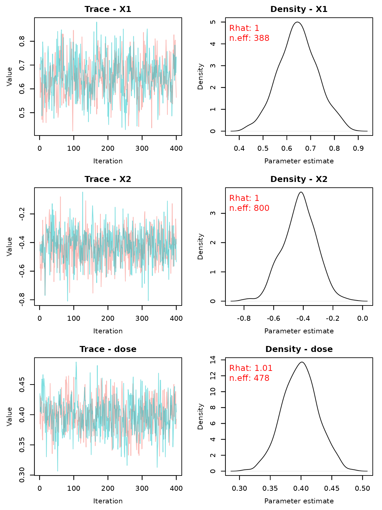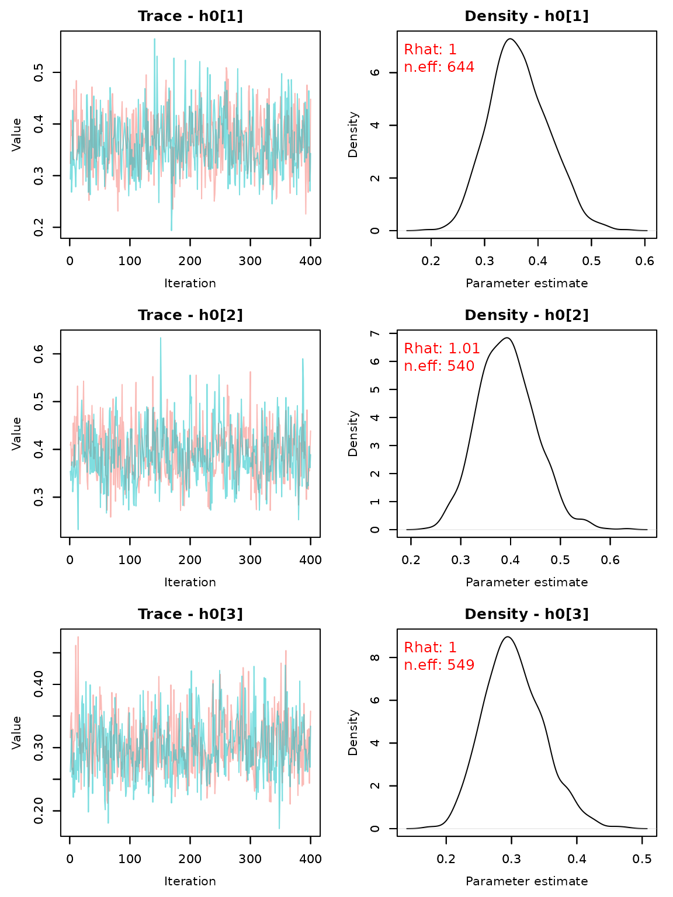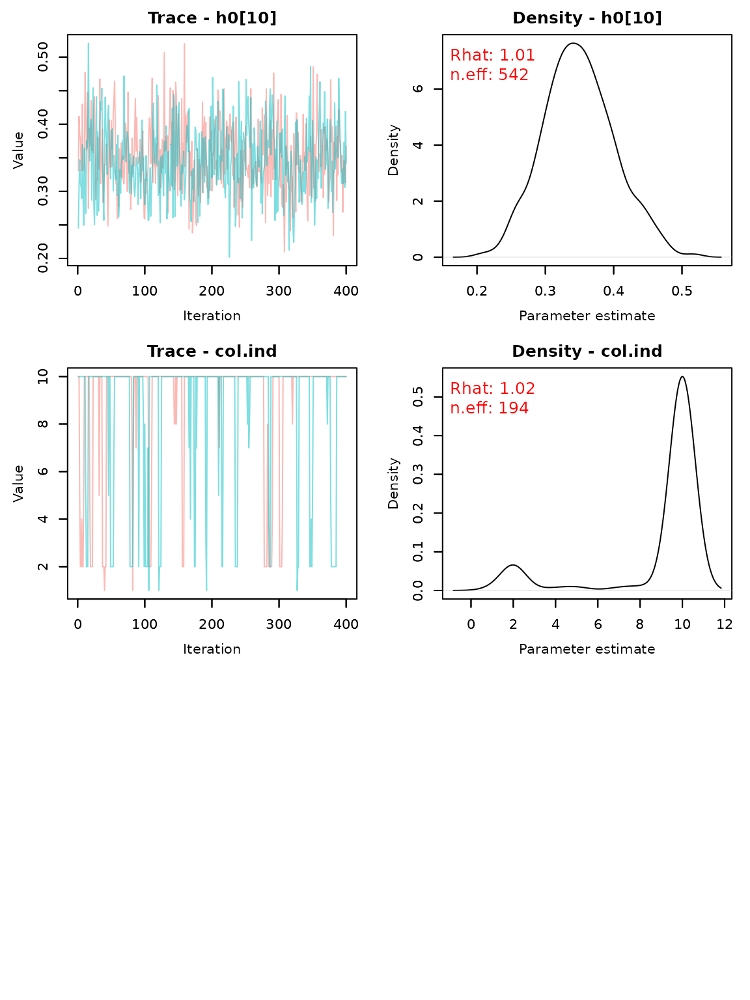

## Multinomial logistic regression

For multinomial logistic regression, the last category (in the case of
the example data, `Y.multinomial='3'`) is used as the referent category.

Again, we first fit models including a quadratic exposure term by
setting `deg=2`.

``` r
set.seed(33)
fit.ameras.multinomial <- ameras(Y="Y.multinomial", dosevars=dosevars, X=c("X1","X2"), data=data, 
                            family="multinomial", deg=2, doseRRmod = "EXP", 
                            methods=c("RC", "ERC", "MCML", "FMA", "BMA"), niter.BMA = 5000, 
                            nburnin.BMA = 1000, CI=c("wald.orig","percentile"))
#> Note: BMA may require extensive computation time in the order of multiple hours
#> Fitting RC
#> Fitting ERC
#> Fitting MCML
#> Fitting FMA
#> Fitting BMA
#> Defining model
#> Building model
#> Setting data and initial values
#> Running calculate on model
#>   [Note] Any error reports that follow may simply reflect missing values in model variables.
#> Checking model sizes and dimensions
#>   [Note] This model is not fully initialized. This is not an error.
#>          To see which variables are not initialized, use model$initializeInfo().
#>          For more information on model initialization, see help(modelInitialization).
#> Compiling
#>   [Note] This may take a minute.
#>   [Note] Use 'showCompilerOutput = TRUE' to see C++ compilation details.
#> Compiling
#>   [Note] This may take a minute.
#>   [Note] Use 'showCompilerOutput = TRUE' to see C++ compilation details.
#> running chain 1...
#> |-------------|-------------|-------------|-------------|
#> |-------------------------------------------------------|
#> running chain 2...
#> |-------------|-------------|-------------|-------------|
#> |-------------------------------------------------------|
```

``` r
summary(fit.ameras.multinomial)
#> Call:
#> ameras(data = data, family = "multinomial", Y = "Y.multinomial", 
#>     dosevars = dosevars, X = c("X1", "X2"), methods = c("RC", 
#>         "ERC", "MCML", "FMA", "BMA"), deg = 2, doseRRmod = "EXP", 
#>     CI = c("wald.orig", "percentile"), nburnin.BMA = 1000, niter.BMA = 5000)
#> 
#> Total run time: 441 seconds
#> 
#> Runtime in seconds by method:
#> 
#>  Method Runtime
#>      RC     1.1
#>     ERC   158.2
#>    MCML     8.0
#>     FMA    10.7
#>     BMA   263.0
#> 
#> Summary of coefficients by method:
#> 
#>  Method             Term  Estimate      SE CI.lowerbound CI.upperbound Rhat
#>      RC  (1)_(Intercept) -1.134879 0.11395      -1.35823      -0.91153   NA
#>      RC           (1)_X1  0.521885 0.10631       0.31352       0.73025   NA
#>      RC           (1)_X2 -0.347821 0.14935      -0.64054      -0.05510   NA
#>      RC         (1)_dose  0.541114 0.13250       0.28142       0.80081   NA
#>      RC (1)_dose_squared -0.028978 0.03377      -0.09517       0.03721   NA
#>      RC  (2)_(Intercept) -0.007547 0.08795      -0.17992       0.16483   NA
#>      RC           (2)_X1 -0.513675 0.08620      -0.68264      -0.34471   NA
#>      RC           (2)_X2  0.705782 0.10738       0.49532       0.91625   NA
#>      RC         (2)_dose  0.555006 0.11504       0.32952       0.78049   NA
#>      RC (2)_dose_squared -0.037842 0.03053      -0.09769       0.02201   NA
#>     ERC  (1)_(Intercept) -1.139984 0.11278      -1.36104      -0.91893   NA
#>     ERC           (1)_X1  0.524098 0.10651       0.31534       0.73286   NA
#>     ERC           (1)_X2 -0.351142 0.14952      -0.64420      -0.05808   NA
#>     ERC         (1)_dose  0.561788 0.12424       0.31827       0.80531   NA
#>     ERC (1)_dose_squared -0.031891 0.02990      -0.09050       0.02672   NA
#>     ERC  (2)_(Intercept) -0.008660 0.08626      -0.17772       0.16040   NA
#>     ERC           (2)_X1 -0.511536 0.08638      -0.68084      -0.34223   NA
#>     ERC           (2)_X2  0.703688 0.10757       0.49285       0.91452   NA
#>     ERC         (2)_dose  0.563142 0.10587       0.35564       0.77065   NA
#>     ERC (2)_dose_squared -0.036409 0.02606      -0.08748       0.01466   NA
#>    MCML  (1)_(Intercept) -1.121541 0.11214      -1.34134      -0.90174   NA
#>    MCML           (1)_X1  0.522503 0.10638       0.31400       0.73101   NA
#>    MCML           (1)_X2 -0.349944 0.14943      -0.64282      -0.05707   NA
#>    MCML         (1)_dose  0.526846 0.12549       0.28090       0.77280   NA
#>    MCML (1)_dose_squared -0.027194 0.03020      -0.08639       0.03200   NA
#>    MCML  (2)_(Intercept) -0.001584 0.08614      -0.17042       0.16725   NA
#>    MCML           (2)_X1 -0.513787 0.08621      -0.68275      -0.34482   NA
#>    MCML           (2)_X2  0.703779 0.10746       0.49316       0.91440   NA
#>    MCML         (2)_dose  0.559807 0.10680       0.35048       0.76913   NA
#>    MCML (2)_dose_squared -0.041118 0.02628      -0.09264       0.01040   NA
#>     FMA  (1)_(Intercept) -1.125692 0.11269      -1.34744      -0.90538   NA
#>     FMA           (1)_X1  0.522203 0.10653       0.31231       0.72993   NA
#>     FMA           (1)_X2 -0.349524 0.14951      -0.64083      -0.05569   NA
#>     FMA         (1)_dose  0.536663 0.12823       0.28843       0.79027   NA
#>     FMA (1)_dose_squared -0.030264 0.03136      -0.09280       0.03040   NA
#>     FMA  (2)_(Intercept) -0.001039 0.08607      -0.16976       0.16766   NA
#>     FMA           (2)_X1 -0.513380 0.08602      -0.68183      -0.34437   NA
#>     FMA           (2)_X2  0.704601 0.10763       0.49377       0.91608   NA
#>     FMA         (2)_dose  0.557269 0.10747       0.34688       0.76959   NA
#>     FMA (2)_dose_squared -0.040745 0.02652      -0.09316       0.01108   NA
#>     BMA  (1)_(Intercept) -1.120533 0.11510      -1.35169      -0.90697 1.02
#>     BMA           (1)_X1  0.518102 0.11473       0.30333       0.74778 1.00
#>     BMA           (1)_X2 -0.342415 0.14116      -0.61963      -0.07669 1.01
#>     BMA         (1)_dose  0.522811 0.12793       0.27114       0.79384 1.04
#>     BMA (1)_dose_squared -0.024286 0.03270      -0.08275       0.04419 1.01
#>     BMA  (2)_(Intercept)  0.003372 0.09478      -0.17065       0.19664 1.00
#>     BMA           (2)_X1 -0.522597 0.08709      -0.68900      -0.35222 1.00
#>     BMA           (2)_X2  0.708877 0.10811       0.49078       0.91896 1.00
#>     BMA         (2)_dose  0.554817 0.12798       0.23771       0.76811 1.01
#>     BMA (2)_dose_squared -0.037946 0.03326      -0.09258       0.04645 1.01
#>   n.eff
#>      NA
#>      NA
#>      NA
#>      NA
#>      NA
#>      NA
#>      NA
#>      NA
#>      NA
#>      NA
#>      NA
#>      NA
#>      NA
#>      NA
#>      NA
#>      NA
#>      NA
#>      NA
#>      NA
#>      NA
#>      NA
#>      NA
#>      NA
#>      NA
#>      NA
#>      NA
#>      NA
#>      NA
#>      NA
#>      NA
#>      NA
#>      NA
#>      NA
#>      NA
#>      NA
#>      NA
#>      NA
#>      NA
#>      NA
#>      NA
#>  173.00
#>  330.00
#>  663.00
#>   73.00
#>   73.00
#>  101.00
#>  364.00
#>  462.00
#>   47.00
#>   45.00
```

``` r
coef(fit.ameras.multinomial)
#>                            RC          ERC        MCML          FMA
#> (1)_(Intercept)  -1.134879146 -1.139983536 -1.12154130 -1.125692410
#> (1)_X1            0.521885281  0.524097727  0.52250322  0.522202730
#> (1)_X2           -0.347820786 -0.351142280 -0.34994376 -0.349524397
#> (1)_dose          0.541114276  0.561787528  0.52684585  0.536663279
#> (1)_dose_squared -0.028978278 -0.031891085 -0.02719420 -0.030263819
#> (2)_(Intercept)  -0.007546883 -0.008659617 -0.00158420 -0.001039462
#> (2)_X1           -0.513675252 -0.511536376 -0.51378683 -0.513379776
#> (2)_X2            0.705781705  0.703687594  0.70377938  0.704600522
#> (2)_dose          0.555005580  0.563142229  0.55980729  0.557268591
#> (2)_dose_squared -0.037841810 -0.036408828 -0.04111845 -0.040744704
#>                           BMA
#> (1)_(Intercept)  -1.120532838
#> (1)_X1            0.518102027
#> (1)_X2           -0.342415237
#> (1)_dose          0.522811057
#> (1)_dose_squared -0.024285677
#> (2)_(Intercept)   0.003371856
#> (2)_X1           -0.522596807
#> (2)_X2            0.708876654
#> (2)_dose          0.554817132
#> (2)_dose_squared -0.037945537
```

``` r
traceplot(fit.ameras.multinomial)
```

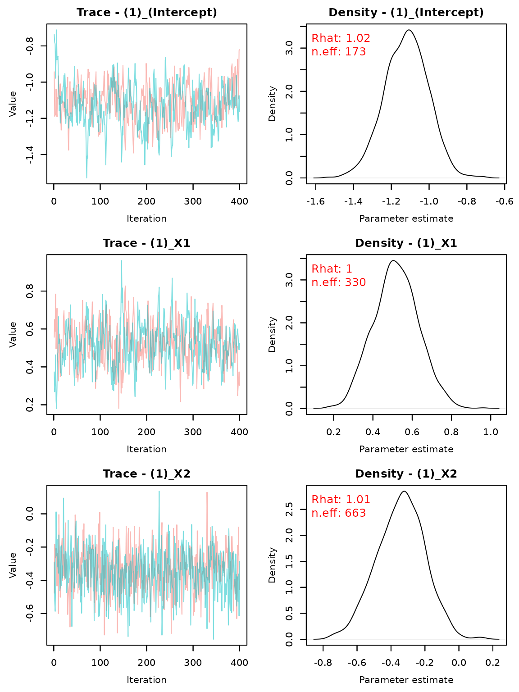

Without the quadratic term (`deg=1`):

``` r
set.seed(44)
fit.ameras.multinomial.lin <- ameras(Y="Y.multinomial", dosevars=dosevars, X=c("X1","X2"), data=data, 
                            family="multinomial", deg=1, doseRRmod = "EXP", 
                            methods=c("RC","ERC", "MCML", "FMA", "BMA"), niter.BMA = 5000, 
                            nburnin.BMA = 1000, CI=c("wald.orig","percentile"))
#> Note: BMA may require extensive computation time in the order of multiple hours
#> Fitting RC
#> Fitting ERC
#> Fitting MCML
#> Fitting FMA
#> Fitting BMA
#> Defining model
#> Building model
#> Setting data and initial values
#> Running calculate on model
#>   [Note] Any error reports that follow may simply reflect missing values in model variables.
#> Checking model sizes and dimensions
#>   [Note] This model is not fully initialized. This is not an error.
#>          To see which variables are not initialized, use model$initializeInfo().
#>          For more information on model initialization, see help(modelInitialization).
#> Compiling
#>   [Note] This may take a minute.
#>   [Note] Use 'showCompilerOutput = TRUE' to see C++ compilation details.
#> Compiling
#>   [Note] This may take a minute.
#>   [Note] Use 'showCompilerOutput = TRUE' to see C++ compilation details.
#> running chain 1...
#> |-------------|-------------|-------------|-------------|
#> |-------------------------------------------------------|
#> running chain 2...
#> |-------------|-------------|-------------|-------------|
#> |-------------------------------------------------------|
```

``` r
summary(fit.ameras.multinomial.lin)
#> Call:
#> ameras(data = data, family = "multinomial", Y = "Y.multinomial", 
#>     dosevars = dosevars, X = c("X1", "X2"), methods = c("RC", 
#>         "ERC", "MCML", "FMA", "BMA"), deg = 1, doseRRmod = "EXP", 
#>     CI = c("wald.orig", "percentile"), nburnin.BMA = 1000, niter.BMA = 5000)
#> 
#> Total run time: 350.6 seconds
#> 
#> Runtime in seconds by method:
#> 
#>  Method Runtime
#>      RC     1.0
#>     ERC   111.5
#>    MCML     6.1
#>     FMA     8.4
#>     BMA   223.6
#> 
#> Summary of coefficients by method:
#> 
#>  Method            Term Estimate      SE CI.lowerbound CI.upperbound Rhat
#>      RC (1)_(Intercept) -1.10156 0.10093      -1.29939      -0.90373   NA
#>      RC          (1)_X1  0.52203 0.10628       0.31372       0.73034   NA
#>      RC          (1)_X2 -0.34710 0.14929      -0.63971      -0.05448   NA
#>      RC        (1)_dose  0.45264 0.05805       0.33885       0.56643   NA
#>      RC (2)_(Intercept)  0.04417 0.07667      -0.10611       0.19445   NA
#>      RC          (2)_X1 -0.51312 0.08614      -0.68196      -0.34428   NA
#>      RC          (2)_X2  0.70793 0.10728       0.49767       0.91819   NA
#>      RC        (2)_dose  0.43049 0.05170       0.32915       0.53183   NA
#>     ERC (1)_(Intercept) -1.10285 0.10195      -1.30266      -0.90304   NA
#>     ERC          (1)_X1  0.52577 0.10650       0.31704       0.73451   NA
#>     ERC          (1)_X2 -0.35176 0.14953      -0.64483      -0.05868   NA
#>     ERC        (1)_dose  0.46441 0.06099       0.34486       0.58396   NA
#>     ERC (2)_(Intercept)  0.03947 0.07756      -0.11255       0.19148   NA
#>     ERC          (2)_X1 -0.51003 0.08634      -0.67926      -0.34081   NA
#>     ERC          (2)_X2  0.70435 0.10749       0.49368       0.91502   NA
#>     ERC        (2)_dose  0.44543 0.05364       0.34031       0.55056   NA
#>    MCML (1)_(Intercept) -1.09147 0.10115      -1.28972      -0.89322   NA
#>    MCML          (1)_X1  0.52239 0.10633       0.31398       0.73081   NA
#>    MCML          (1)_X2 -0.34934 0.14941      -0.64218      -0.05650   NA
#>    MCML        (1)_dose  0.44410 0.05912       0.32822       0.55998   NA
#>    MCML (2)_(Intercept)  0.05917 0.07624      -0.09027       0.20860   NA
#>    MCML          (2)_X1 -0.51290 0.08614      -0.68175      -0.34406   NA
#>    MCML          (2)_X2  0.70604 0.10735       0.49564       0.91645   NA
#>    MCML        (2)_dose  0.41753 0.05156       0.31647       0.51860   NA
#>     FMA (1)_(Intercept) -1.09114 0.10101      -1.28880      -0.89308   NA
#>     FMA          (1)_X1  0.52245 0.10612       0.31541       0.73147   NA
#>     FMA          (1)_X2 -0.34937 0.14960      -0.64255      -0.05564   NA
#>     FMA        (1)_dose  0.44381 0.05893       0.32835       0.56009   NA
#>     FMA (2)_(Intercept)  0.05869 0.07627      -0.09165       0.20799   NA
#>     FMA          (2)_X1 -0.51272 0.08608      -0.68150      -0.34349   NA
#>     FMA          (2)_X2  0.70611 0.10708       0.49662       0.91574   NA
#>     FMA        (2)_dose  0.41769 0.05137       0.31727       0.51840   NA
#>     BMA (1)_(Intercept) -1.09319 0.09280      -1.26893      -0.92000 1.00
#>     BMA          (1)_X1  0.52119 0.10307       0.32635       0.72192 1.02
#>     BMA          (1)_X2 -0.34994 0.15277      -0.63763      -0.04922 1.01
#>     BMA        (1)_dose  0.44801 0.05670       0.33765       0.56194 1.00
#>     BMA (2)_(Intercept)  0.05267 0.07548      -0.09026       0.19230 1.00
#>     BMA          (2)_X1 -0.51037 0.08339      -0.67078      -0.34844 1.01
#>     BMA          (2)_X2  0.70371 0.11185       0.49766       0.92805 1.01
#>     BMA        (2)_dose  0.42386 0.05084       0.32103       0.52702 1.00
#>   n.eff
#>      NA
#>      NA
#>      NA
#>      NA
#>      NA
#>      NA
#>      NA
#>      NA
#>      NA
#>      NA
#>      NA
#>      NA
#>      NA
#>      NA
#>      NA
#>      NA
#>      NA
#>      NA
#>      NA
#>      NA
#>      NA
#>      NA
#>      NA
#>      NA
#>      NA
#>      NA
#>      NA
#>      NA
#>      NA
#>      NA
#>      NA
#>      NA
#>  245.00
#>  390.00
#>  447.00
#>  254.00
#>  324.00
#>  373.00
#>  650.00
#>  313.00
```

``` r
coef(fit.ameras.multinomial.lin)
#>                          RC         ERC        MCML         FMA         BMA
#> (1)_(Intercept) -1.10156112 -1.10285018 -1.09147154 -1.09114142 -1.09318983
#> (1)_X1           0.52203186  0.52577389  0.52239330  0.52245186  0.52118788
#> (1)_X2          -0.34709866 -0.35175606 -0.34933932 -0.34937267 -0.34993934
#> (1)_dose         0.45263847  0.46441427  0.44410129  0.44380519  0.44801466
#> (2)_(Intercept)  0.04416972  0.03946571  0.05916562  0.05869433  0.05266985
#> (2)_X1          -0.51311892 -0.51003494 -0.51290413 -0.51271584 -0.51036888
#> (2)_X2           0.70793136  0.70434790  0.70604308  0.70611143  0.70370686
#> (2)_dose         0.43049029  0.44543353  0.41753398  0.41768779  0.42386430
```

``` r
traceplot(fit.ameras.multinomial.lin)
```

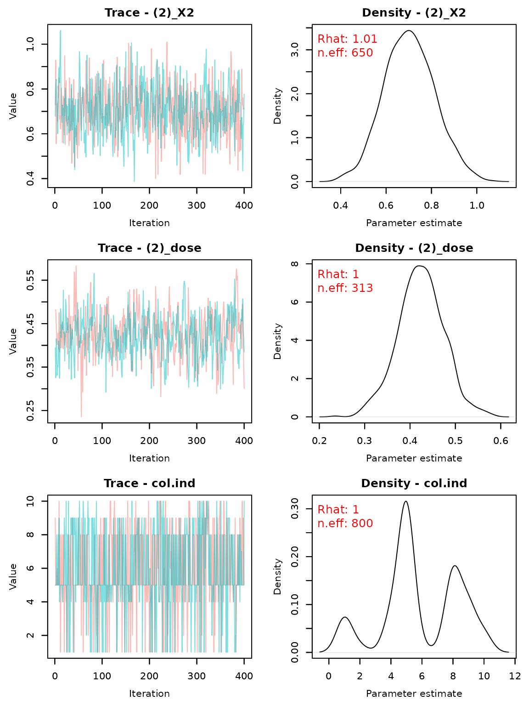

## Conditional logistic regression

Again, we first fit models including a quadratic exposure term by
setting `deg=2`.

``` r
set.seed(3301)
fit.ameras.clogit <- ameras(Y="Y.clogit", dosevars=dosevars, X=c("X1","X2"), data=data, 
                            family="clogit", deg=2, doseRRmod = "EXP", setnr="setnr",
                            methods=c("RC", "ERC", "MCML", "FMA", "BMA"), niter.BMA = 5000, 
                            nburnin.BMA = 1000, CI=c("wald.orig","percentile"))
#> Note: BMA may require extensive computation time in the order of multiple hours
#> Fitting RC
#> Fitting ERC
#> Fitting MCML
#> Fitting FMA
#> Fitting BMA
#> Defining model
#> Building model
#> Setting data and initial values
#> Running calculate on model
#>   [Note] Any error reports that follow may simply reflect missing values in model variables.
#> Checking model sizes and dimensions
#>   [Note] This model is not fully initialized. This is not an error.
#>          To see which variables are not initialized, use model$initializeInfo().
#>          For more information on model initialization, see help(modelInitialization).
#> Compiling
#>   [Note] This may take a minute.
#>   [Note] Use 'showCompilerOutput = TRUE' to see C++ compilation details.
#> Compiling
#>   [Note] This may take a minute.
#>   [Note] Use 'showCompilerOutput = TRUE' to see C++ compilation details.
#> running chain 1...
#> |-------------|-------------|-------------|-------------|
#> |-------------------------------------------------------|
#> running chain 2...
#> |-------------|-------------|-------------|-------------|
#> |-------------------------------------------------------|
```

``` r
summary(fit.ameras.clogit)
#> Call:
#> ameras(data = data, family = "clogit", Y = "Y.clogit", dosevars = dosevars, 
#>     X = c("X1", "X2"), setnr = "setnr", methods = c("RC", "ERC", 
#>         "MCML", "FMA", "BMA"), deg = 2, doseRRmod = "EXP", CI = c("wald.orig", 
#>         "percentile"), nburnin.BMA = 1000, niter.BMA = 5000)
#> 
#> Total run time: 696.8 seconds
#> 
#> Runtime in seconds by method:
#> 
#>  Method Runtime
#>      RC     0.5
#>     ERC   618.4
#>    MCML     1.8
#>     FMA     6.4
#>     BMA    69.7
#> 
#> Summary of coefficients by method:
#> 
#>  Method         Term Estimate      SE CI.lowerbound CI.upperbound Rhat  n.eff
#>      RC           X1  0.54553 0.08896       0.37116      0.719888   NA     NA
#>      RC           X2 -0.53392 0.11711      -0.76345     -0.304387   NA     NA
#>      RC         dose  0.68029 0.10131       0.48173      0.878856   NA     NA
#>      RC dose_squared -0.05146 0.02242      -0.09540     -0.007522   NA     NA
#>     ERC           X1  0.61917 0.09205       0.43876      0.799584   NA     NA
#>     ERC           X2 -0.51784 0.11993      -0.75291     -0.282781   NA     NA
#>     ERC         dose  0.35155 0.08030       0.19416      0.508940   NA     NA
#>     ERC dose_squared  0.03687 0.01013       0.01701      0.056735   NA     NA
#>    MCML           X1  0.55083 0.08923       0.37594      0.725708   NA     NA
#>    MCML           X2 -0.53547 0.11712      -0.76502     -0.305906   NA     NA
#>    MCML         dose  0.69334 0.09315       0.51077      0.875908   NA     NA
#>    MCML dose_squared -0.05581 0.01950      -0.09404     -0.017584   NA     NA
#>     FMA           X1  0.55052 0.08917       0.37652      0.724765   NA     NA
#>     FMA           X2 -0.53471 0.11713      -0.76341     -0.306357   NA     NA
#>     FMA         dose  0.69461 0.09617       0.50415      0.883034   NA     NA
#>     FMA dose_squared -0.05610 0.02045      -0.09714     -0.016029   NA     NA
#>     BMA           X1  0.54909 0.09212       0.37679      0.736473 1.00 800.00
#>     BMA           X2 -0.53845 0.12233      -0.78635     -0.299339 1.00 800.00
#>     BMA         dose  0.70058 0.10236       0.48129      0.898905 1.00 154.00
#>     BMA dose_squared -0.05764 0.02212      -0.10209     -0.013441 1.00 131.00
```

``` r
coef(fit.ameras.clogit)
#>                       RC         ERC        MCML         FMA         BMA
#> X1            0.54552627  0.61917374  0.55082666  0.55052070  0.54908986
#> X2           -0.53391889 -0.51784345 -0.53546549 -0.53471237 -0.53844738
#> dose          0.68029437  0.35155174  0.69333718  0.69461086  0.70058151
#> dose_squared -0.05145934  0.03687427 -0.05581249 -0.05609925 -0.05764133
```

``` r
traceplot(fit.ameras.clogit)
```


Without the quadratic term (`deg=1`):

``` r
set.seed(4401)
fit.ameras.clogit.lin <- ameras(Y="Y.clogit", dosevars=dosevars, X=c("X1","X2"), data=data, 
                            family="clogit", deg=1, doseRRmod = "EXP", setnr="setnr",
                            methods=c("RC","ERC", "MCML", "FMA", "BMA"), niter.BMA = 5000, 
                            nburnin.BMA = 1000, CI=c("wald.orig","percentile"))
#> Note: BMA may require extensive computation time in the order of multiple hours
#> Fitting RC
#> Fitting ERC
#> Warning in ameras.rc(family = family, dosevars = dosevars, data = data, :
#> WARNING: Hessian was not invertible or inverse was not positive definite,
#> variance matrix could not be obtained
#> Fitting MCML
#> Fitting FMA
#> Fitting BMA
#> Defining model
#> Building model
#> Setting data and initial values
#> Running calculate on model
#>   [Note] Any error reports that follow may simply reflect missing values in model variables.
#> Checking model sizes and dimensions
#>   [Note] This model is not fully initialized. This is not an error.
#>          To see which variables are not initialized, use model$initializeInfo().
#>          For more information on model initialization, see help(modelInitialization).
#> Compiling
#>   [Note] This may take a minute.
#>   [Note] Use 'showCompilerOutput = TRUE' to see C++ compilation details.
#> Compiling
#>   [Note] This may take a minute.
#>   [Note] Use 'showCompilerOutput = TRUE' to see C++ compilation details.
#> running chain 1...
#> |-------------|-------------|-------------|-------------|
#> |-------------------------------------------------------|
#> running chain 2...
#> |-------------|-------------|-------------|-------------|
#> |-------------------------------------------------------|
```

``` r
summary(fit.ameras.clogit.lin)
#> Call:
#> ameras(data = data, family = "clogit", Y = "Y.clogit", dosevars = dosevars, 
#>     X = c("X1", "X2"), setnr = "setnr", methods = c("RC", "ERC", 
#>         "MCML", "FMA", "BMA"), deg = 1, doseRRmod = "EXP", CI = c("wald.orig", 
#>         "percentile"), nburnin.BMA = 1000, niter.BMA = 5000)
#> 
#> Total run time: 345.5 seconds
#> 
#> Runtime in seconds by method:
#> 
#>  Method Runtime
#>      RC     0.3
#>     ERC   279.3
#>    MCML     0.7
#>     FMA     3.1
#>     BMA    62.1
#> 
#> Summary of coefficients by method:
#> 
#>  Method Term Estimate      SE CI.lowerbound CI.upperbound Rhat  n.eff
#>      RC   X1   0.5463 0.08890        0.3721        0.7206   NA     NA
#>      RC   X2  -0.5231 0.11692       -0.7522       -0.2939   NA     NA
#>      RC dose   0.4725 0.04268        0.3888        0.5562   NA     NA
#>     ERC   X1   0.6405      NA            NA            NA   NA     NA
#>     ERC   X2  -0.4907      NA            NA            NA   NA     NA
#>     ERC dose   0.3430      NA            NA            NA   NA     NA
#>    MCML   X1   0.5514 0.08905        0.3769        0.7259   NA     NA
#>    MCML   X2  -0.5191 0.11710       -0.7486       -0.2896   NA     NA
#>    MCML dose   0.4575 0.04293        0.3734        0.5417   NA     NA
#>     FMA   X1   0.5515 0.08918        0.3764        0.7257   NA     NA
#>     FMA   X2  -0.5186 0.11723       -0.7487       -0.2885   NA     NA
#>     FMA dose   0.4578 0.04287        0.3745        0.5421   NA     NA
#>     BMA   X1   0.5468 0.08828        0.3823        0.7188 1.00 806.00
#>     BMA   X2  -0.5265 0.11725       -0.7787       -0.3116 1.00 907.00
#>     BMA dose   0.4578 0.04323        0.3715        0.5430 1.00 549.00
```

``` r
coef(fit.ameras.clogit.lin)
#>              RC        ERC       MCML        FMA        BMA
#> X1    0.5463374  0.6405011  0.5514108  0.5515131  0.5467938
#> X2   -0.5230641 -0.4906780 -0.5190952 -0.5186443 -0.5265150
#> dose  0.4724948  0.3429971  0.4575164  0.4578075  0.4577984
```

``` r
traceplot(fit.ameras.clogit.lin)
```

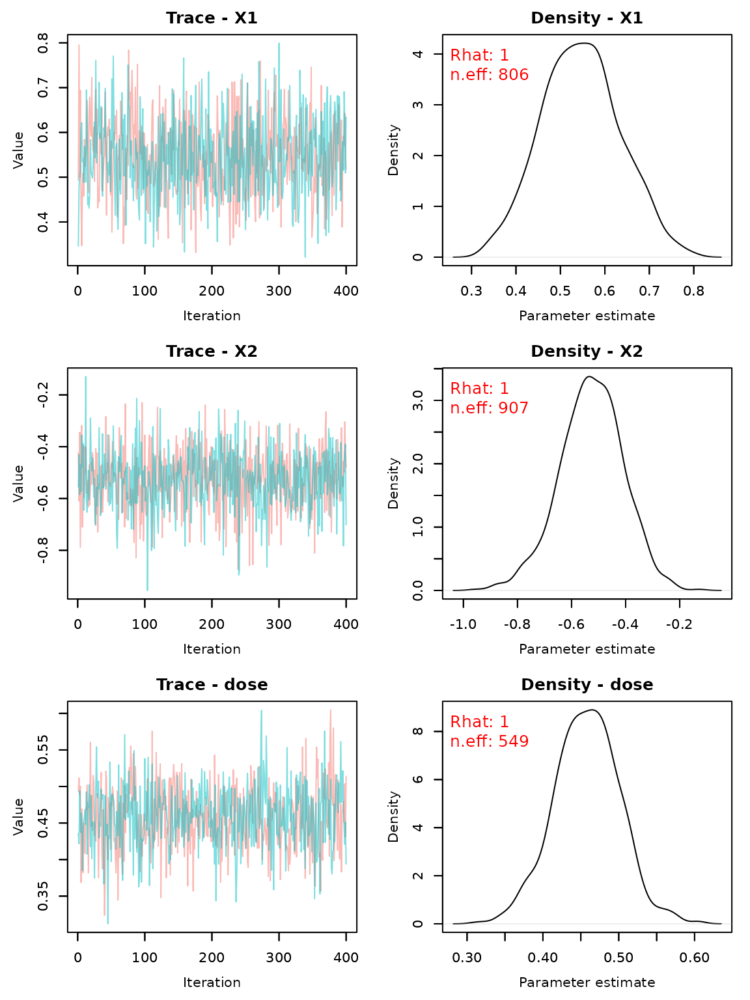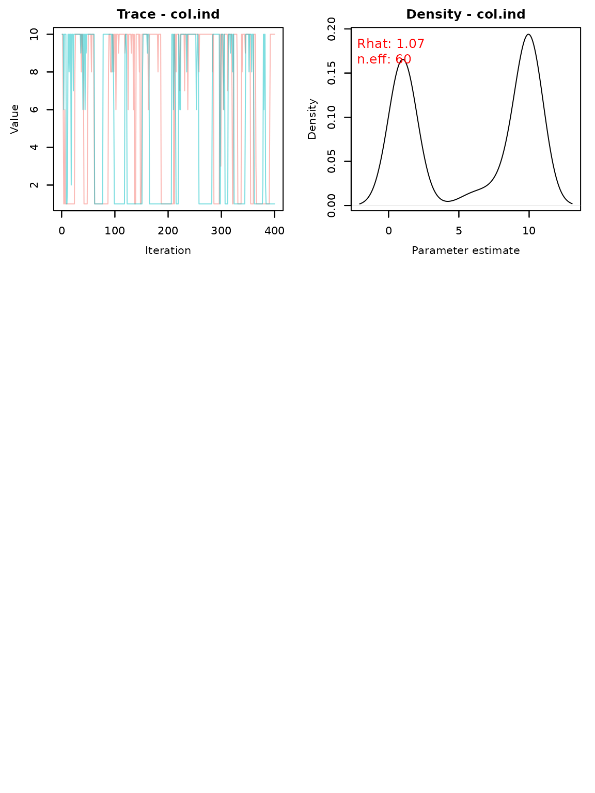
