# Fitting models and displaying output

``` r
  library(ameras)
#> Loading required package: nimble
#> nimble version 1.4.2 is loaded.
#> For more information on NIMBLE and a User Manual,
#> please visit https://R-nimble.org.
#> 
#> Attaching package: 'nimble'
#> The following object is masked from 'package:stats':
#> 
#>     simulate
#> The following object is masked from 'package:base':
#> 
#>     declare
```

## Introduction

All functionality of the package is included in the function `ameras`.
This vignette demonstrates the basic functionality and the generated
output.

### Model specification

Models are specified through formulas. The data should contain the
exposure replicates in an uninterrupted series of columns with
sequential names, such as `D1, D2, ..., D1000`. Then the model is
specified with formulas such as
`Y~dose(D1:D1000, deg=2, modifier=M1+M2, model="ERR")+X1+X2`. Here the
terms `M1` and `M2` are binary effect modifiers, and the specified model
is a linear-quadratic (since `deg=2`) excess relative risk model. The
other covariates are `X1` and `X2`. When `deg`, `modifier`, and `model`
are not supplied, the defaults are `deg=1`, no effect modifiers, and
`model="ERR"`.

### Example data

The included example dataset contains 3,000 individuals with 10 exposure
replicates `V1`-`V10`, binary covariates `X1` and `X2` and effect
modifiers `M1` and `M2`, and outcomes of all types (`Y.gaussian`,
`Y.binomial`, `Y.poisson`, `status`, `time`, `Y.multinomial`,
`Y.clogit`, and `setnr`).

``` r
data(data, package="ameras")
head(data)
#>    Y.gaussian Y.binomial Y.poisson       time status setnr Y.clogit
#> 1 -0.32647093          0         0 0.30276565      0     1        0
#> 2 -0.18734036          1         0 0.19735142      1     1        1
#> 3  0.08404044          0         2 0.30276565      0     1        0
#> 4  0.22432504          0         0 0.23602584      1     1        0
#> 5 -0.46317255          0         0 0.30276565      0     2        0
#> 6 -1.41036573          0         0 0.07838133      1     2        0
#>   Y.multinomial X1 X2 M1 M2         V1         V2         V3         V4
#> 1             3  0  0  0  1 0.42868043 0.61542487 0.41960219 0.49265549
#> 2             2  1  0  1  0 0.73321154 0.35512449 0.41876478 0.49235658
#> 3             2  0  0  1  0 0.70369712 0.43407408 1.04115924 0.79882088
#> 4             3  0  0  1  0 0.01845324 0.01373367 0.02733303 0.01912686
#> 5             3  1  0  0  0 0.39389441 0.40087181 0.61932032 0.51715526
#> 6             2  1  1  1  0 0.01493158 0.02335143 0.01828983 0.02705350
#>           V5         V6         V7         V8         V9        V10
#> 1 0.31363762 0.42218455 0.42464021 0.29630858 0.38211182 0.45751570
#> 2 0.49515815 0.56837639 0.61126842 0.67723449 0.53361810 0.49393510
#> 3 0.66613754 0.72346942 0.64077434 0.79894534 0.98278177 1.06068250
#> 4 0.01917956 0.03056413 0.01536966 0.02135999 0.01548655 0.01596626
#> 5 0.36440322 0.60255525 0.47512525 0.52567606 0.53391825 0.56026531
#> 6 0.02298922 0.02399258 0.01890339 0.02094013 0.02303085 0.02091743
```

## Linear regression & displaying output

Now we fit all methods to the data through one function call:

``` r
set.seed(12345)
fit.ameras.linreg <- ameras(Y.gaussian~dose(V1:V10)+X1+X2, data=data, 
                            family="gaussian", niter.BMA=5000, nburnin.BMA=1000,
                            methods=c("RC", "ERC", "MCML", "FMA", "BMA"))
#> Note: BMA may require extensive computation time
#> Fitting RC
#> Fitting ERC
#> Fitting MCML
#> Fitting FMA
#> Fitting BMA
#> Defining model
#> Building model
#> Setting data and initial values
#> Running calculate on model
#>   [Note] Any error reports that follow may simply reflect missing values in model variables.
#> Checking model sizes and dimensions
#>   [Note] This model is not fully initialized. This is not an error.
#>          To see which variables are not initialized, use model$initializeInfo().
#>          For more information on model initialization, see help(modelInitialization).
#> Compiling
#>   [Note] This may take a minute.
#>   [Note] Use 'showCompilerOutput = TRUE' to see C++ compilation details.
#> Compiling
#>   [Note] This may take a minute.
#>   [Note] Use 'showCompilerOutput = TRUE' to see C++ compilation details.
#> running chain 1...
#> |-------------|-------------|-------------|-------------|
#> |-------------------------------------------------------|
#> running chain 2...
#> |-------------|-------------|-------------|-------------|
#> |-------------------------------------------------------|
```

The output is a list object with a `call` component, and one component
for each method, each being a list:

``` r
str(fit.ameras.linreg)
#> List of 14
#>  $ call              : language ameras(formula = Y.gaussian ~ dose(V1:V10) + X1 + X2, data = data, family = "gaussian",      methods = c("RC", "E| __truncated__ ...
#>  $ formula           :Class 'formula'  language Y.gaussian ~ dose(V1:V10) + X1 + X2
#>   .. ..- attr(*, ".Environment")=<environment: R_GlobalEnv> 
#>  $ num.rows          : int 3000
#>  $ num.replicates    : int 10
#>  $ transform         :function (params, boundcheck = FALSE, ...)  
#>  $ transform.jacobian:function (params, ...)  
#>  $ other.args        : list()
#>  $ model             :List of 18
#>   ..$ data        :'data.frame': 3000 obs. of  23 variables:
#>   .. ..$ Y.gaussian   : num [1:3000] -0.326 -0.187 0.084 0.224 -0.463 ...
#>   .. ..$ Y.binomial   : int [1:3000] 0 1 0 0 0 0 1 0 0 0 ...
#>   .. ..$ Y.poisson    : int [1:3000] 0 0 2 0 0 0 4 1 0 0 ...
#>   .. ..$ time         : num [1:3000] 0.303 0.197 0.303 0.236 0.303 ...
#>   .. ..$ status       : num [1:3000] 0 1 0 1 0 1 0 0 1 0 ...
#>   .. ..$ setnr        : int [1:3000] 1 1 1 1 2 2 2 2 3 3 ...
#>   .. ..$ Y.clogit     : num [1:3000] 0 1 0 0 0 0 1 0 0 1 ...
#>   .. ..$ Y.multinomial: Factor w/ 3 levels "1","2","3": 3 2 2 3 3 2 1 3 1 1 ...
#>   .. ..$ X1           : int [1:3000] 0 1 0 0 1 1 0 0 1 1 ...
#>   .. ..$ X2           : int [1:3000] 0 0 0 0 0 1 0 0 0 0 ...
#>   .. ..$ M1           : int [1:3000] 0 1 1 1 0 1 0 1 1 0 ...
#>   .. ..$ M2           : int [1:3000] 1 0 0 0 0 0 1 0 0 0 ...
#>   .. ..$ V1           : num [1:3000] 0.4287 0.7332 0.7037 0.0185 0.3939 ...
#>   .. ..$ V2           : num [1:3000] 0.6154 0.3551 0.4341 0.0137 0.4009 ...
#>   .. ..$ V3           : num [1:3000] 0.4196 0.4188 1.0412 0.0273 0.6193 ...
#>   .. ..$ V4           : num [1:3000] 0.4927 0.4924 0.7988 0.0191 0.5172 ...
#>   .. ..$ V5           : num [1:3000] 0.3136 0.4952 0.6661 0.0192 0.3644 ...
#>   .. ..$ V6           : num [1:3000] 0.4222 0.5684 0.7235 0.0306 0.6026 ...
#>   .. ..$ V7           : num [1:3000] 0.4246 0.6113 0.6408 0.0154 0.4751 ...
#>   .. ..$ V8           : num [1:3000] 0.2963 0.6772 0.7989 0.0214 0.5257 ...
#>   .. ..$ V9           : num [1:3000] 0.3821 0.5336 0.9828 0.0155 0.5339 ...
#>   .. ..$ V10          : num [1:3000] 0.458 0.494 1.061 0.016 0.56 ...
#>   .. ..$ rcdose_ameras: num [1:3000] 0.4253 0.5379 0.7851 0.0197 0.4993 ...
#>   ..$ keep.data   : logi TRUE
#>   ..$ family      : chr "gaussian"
#>   ..$ dosevars    : chr [1:10] "V1" "V2" "V3" "V4" ...
#>   ..$ Y           : chr "Y.gaussian"
#>   ..$ M           : NULL
#>   ..$ X_formula   :Class 'formula'  language ~X1 + X2
#>   .. .. ..- attr(*, ".Environment")=<environment: 0x55c345c0fdc0> 
#>   ..$ X           : int [1:2] 9 10
#>   ..$ offset      : NULL
#>   ..$ entry       : NULL
#>   ..$ exit        : NULL
#>   ..$ status      : NULL
#>   ..$ setnr       : NULL
#>   ..$ deg         : num 1
#>   ..$ doseRRmod   : chr "ERR"
#>   ..$ loglim      : num 1e-30
#>   ..$ optim.method: chr "Nelder-Mead"
#>   ..$ control     : NULL
#>  $ CI.computed       : logi FALSE
#>  $ RC                :List of 7
#>   ..$ coefficients: Named num [1:5] -1.362 0.481 -0.519 1.166 1.108
#>   .. ..- attr(*, "names")= chr [1:5] "(Intercept)" "X1" "X2" "dose" ...
#>   ..$ sd          : Named num [1:5] 0.0367 0.0405 0.0497 0.0204 0.0143
#>   .. ..- attr(*, "names")= chr [1:5] "(Intercept)" "X1" "X2" "dose" ...
#>   ..$ vcov        : num [1:5, 1:5] 1.34e-03 -8.36e-04 -4.86e-04 -4.15e-04 1.55e-09 ...
#>   .. ..- attr(*, "dimnames")=List of 2
#>   .. .. ..$ : chr [1:5] "(Intercept)" "X1" "X2" "dose" ...
#>   .. .. ..$ : chr [1:5] "(Intercept)" "X1" "X2" "dose" ...
#>   ..$ optim       :List of 4
#>   .. ..$ par        : num [1:5] -1.362 0.481 -0.519 1.166 0.102
#>   .. ..$ hessian    : num [1:5, 1:5] 2.45e+03 1.23e+03 5.12e+02 2.43e+03 2.15e-03 ...
#>   .. ..$ convergence: int 0
#>   .. ..$ counts     : Named num [1:2] 509 1
#>   .. .. ..- attr(*, "names")= chr [1:2] "function" "gradient"
#>   ..$ loglik      : num -4563
#>   ..$ runtime     : chr "0.2 seconds"
#>   ..$ ERC         : logi FALSE
#>  $ ERC               :List of 7
#>   ..$ coefficients: Named num [1:5] -1.361 0.48 -0.519 1.165 1.106
#>   .. ..- attr(*, "names")= chr [1:5] "(Intercept)" "X1" "X2" "dose" ...
#>   ..$ sd          : Named num [1:5] 0.0366 0.0404 0.0497 0.0204 0.0142
#>   .. ..- attr(*, "names")= chr [1:5] "(Intercept)" "X1" "X2" "dose" ...
#>   ..$ vcov        : num [1:5, 1:5] 1.34e-03 -8.34e-04 -4.85e-04 -4.14e-04 1.53e-06 ...
#>   .. ..- attr(*, "dimnames")=List of 2
#>   .. .. ..$ : chr [1:5] "(Intercept)" "X1" "X2" "dose" ...
#>   .. .. ..$ : chr [1:5] "(Intercept)" "X1" "X2" "dose" ...
#>   ..$ optim       :List of 4
#>   .. ..$ par        : num [1:5] -1.361 0.48 -0.519 1.165 0.101
#>   .. ..$ hessian    : num [1:5, 1:5] 2448.9 1232.8 513.4 2428.2 7.1 ...
#>   .. ..$ convergence: int 0
#>   .. ..$ counts     : Named num [1:2] 546 9
#>   .. .. ..- attr(*, "names")= chr [1:2] "function" "gradient"
#>   ..$ loglik      : num -4559
#>   ..$ runtime     : chr "124.8 seconds"
#>   ..$ ERC         : logi TRUE
#>  $ MCML              :List of 6
#>   ..$ coefficients: Named num [1:5] -1.28 0.484 -0.517 1.079 1.138
#>   .. ..- attr(*, "names")= chr [1:5] "(Intercept)" "X1" "X2" "dose" ...
#>   ..$ sd          : Named num [1:5] 0.0371 0.0416 0.0511 0.0199 0.0147
#>   .. ..- attr(*, "names")= chr [1:5] "(Intercept)" "X1" "X2" "dose" ...
#>   ..$ vcov        : num [1:5, 1:5] 1.38e-03 -8.83e-04 -5.14e-04 -3.98e-04 -1.91e-08 ...
#>   .. ..- attr(*, "dimnames")=List of 2
#>   .. .. ..$ : chr [1:5] "(Intercept)" "X1" "X2" "dose" ...
#>   .. .. ..$ : chr [1:5] "(Intercept)" "X1" "X2" "dose" ...
#>   ..$ optim       :List of 4
#>   .. ..$ par        : num [1:5] -1.28 0.484 -0.517 1.079 0.129
#>   .. ..$ hessian    : num [1:5, 1:5] 2316.337 1165.788 484.911 2300.887 -0.322 ...
#>   .. ..$ convergence: int 0
#>   .. ..$ counts     : Named num [1:2] 555 7
#>   .. .. ..- attr(*, "names")= chr [1:2] "function" "gradient"
#>   ..$ loglik      : num -4646
#>   ..$ runtime     : chr "0.7 seconds"
#>  $ FMA               :List of 6
#>   ..$ coefficients       : Named num [1:5] -1.28 0.484 -0.517 1.079 1.138
#>   .. ..- attr(*, "names")= chr [1:5] "(Intercept)" "X1" "X2" "dose" ...
#>   ..$ sd                 : Named num [1:5] 0.0373 0.0418 0.0512 0.0202 0.0147
#>   .. ..- attr(*, "names")= chr [1:5] "(Intercept)" "X1" "X2" "dose" ...
#>   ..$ included.replicates: int [1:10] 1 2 3 4 5 6 7 8 9 10
#>   ..$ included.samples   : int 100006
#>   ..$ samples            :'data.frame':  100006 obs. of  5 variables:
#>   .. ..$ (Intercept): num [1:100006] -1.27 -1.32 -1.32 -1.26 -1.24 ...
#>   .. ..$ X1         : num [1:100006] 0.516 0.511 0.534 0.415 0.509 ...
#>   .. ..$ X2         : num [1:100006] -0.525 -0.535 -0.49 -0.529 -0.538 ...
#>   .. ..$ dose       : num [1:100006] 1.08 1.09 1.1 1.11 1.03 ...
#>   .. ..$ sigma      : num [1:100006] 1.17 1.14 1.13 1.15 1.12 ...
#>   ..$ runtime            : chr "1.3 seconds"
#>  $ BMA               :List of 6
#>   ..$ coefficients       : Named num [1:5] -1.28 0.483 -0.517 1.079 1.139
#>   .. ..- attr(*, "names")= chr [1:5] "(Intercept)" "X1" "X2" "dose" ...
#>   ..$ sd                 : Named num [1:5] 0.038 0.0424 0.0525 0.0202 0.015
#>   .. ..- attr(*, "names")= chr [1:5] "(Intercept)" "X1" "X2" "dose" ...
#>   ..$ Rhat               :'data.frame':  5 obs. of  2 variables:
#>   .. ..$ Rhat : num [1:5] 1 1.01 1 1 1.02
#>   .. ..$ n.eff: num [1:5] 871 822 800 800 744
#>   ..$ samples            :List of 2
#>   .. ..$ chain1: num [1:400, 1:6] -1.32 -1.27 -1.33 -1.29 -1.33 ...
#>   .. .. ..- attr(*, "dimnames")=List of 2
#>   .. .. .. ..$ : NULL
#>   .. .. .. ..$ : chr [1:6] "(Intercept)" "X1" "X2" "dose" ...
#>   .. ..$ chain2: num [1:400, 1:6] -1.3 -1.29 -1.23 -1.3 -1.26 ...
#>   .. .. ..- attr(*, "dimnames")=List of 2
#>   .. .. .. ..$ : NULL
#>   .. .. .. ..$ : chr [1:6] "(Intercept)" "X1" "X2" "dose" ...
#>   ..$ included.replicates: int [1:10] 1 2 3 4 5 6 7 8 9 10
#>   ..$ runtime            : chr "74.9 seconds"
#>  - attr(*, "class")= chr "amerasfit"
```

Access the results for e.g. regression calibration as follows:

``` r
fit.ameras.linreg$RC
#> $coefficients
#> (Intercept)          X1          X2        dose       sigma 
#>  -1.3622239   0.4807463  -0.5187877   1.1660368   1.1075696 
#> 
#> $sd
#> (Intercept)          X1          X2        dose       sigma 
#>  0.03665711  0.04045137  0.04971981  0.02039612  0.01429864 
#> 
#> $vcov
#>               (Intercept)            X1            X2          dose
#> (Intercept)  1.343744e-03 -8.358763e-04 -4.863064e-04 -4.154402e-04
#> X1          -8.358763e-04  1.636314e-03 -1.376614e-05  1.526165e-05
#> X2          -4.863064e-04 -1.376614e-05  2.472060e-03 -2.443289e-05
#> dose        -4.154402e-04  1.526165e-05 -2.443289e-05  4.160019e-04
#> sigma        1.547510e-09 -1.113334e-08  8.801421e-09  2.066810e-09
#>                     sigma
#> (Intercept)  1.547510e-09
#> X1          -1.113334e-08
#> X2           8.801421e-09
#> dose         2.066810e-09
#> sigma        2.044510e-04
#> 
#> $optim
#> $optim$par
#> [1] -1.3622239  0.4807463 -0.5187877  1.1660368  0.1021681
#> 
#> $optim$hessian
#>              [,1]         [,2]        [,3]          [,4]          [,5]
#> [1,] 2.445565e+03 1.230934e+03 511.9382502 2427.17149144  2.153852e-03
#> [2,] 1.230934e+03 1.230934e+03 260.8602549 1199.43455144  3.805417e-02
#> [3,] 5.119383e+02 2.608603e+02 511.9382503  531.74442357 -1.892140e-02
#> [4,] 2.427171e+03 1.199435e+03 531.7444236 4814.95714494 -2.727097e-02
#> [5,] 2.153852e-03 3.805417e-02  -0.0189214   -0.02727097  6.000020e+03
#> 
#> $optim$convergence
#> [1] 0
#> 
#> $optim$counts
#> function gradient 
#>      509        1 
#> 
#> 
#> $loglik
#> [1] -4563.325
#> 
#> $runtime
#> [1] "0.2 seconds"
#> 
#> $ERC
#> [1] FALSE
```

For a summary of results, use `summary` (note that `Rhat` and `n.eff`
only apply to BMA results):

``` r
summary(fit.ameras.linreg)
#> Call:
#> ameras(formula = Y.gaussian ~ dose(V1:V10) + X1 + X2, data = data, 
#>     family = "gaussian", methods = c("RC", "ERC", "MCML", "FMA", 
#>         "BMA"), nburnin.BMA = 1000, niter.BMA = 5000)
#> 
#> Total run time: 201.9 seconds
#> 
#> Runtime in seconds by method:
#> 
#>  Method Runtime
#>      RC     0.2
#>     ERC   124.8
#>    MCML     0.7
#>     FMA     1.3
#>     BMA    74.9
#> 
#> Summary of coefficients by method:
#> 
#> data frame with 0 columns and 25 rows
#> 
#> Note: confidence intervals not yet computed. Use confint() to add them.
```

To extract model coefficients and compare between methods, use `coef`:

``` r
coef(fit.ameras.linreg)
#>                     RC        ERC       MCML        FMA        BMA
#> (Intercept) -1.3622239 -1.3610557 -1.2802532 -1.2803273 -1.2796163
#> X1           0.4807463  0.4795308  0.4836506  0.4836869  0.4830670
#> X2          -0.5187877 -0.5188299 -0.5171452 -0.5173188 -0.5169488
#> dose         1.1660368  1.1649227  1.0790214  1.0791951  1.0787855
#> sigma        1.1075696  1.1062486  1.1377732  1.1377321  1.1391166
```

To produce traceplots and density plots for BMA results, use
`traceplot`:

``` r
traceplot(fit.ameras.linreg)
```

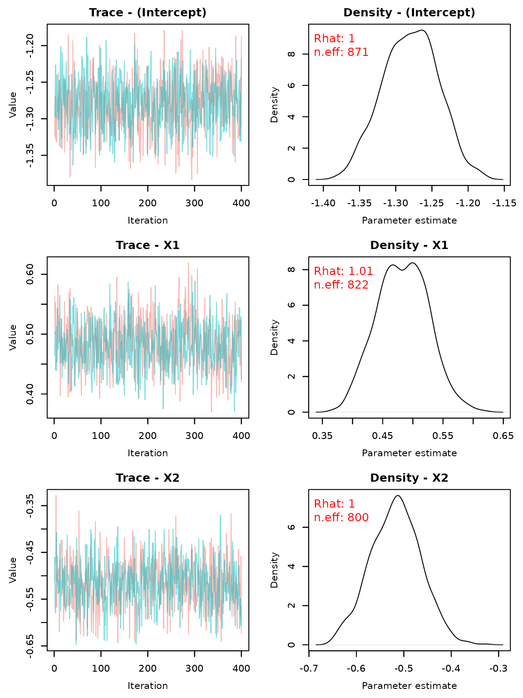

## Logistic regression

To fit a logistic regression model, the syntax is very similar. However,
`ameras` offers three functional forms for modeling the exposure-outcome
relationship. Here, we will illustrate the standard exponential
relationship `model="EXP"`. For more information, see the vignette
[Relative risk
models](https://ameras.sanderroberti.com/articles/relativeriskmodels.md).

First, we fit models including a quadratic exposure term by setting
`deg=2`.

``` r
set.seed(33521)
fit.ameras.logreg <- ameras(Y.binomial~dose(V1:V10, deg=2, model="EXP")+X1+X2, 
                            data=data, family="binomial", 
                            methods=c("RC", "ERC", "MCML", "FMA", "BMA"), 
                            niter.BMA = 5000, nburnin.BMA = 1000)
#> Note: BMA may require extensive computation time
#> Fitting RC
#> Fitting ERC
#> Fitting MCML
#> Fitting FMA
#> Fitting BMA
#> Defining model
#> Building model
#> Setting data and initial values
#> Running calculate on model
#>   [Note] Any error reports that follow may simply reflect missing values in model variables.
#> Checking model sizes and dimensions
#>   [Note] This model is not fully initialized. This is not an error.
#>          To see which variables are not initialized, use model$initializeInfo().
#>          For more information on model initialization, see help(modelInitialization).
#> Compiling
#>   [Note] This may take a minute.
#>   [Note] Use 'showCompilerOutput = TRUE' to see C++ compilation details.
#> Compiling
#>   [Note] This may take a minute.
#>   [Note] Use 'showCompilerOutput = TRUE' to see C++ compilation details.
#> running chain 1...
#> |-------------|-------------|-------------|-------------|
#> |-------------------------------------------------------|
#> running chain 2...
#> |-------------|-------------|-------------|-------------|
#> |-------------------------------------------------------|
#> Warning in ameras.bma(family = family, dosevars = dosevars, data = data, :
#> WARNING: Potential problems with MCMC convergence, consider using longer chains
```

``` r
summary(fit.ameras.logreg)
#> Call:
#> ameras(formula = Y.binomial ~ dose(V1:V10, deg = 2, model = "EXP") + 
#>     X1 + X2, data = data, family = "binomial", methods = c("RC", 
#>     "ERC", "MCML", "FMA", "BMA"), nburnin.BMA = 1000, niter.BMA = 5000)
#> 
#> Total run time: 141 seconds
#> 
#> Runtime in seconds by method:
#> 
#>  Method Runtime
#>      RC     0.3
#>     ERC    79.1
#>    MCML     1.0
#>     FMA     2.8
#>     BMA    57.8
#> 
#> Summary of coefficients by method:
#> 
#> data frame with 0 columns and 25 rows
#> 
#> Note: confidence intervals not yet computed. Use confint() to add them.
```

``` r
coef(fit.ameras.logreg)
#>                       RC         ERC        MCML         FMA         BMA
#> (Intercept)  -0.94461327 -0.93188863 -0.91146831 -0.91243544 -0.90778810
#> X1            0.44552273  0.44997904  0.44619209  0.44619391  0.44552058
#> X2           -0.33375991 -0.33923955 -0.34430935 -0.34400234 -0.34360534
#> dose          0.37904346  0.33857980  0.31654277  0.31870705  0.30657532
#> dose_squared  0.01943381  0.03528262  0.03799845  0.03735107  0.04134337
```

``` r
traceplot(fit.ameras.logreg)
```

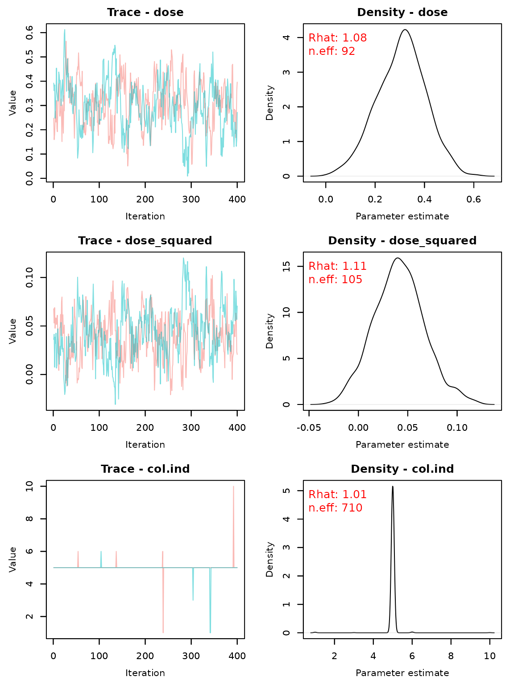

Without the quadratic term (`deg=1`):

``` r
set.seed(3521216)
fit.ameras.logreg.lin <- ameras(Y.binomial~dose(V1:V10, deg=1, model="EXP")+X1+X2,  
                                data=data, family="binomial", 
                                methods=c("RC", "ERC", "MCML", "FMA", "BMA"), 
                                niter.BMA = 5000, nburnin.BMA = 1000)
#> Note: BMA may require extensive computation time
#> Fitting RC
#> Fitting ERC
#> Fitting MCML
#> Fitting FMA
#> Fitting BMA
#> Defining model
#> Building model
#> Setting data and initial values
#> Running calculate on model
#>   [Note] Any error reports that follow may simply reflect missing values in model variables.
#> Checking model sizes and dimensions
#>   [Note] This model is not fully initialized. This is not an error.
#>          To see which variables are not initialized, use model$initializeInfo().
#>          For more information on model initialization, see help(modelInitialization).
#> Compiling
#>   [Note] This may take a minute.
#>   [Note] Use 'showCompilerOutput = TRUE' to see C++ compilation details.
#> Compiling
#>   [Note] This may take a minute.
#>   [Note] Use 'showCompilerOutput = TRUE' to see C++ compilation details.
#> running chain 1...
#> |-------------|-------------|-------------|-------------|
#> |-------------------------------------------------------|
#> running chain 2...
#> |-------------|-------------|-------------|-------------|
#> |-------------------------------------------------------|
```

``` r
summary(fit.ameras.logreg.lin)
#> Call:
#> ameras(formula = Y.binomial ~ dose(V1:V10, deg = 1, model = "EXP") + 
#>     X1 + X2, data = data, family = "binomial", methods = c("RC", 
#>     "ERC", "MCML", "FMA", "BMA"), nburnin.BMA = 1000, niter.BMA = 5000)
#> 
#> Total run time: 119.7 seconds
#> 
#> Runtime in seconds by method:
#> 
#>  Method Runtime
#>      RC     0.2
#>     ERC    64.6
#>    MCML     0.7
#>     FMA     1.6
#>     BMA    52.6
#> 
#> Summary of coefficients by method:
#> 
#> data frame with 0 columns and 20 rows
#> 
#> Note: confidence intervals not yet computed. Use confint() to add them.
```

``` r
coef(fit.ameras.logreg.lin)
#>                     RC        ERC       MCML        FMA        BMA
#> (Intercept) -0.9759817 -0.9897555 -0.9724854 -0.9725462 -0.9791394
#> X1           0.4459778  0.4533083  0.4468997  0.4471557  0.4555060
#> X2          -0.3358992 -0.3436867 -0.3467298 -0.3465319 -0.3485601
#> dose         0.4471346  0.4632116  0.4497526  0.4497072  0.4522620
```

``` r
traceplot(fit.ameras.logreg.lin)
```

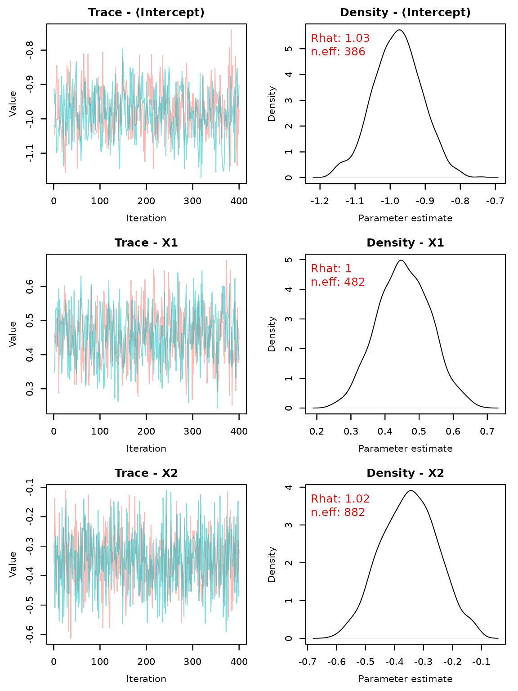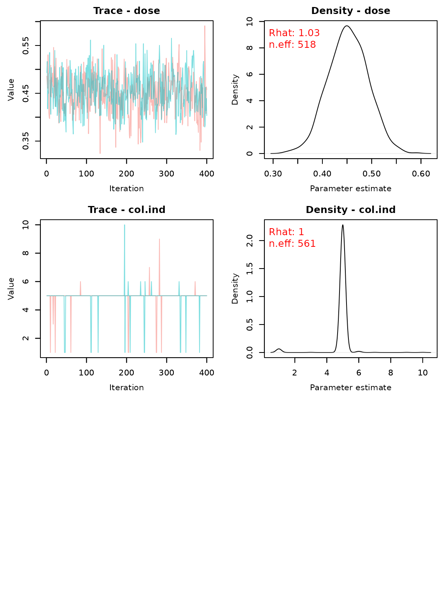

## Poisson regression

For Poisson regression, an offset can be optionally used by including an
`offset` term in the formula, e.g., `Y~dose(V1:V10)~X1+offset(PYR)`.
Here, we show models without using an offset, first including a
quadratic exposure term:

``` r
set.seed(332101)
fit.ameras.poisson <- ameras(Y.poisson~dose(V1:V10, deg=2, model="EXP")+X1+X2, 
                             data=data, family="poisson", 
                             methods=c("RC", "ERC", "MCML", "FMA", "BMA"), 
                             niter.BMA = 5000, nburnin.BMA = 1000)
#> Note: BMA may require extensive computation time
#> Fitting RC
#> Fitting ERC
#> Fitting MCML
#> Fitting FMA
#> Fitting BMA
#> Defining model
#> Building model
#> Setting data and initial values
#> Running calculate on model
#>   [Note] Any error reports that follow may simply reflect missing values in model variables.
#> Checking model sizes and dimensions
#>   [Note] This model is not fully initialized. This is not an error.
#>          To see which variables are not initialized, use model$initializeInfo().
#>          For more information on model initialization, see help(modelInitialization).
#> Compiling
#>   [Note] This may take a minute.
#>   [Note] Use 'showCompilerOutput = TRUE' to see C++ compilation details.
#> Compiling
#>   [Note] This may take a minute.
#>   [Note] Use 'showCompilerOutput = TRUE' to see C++ compilation details.
#> running chain 1...
#> |-------------|-------------|-------------|-------------|
#> |-------------------------------------------------------|
#> running chain 2...
#> warning: logProb of data node Y[247]: logProb less than -1e12.
#> warning: logProb of data node Y[676]: logProb less than -1e12.
#> warning: logProb of data node Y[833]: logProb less than -1e12.
#> warning: logProb of data node Y[1635]: logProb less than -1e12.
#> |-------------|-------------|-------------|-------------|
#> |-------------------------------------------------------|
```

``` r
summary(fit.ameras.poisson)
#> Call:
#> ameras(formula = Y.poisson ~ dose(V1:V10, deg = 2, model = "EXP") + 
#>     X1 + X2, data = data, family = "poisson", methods = c("RC", 
#>     "ERC", "MCML", "FMA", "BMA"), nburnin.BMA = 1000, niter.BMA = 5000)
#> 
#> Total run time: 69.4 seconds
#> 
#> Runtime in seconds by method:
#> 
#>  Method Runtime
#>      RC     0.8
#>     ERC     1.1
#>    MCML     1.2
#>     FMA     3.1
#>     BMA    63.2
#> 
#> Summary of coefficients by method:
#> 
#> data frame with 0 columns and 25 rows
#> 
#> Note: confidence intervals not yet computed. Use confint() to add them.
```

``` r
coef(fit.ameras.poisson)
#>                       RC         ERC        MCML         FMA        BMA
#> (Intercept)  -1.09455980 -1.09068092 -1.07519346 -1.07541780 -1.0794372
#> X1            0.49070108  0.49179875  0.49897425  0.49895993  0.4980120
#> X2           -0.37624508 -0.37854805 -0.37711401 -0.37715581 -0.3816682
#> dose          0.61975742  0.61138406  0.60089474  0.60137955  0.6080481
#> dose_squared -0.03849039 -0.03626348 -0.03643505 -0.03656317 -0.0379750
```

``` r
traceplot(fit.ameras.poisson)
```

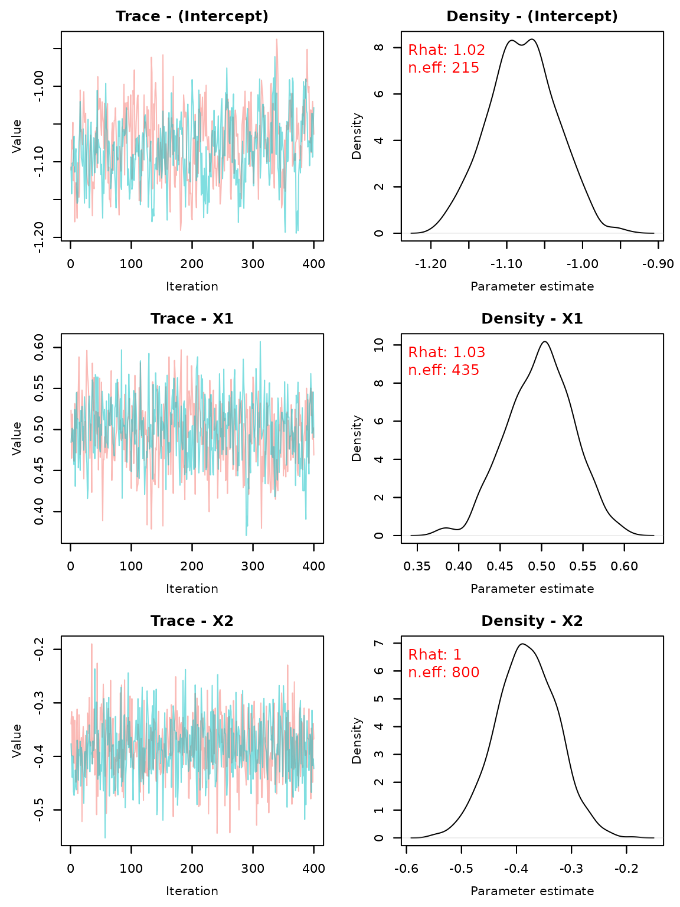

Without the quadratic term (`deg=1`):

``` r
set.seed(24252)
fit.ameras.poisson.lin <- ameras(Y.poisson~dose(V1:V10, deg=1, model="EXP")+X1+X2, 
                                 data=data, family="poisson", 
                                 methods=c("RC", "ERC", "MCML", "FMA", "BMA"), 
                                 niter.BMA = 5000, nburnin.BMA = 1000)
#> Note: BMA may require extensive computation time
#> Fitting RC
#> Fitting ERC
#> Fitting MCML
#> Fitting FMA
#> Fitting BMA
#> Defining model
#> Building model
#> Setting data and initial values
#> Running calculate on model
#>   [Note] Any error reports that follow may simply reflect missing values in model variables.
#> Checking model sizes and dimensions
#>   [Note] This model is not fully initialized. This is not an error.
#>          To see which variables are not initialized, use model$initializeInfo().
#>          For more information on model initialization, see help(modelInitialization).
#> Compiling
#>   [Note] This may take a minute.
#>   [Note] Use 'showCompilerOutput = TRUE' to see C++ compilation details.
#> Compiling
#>   [Note] This may take a minute.
#>   [Note] Use 'showCompilerOutput = TRUE' to see C++ compilation details.
#> running chain 1...
#> |-------------|-------------|-------------|-------------|
#> |-------------------------------------------------------|
#> running chain 2...
#> |-------------|-------------|-------------|-------------|
#> |-------------------------------------------------------|
```

``` r
summary(fit.ameras.poisson.lin)
#> Call:
#> ameras(formula = Y.poisson ~ dose(V1:V10, deg = 1, model = "EXP") + 
#>     X1 + X2, data = data, family = "poisson", methods = c("RC", 
#>     "ERC", "MCML", "FMA", "BMA"), nburnin.BMA = 1000, niter.BMA = 5000)
#> 
#> Total run time: 64.2 seconds
#> 
#> Runtime in seconds by method:
#> 
#>  Method Runtime
#>      RC     0.2
#>     ERC     0.6
#>    MCML     0.6
#>     FMA     1.9
#>     BMA    60.9
#> 
#> Summary of coefficients by method:
#> 
#> data frame with 0 columns and 20 rows
#> 
#> Note: confidence intervals not yet computed. Use confint() to add them.
```

``` r
coef(fit.ameras.poisson.lin)
#>                     RC        ERC       MCML        FMA        BMA
#> (Intercept) -0.9649529 -0.9666735 -0.9173445 -0.9173785 -0.9179930
#> X1           0.5054270  0.5049256  0.5129102  0.5120519  0.5099994
#> X2          -0.3639707 -0.3666592 -0.3579466 -0.3583942 -0.3581445
#> dose         0.4204226  0.4222084  0.3822723  0.3826304  0.3833150
```

``` r
traceplot(fit.ameras.poisson.lin)
```

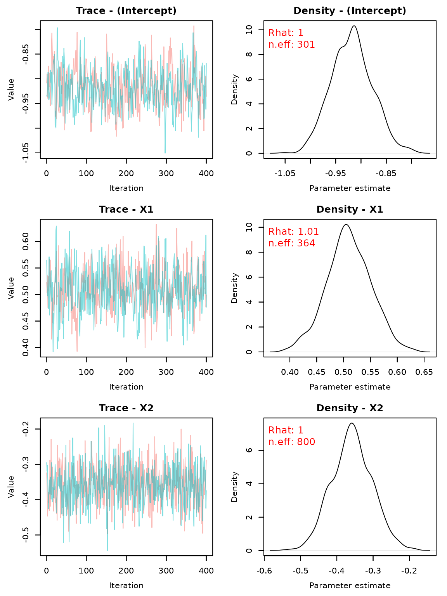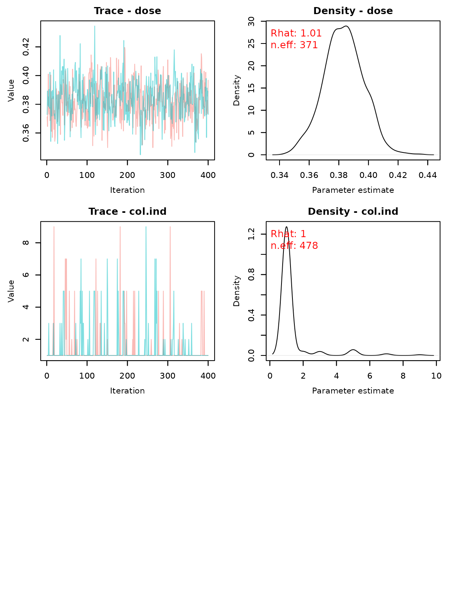

## Proportional hazards regression

Proportional hazards regression uses syntax similar to the `survival`
package, with models specified using formulas with `Surv(exit, status)`
or `Surv(entry, exit, status)` on the left hand side. Note that BMA fits
a piecewise constant baseline hazard `h0` as the proportional hazards
model is not directly supported. By default, the observed time interval
is divided into 10 intervals using quantiles of the observed event times
among cases. This number of such intervals can be specified through the
`prophaz.numints.BMA` argument. The BMA output contains the
`prophaz.numints.BMA+1` cutpoints defining the intervals in addition to
`h0`.

Again, we first fit models including a quadratic exposure term by
setting `deg=2`.

``` r
set.seed(332120000)
fit.ameras.prophaz <- ameras(Surv(time, status)~
                               dose(V1:V10, deg=2, model="EXP")+X1+X2, 
                             data=data, family="prophaz", 
                             methods=c("RC", "ERC", "MCML", "FMA", "BMA"), 
                             niter.BMA = 5000, nburnin.BMA = 1000)
#> Note: BMA may require extensive computation time
#> Fitting RC
#> Fitting ERC
#> Warning in ameras.rc(family = family, dosevars = dosevars, data = data, :
#> WARNING: Hessian was not invertible or inverse was not positive definite,
#> variance matrix could not be obtained
#> Fitting MCML
#> Fitting FMA
#> Fitting BMA
#> Defining model
#> Building model
#> Setting data and initial values
#> Running calculate on model
#>   [Note] Any error reports that follow may simply reflect missing values in model variables.
#> Checking model sizes and dimensions
#>   [Note] This model is not fully initialized. This is not an error.
#>          To see which variables are not initialized, use model$initializeInfo().
#>          For more information on model initialization, see help(modelInitialization).
#> Compiling
#>   [Note] This may take a minute.
#>   [Note] Use 'showCompilerOutput = TRUE' to see C++ compilation details.
#> Compiling
#>   [Note] This may take a minute.
#>   [Note] Use 'showCompilerOutput = TRUE' to see C++ compilation details.
#> running chain 1...
#> warning: logProb of data node zeros[7]: logProb less than -1e12.
#> warning: logProb of data node zeros[17]: logProb less than -1e12.
#> warning: logProb of data node zeros[71]: logProb less than -1e12.
#> warning: logProb of data node zeros[247]: logProb less than -1e12.
#> warning: logProb of data node zeros[267]: logProb less than -1e12.
#> warning: logProb of data node zeros[270]: logProb less than -1e12.
#> warning: logProb of data node zeros[433]: logProb less than -1e12.
#> warning: logProb of data node zeros[509]: logProb less than -1e12.
#> warning: logProb of data node zeros[620]: logProb less than -1e12.
#> warning: logProb of data node zeros[676]: logProb less than -1e12.
#> warning: logProb of data node zeros[716]: logProb less than -1e12.
#> warning: logProb of data node zeros[833]: logProb less than -1e12.
#> warning: logProb of data node zeros[1074]: logProb less than -1e12.
#> warning: logProb of data node zeros[1517]: logProb less than -1e12.
#> warning: logProb of data node zeros[1566]: logProb less than -1e12.
#> warning: logProb of data node zeros[1635]: logProb less than -1e12.
#> warning: logProb of data node zeros[1755]: logProb less than -1e12.
#> warning: logProb of data node zeros[1827]: logProb less than -1e12.
#> warning: logProb of data node zeros[1991]: logProb less than -1e12.
#> warning: logProb of data node zeros[1997]: logProb less than -1e12.
#> warning: logProb of data node zeros[2021]: logProb less than -1e12.
#> warning: logProb of data node zeros[2237]: logProb less than -1e12.
#> warning: logProb of data node zeros[2339]: logProb less than -1e12.
#> warning: logProb of data node zeros[2395]: logProb less than -1e12.
#> warning: logProb of data node zeros[2530]: logProb less than -1e12.
#> warning: logProb of data node zeros[2559]: logProb less than -1e12.
#> warning: logProb of data node zeros[2562]: logProb less than -1e12.
#> warning: logProb of data node zeros[2655]: logProb less than -1e12.
#> warning: logProb of data node zeros[2671]: logProb less than -1e12.
#> warning: logProb of data node zeros[2715]: logProb less than -1e12.
#> warning: logProb of data node zeros[2733]: logProb less than -1e12.
#> warning: logProb of data node zeros[2743]: logProb less than -1e12.
#> warning: logProb of data node zeros[2771]: logProb less than -1e12.
#> warning: logProb of data node zeros[2824]: logProb less than -1e12.
#> warning: logProb of data node zeros[2971]: logProb less than -1e12.
#> |-------------|-------------|-------------|-------------|
#> |-------------------------------------------------------|
#> running chain 2...
#> warning: logProb of data node zeros[1635]: logProb less than -1e12.
#> warning: logProb of data node zeros[2907]: logProb less than -1e12.
#> |-------------|-------------|-------------|-------------|
#> |-------------------------------------------------------|
```

``` r
summary(fit.ameras.prophaz)
#> Call:
#> ameras(formula = Surv(time, status) ~ dose(V1:V10, deg = 2, model = "EXP") + 
#>     X1 + X2, data = data, family = "prophaz", methods = c("RC", 
#>     "ERC", "MCML", "FMA", "BMA"), nburnin.BMA = 1000, niter.BMA = 5000)
#> 
#> Total run time: 657.6 seconds
#> 
#> Runtime in seconds by method:
#> 
#>  Method Runtime
#>      RC     0.3
#>     ERC   547.4
#>    MCML     0.7
#>     FMA     2.1
#>     BMA   107.1
#> 
#> Summary of coefficients by method:
#> 
#> data frame with 0 columns and 30 rows
#> 
#> Note: confidence intervals not yet computed. Use confint() to add them.
```

``` r
coef(fit.ameras.prophaz)
#>                       RC          ERC        MCML         FMA         BMA
#> X1            0.62967434  0.636754979  0.62916199  0.62453646  0.63144657
#> X2           -0.42311583 -0.422041734 -0.42515576 -0.43364414 -0.43257946
#> dose          0.58761408  0.295487972  0.59021691  0.59419590  0.57926053
#> dose_squared -0.03368205 -0.003356734 -0.03803829 -0.03894528 -0.03633593
#> h0[1]                 NA           NA          NA          NA  0.33184446
#> h0[2]                 NA           NA          NA          NA  0.35496760
#> h0[3]                 NA           NA          NA          NA  0.27403811
#> h0[4]                 NA           NA          NA          NA  0.30483271
#> h0[5]                 NA           NA          NA          NA  0.32418664
#> h0[6]                 NA           NA          NA          NA  0.41026813
#> h0[7]                 NA           NA          NA          NA  0.27596111
#> h0[8]                 NA           NA          NA          NA  0.31948789
#> h0[9]                 NA           NA          NA          NA  0.27957458
#> h0[10]                NA           NA          NA          NA  0.31712022
```

The BMA output now contains the intervals with piecewise constant
baseline hazards, corresponding to the estimates `h0`:

``` r
fit.ameras.prophaz$BMA$prophaz.timepoints
#> NULL
```

``` r
traceplot(fit.ameras.prophaz)
```

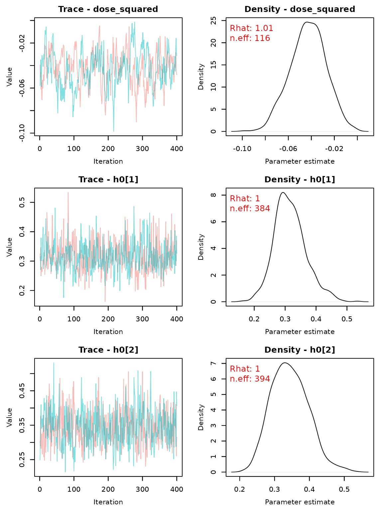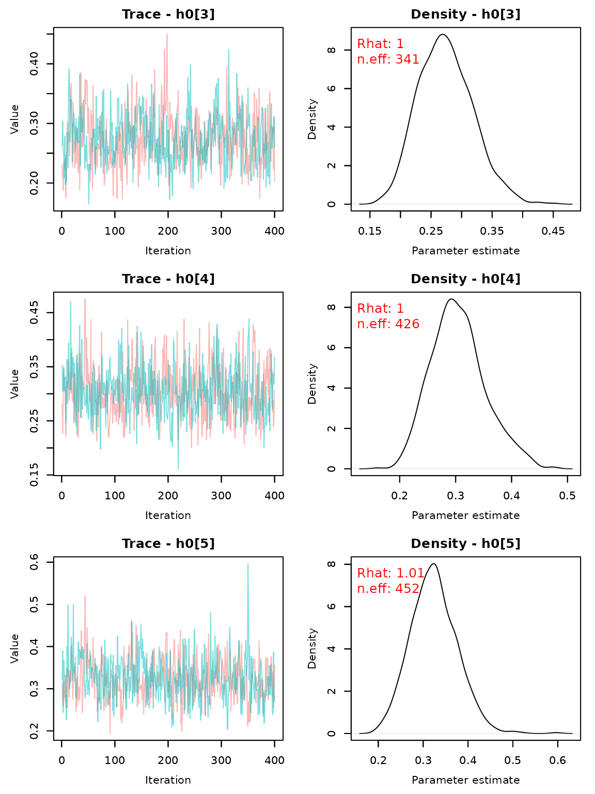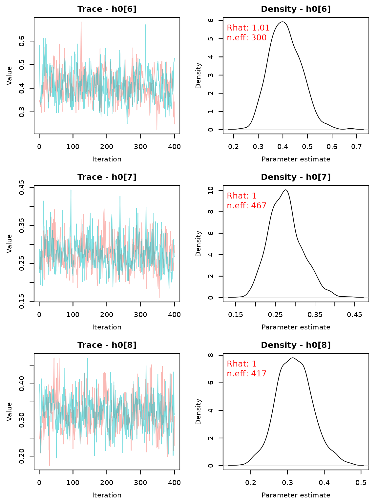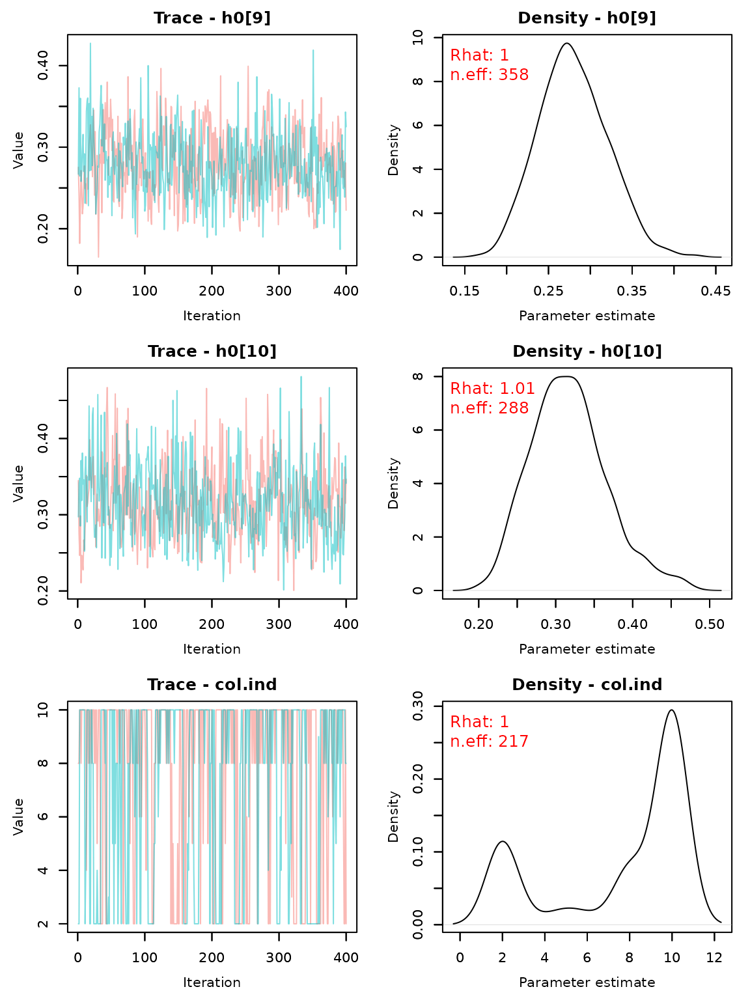

Without the quadratic term (`deg=1`):

``` r
set.seed(24978252)
fit.ameras.prophaz.lin <- ameras(Surv(time, status)~
                                   dose(V1:V10, deg=1, model="EXP")+X1+X2, 
                                 data=data, family="prophaz", 
                                 methods=c("RC", "ERC", "MCML", "FMA", "BMA"), 
                                 niter.BMA = 5000, nburnin.BMA = 1000)
#> Note: BMA may require extensive computation time
#> Fitting RC
#> Fitting ERC
#> Warning in ameras.rc(family = family, dosevars = dosevars, data = data, :
#> WARNING: Hessian was not invertible or inverse was not positive definite,
#> variance matrix could not be obtained
#> Fitting MCML
#> Fitting FMA
#> Fitting BMA
#> Defining model
#> Building model
#> Setting data and initial values
#> Running calculate on model
#>   [Note] Any error reports that follow may simply reflect missing values in model variables.
#> Checking model sizes and dimensions
#>   [Note] This model is not fully initialized. This is not an error.
#>          To see which variables are not initialized, use model$initializeInfo().
#>          For more information on model initialization, see help(modelInitialization).
#> Compiling
#>   [Note] This may take a minute.
#>   [Note] Use 'showCompilerOutput = TRUE' to see C++ compilation details.
#> Compiling
#>   [Note] This may take a minute.
#>   [Note] Use 'showCompilerOutput = TRUE' to see C++ compilation details.
#> running chain 1...
#> |-------------|-------------|-------------|-------------|
#> |-------------------------------------------------------|
#> running chain 2...
#> |-------------|-------------|-------------|-------------|
#> |-------------------------------------------------------|
```

``` r
summary(fit.ameras.prophaz.lin)
#> Call:
#> ameras(formula = Surv(time, status) ~ dose(V1:V10, deg = 1, model = "EXP") + 
#>     X1 + X2, data = data, family = "prophaz", methods = c("RC", 
#>     "ERC", "MCML", "FMA", "BMA"), nburnin.BMA = 1000, niter.BMA = 5000)
#> 
#> Total run time: 372 seconds
#> 
#> Runtime in seconds by method:
#> 
#>  Method Runtime
#>      RC     0.1
#>     ERC   264.7
#>    MCML     0.4
#>     FMA     1.1
#>     BMA   105.7
#> 
#> Summary of coefficients by method:
#> 
#> data frame with 0 columns and 25 rows
#> 
#> Note: confidence intervals not yet computed. Use confint() to add them.
```

``` r
coef(fit.ameras.prophaz.lin)
#>                RC        ERC       MCML        FMA        BMA
#> X1      0.6358422  0.6415799  0.6462073  0.6457466  0.6474031
#> X2     -0.4160762 -0.4219654 -0.4124721 -0.4125357 -0.4247814
#> dose    0.4283893  0.2811645  0.4001775  0.4000975  0.3987353
#> h0[1]          NA         NA         NA         NA  0.3645755
#> h0[2]          NA         NA         NA         NA  0.3925686
#> h0[3]          NA         NA         NA         NA  0.3035865
#> h0[4]          NA         NA         NA         NA  0.3378431
#> h0[5]          NA         NA         NA         NA  0.3615119
#> h0[6]          NA         NA         NA         NA  0.4547288
#> h0[7]          NA         NA         NA         NA  0.3079510
#> h0[8]          NA         NA         NA         NA  0.3550875
#> h0[9]          NA         NA         NA         NA  0.3091293
#> h0[10]         NA         NA         NA         NA  0.3495984
```

``` r
traceplot(fit.ameras.prophaz.lin)
```

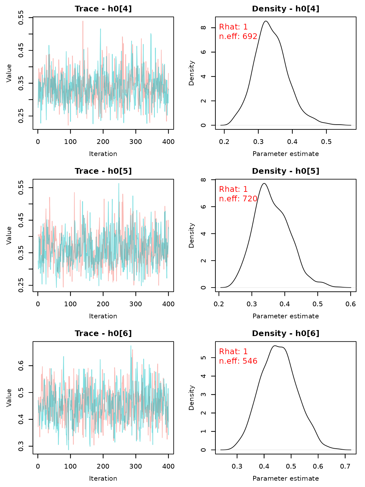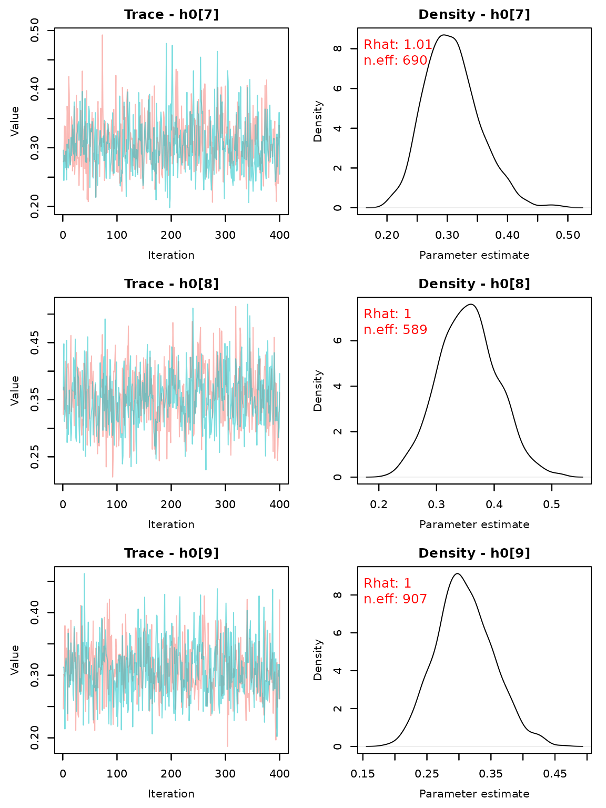

## Multinomial logistic regression

For multinomial logistic regression, the last category (in the case of
the example data, `Y.multinomial='3'`) is used as the referent category.

Again, we first fit models including a quadratic exposure term by
setting `deg=2`.

``` r
set.seed(33)
fit.ameras.multinomial <- ameras(Y.multinomial~
                                   dose(V1:V10, deg=2, model="EXP")+X1+X2, 
                                 data=data, family="multinomial",
                                 methods=c("RC", "ERC", "MCML", "FMA", "BMA"), 
                                 niter.BMA = 5000, nburnin.BMA = 1000)
#> Note: BMA may require extensive computation time
#> Fitting RC
#> Fitting ERC
#> Fitting MCML
#> Fitting FMA
#> Fitting BMA
#> Defining model
#> Building model
#> Setting data and initial values
#> Running calculate on model
#>   [Note] Any error reports that follow may simply reflect missing values in model variables.
#> Checking model sizes and dimensions
#>   [Note] This model is not fully initialized. This is not an error.
#>          To see which variables are not initialized, use model$initializeInfo().
#>          For more information on model initialization, see help(modelInitialization).
#> Compiling
#>   [Note] This may take a minute.
#>   [Note] Use 'showCompilerOutput = TRUE' to see C++ compilation details.
#> Compiling
#>   [Note] This may take a minute.
#>   [Note] Use 'showCompilerOutput = TRUE' to see C++ compilation details.
#> running chain 1...
#> |-------------|-------------|-------------|-------------|
#> |-------------------------------------------------------|
#> running chain 2...
#> |-------------|-------------|-------------|-------------|
#> |-------------------------------------------------------|
```

``` r
summary(fit.ameras.multinomial)
#> Call:
#> ameras(formula = Y.multinomial ~ dose(V1:V10, deg = 2, model = "EXP") + 
#>     X1 + X2, data = data, family = "multinomial", methods = c("RC", 
#>     "ERC", "MCML", "FMA", "BMA"), nburnin.BMA = 1000, niter.BMA = 5000)
#> 
#> Total run time: 461.1 seconds
#> 
#> Runtime in seconds by method:
#> 
#>  Method Runtime
#>      RC     1.1
#>     ERC   157.7
#>    MCML     7.9
#>     FMA    10.7
#>     BMA   283.7
#> 
#> Summary of coefficients by method:
#> 
#> data frame with 0 columns and 50 rows
#> 
#> Note: confidence intervals not yet computed. Use confint() to add them.
```

``` r
coef(fit.ameras.multinomial)
#>                            RC          ERC        MCML          FMA
#> (1)_(Intercept)  -1.134879146 -1.139983536 -1.12154130 -1.125692410
#> (1)_X1            0.521885281  0.524097727  0.52250322  0.522202730
#> (1)_X2           -0.347820786 -0.351142280 -0.34994376 -0.349524397
#> (1)_dose          0.541114276  0.561787528  0.52684585  0.536663279
#> (1)_dose_squared -0.028978278 -0.031891085 -0.02719420 -0.030263819
#> (2)_(Intercept)  -0.007546883 -0.008659617 -0.00158420 -0.001039462
#> (2)_X1           -0.513675252 -0.511536376 -0.51378683 -0.513379776
#> (2)_X2            0.705781705  0.703687594  0.70377938  0.704600522
#> (2)_dose          0.555005580  0.563142229  0.55980729  0.557268591
#> (2)_dose_squared -0.037841810 -0.036408828 -0.04111845 -0.040744704
#>                           BMA
#> (1)_(Intercept)  -1.120532838
#> (1)_X1            0.518102027
#> (1)_X2           -0.342415237
#> (1)_dose          0.522811057
#> (1)_dose_squared -0.024285677
#> (2)_(Intercept)   0.003371856
#> (2)_X1           -0.522596807
#> (2)_X2            0.708876654
#> (2)_dose          0.554817132
#> (2)_dose_squared -0.037945537
```

``` r
traceplot(fit.ameras.multinomial)
```

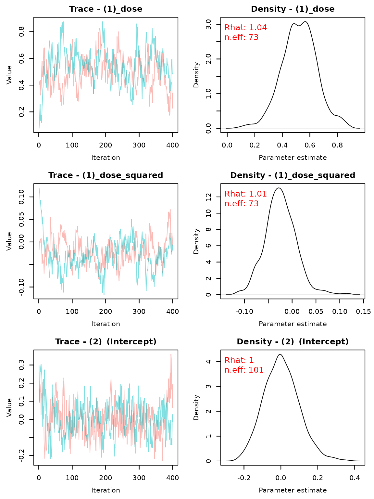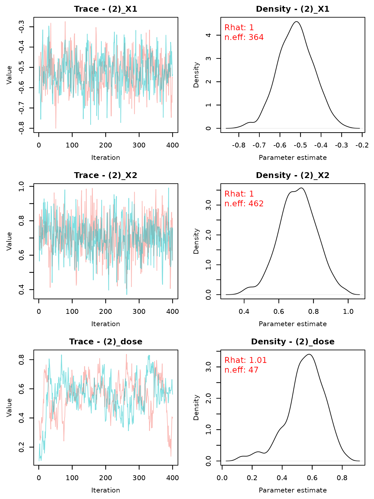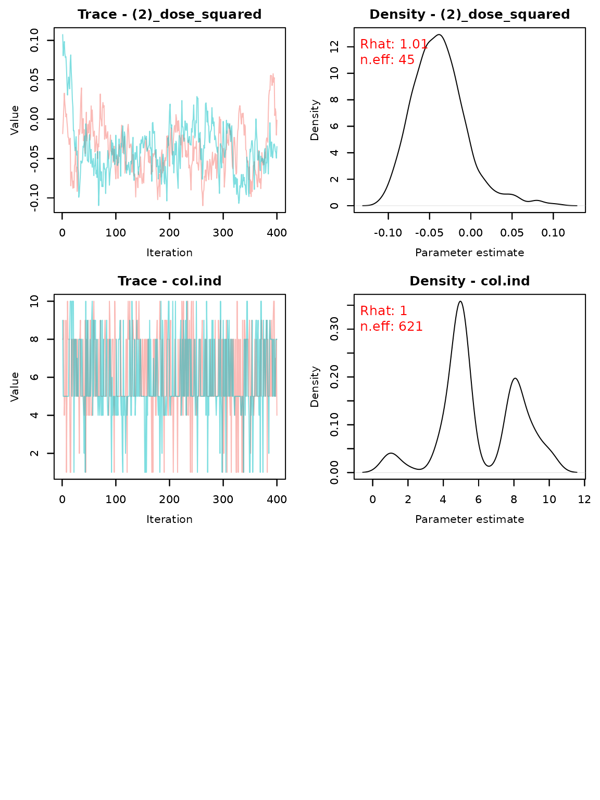

Without the quadratic term (`deg=1`):

``` r
set.seed(44)
fit.ameras.multinomial.lin <- ameras(Y.multinomial~
                                       dose(V1:V10, deg=1, model="EXP")+X1+X2, 
                                     data=data, family="multinomial",
                                     methods=c("RC", "ERC", "MCML", "FMA", "BMA"), 
                                     niter.BMA = 5000, nburnin.BMA = 1000)
#> Note: BMA may require extensive computation time
#> Fitting RC
#> Fitting ERC
#> Fitting MCML
#> Fitting FMA
#> Fitting BMA
#> Defining model
#> Building model
#> Setting data and initial values
#> Running calculate on model
#>   [Note] Any error reports that follow may simply reflect missing values in model variables.
#> Checking model sizes and dimensions
#>   [Note] This model is not fully initialized. This is not an error.
#>          To see which variables are not initialized, use model$initializeInfo().
#>          For more information on model initialization, see help(modelInitialization).
#> Compiling
#>   [Note] This may take a minute.
#>   [Note] Use 'showCompilerOutput = TRUE' to see C++ compilation details.
#> Compiling
#>   [Note] This may take a minute.
#>   [Note] Use 'showCompilerOutput = TRUE' to see C++ compilation details.
#> running chain 1...
#> |-------------|-------------|-------------|-------------|
#> |-------------------------------------------------------|
#> running chain 2...
#> |-------------|-------------|-------------|-------------|
#> |-------------------------------------------------------|
```

``` r
summary(fit.ameras.multinomial.lin)
#> Call:
#> ameras(formula = Y.multinomial ~ dose(V1:V10, deg = 1, model = "EXP") + 
#>     X1 + X2, data = data, family = "multinomial", methods = c("RC", 
#>     "ERC", "MCML", "FMA", "BMA"), nburnin.BMA = 1000, niter.BMA = 5000)
#> 
#> Total run time: 356.5 seconds
#> 
#> Runtime in seconds by method:
#> 
#>  Method Runtime
#>      RC     1.0
#>     ERC   113.8
#>    MCML     6.2
#>     FMA     8.4
#>     BMA   227.1
#> 
#> Summary of coefficients by method:
#> 
#> data frame with 0 columns and 40 rows
#> 
#> Note: confidence intervals not yet computed. Use confint() to add them.
```

``` r
coef(fit.ameras.multinomial.lin)
#>                          RC         ERC        MCML         FMA         BMA
#> (1)_(Intercept) -1.10156112 -1.10285018 -1.09147154 -1.09114142 -1.09318983
#> (1)_X1           0.52203186  0.52577389  0.52239330  0.52245186  0.52118788
#> (1)_X2          -0.34709866 -0.35175606 -0.34933932 -0.34937267 -0.34993934
#> (1)_dose         0.45263847  0.46441427  0.44410129  0.44380519  0.44801466
#> (2)_(Intercept)  0.04416972  0.03946571  0.05916562  0.05869433  0.05266985
#> (2)_X1          -0.51311892 -0.51003494 -0.51290413 -0.51271584 -0.51036888
#> (2)_X2           0.70793136  0.70434790  0.70604308  0.70611143  0.70370686
#> (2)_dose         0.43049029  0.44543353  0.41753398  0.41768779  0.42386430
```

``` r
traceplot(fit.ameras.multinomial.lin)
```

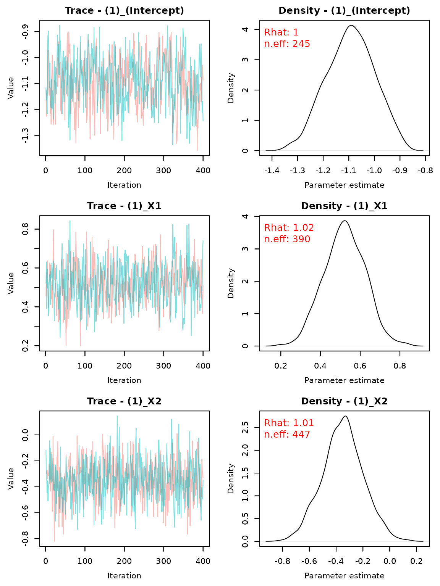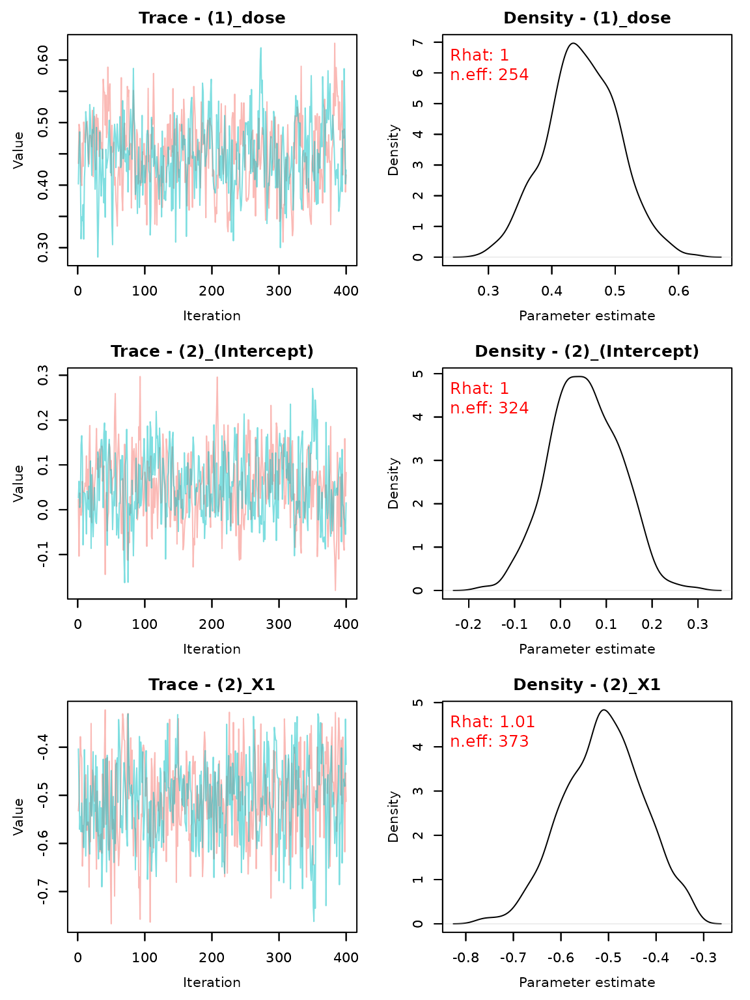

## Conditional logistic regression

For conditional logistic regression, the set number variable is
specified through a `strata` term in the formula. Again, we first fit
models including a quadratic exposure term by setting `deg=2`.

``` r
set.seed(3301)
fit.ameras.clogit <- ameras(Y.clogit~dose(V1:V10, deg=2, model="EXP")+X1+X2+
                              strata(setnr), data=data, family="clogit", 
                            methods=c("RC", "ERC", "MCML", "FMA", "BMA"), 
                            niter.BMA = 5000, nburnin.BMA = 1000)
#> Note: BMA may require extensive computation time
#> Fitting RC
#> Fitting ERC
#> Fitting MCML
#> Fitting FMA
#> Fitting BMA
#> Defining model
#> Building model
#> Setting data and initial values
#> Running calculate on model
#>   [Note] Any error reports that follow may simply reflect missing values in model variables.
#> Checking model sizes and dimensions
#>   [Note] This model is not fully initialized. This is not an error.
#>          To see which variables are not initialized, use model$initializeInfo().
#>          For more information on model initialization, see help(modelInitialization).
#> Compiling
#>   [Note] This may take a minute.
#>   [Note] Use 'showCompilerOutput = TRUE' to see C++ compilation details.
#> Compiling
#>   [Note] This may take a minute.
#>   [Note] Use 'showCompilerOutput = TRUE' to see C++ compilation details.
#> running chain 1...
#> |-------------|-------------|-------------|-------------|
#> |-------------------------------------------------------|
#> running chain 2...
#> |-------------|-------------|-------------|-------------|
#> |-------------------------------------------------------|
```

``` r
summary(fit.ameras.clogit)
#> Call:
#> ameras(formula = Y.clogit ~ dose(V1:V10, deg = 2, model = "EXP") + 
#>     X1 + X2 + strata(setnr), data = data, family = "clogit", 
#>     methods = c("RC", "ERC", "MCML", "FMA", "BMA"), nburnin.BMA = 1000, 
#>     niter.BMA = 5000)
#> 
#> Total run time: 705.6 seconds
#> 
#> Runtime in seconds by method:
#> 
#>  Method Runtime
#>      RC     0.6
#>     ERC   626.1
#>    MCML     1.9
#>     FMA     6.5
#>     BMA    70.5
#> 
#> Summary of coefficients by method:
#> 
#> data frame with 0 columns and 20 rows
#> 
#> Note: confidence intervals not yet computed. Use confint() to add them.
```

``` r
coef(fit.ameras.clogit)
#>                       RC         ERC        MCML         FMA         BMA
#> X1            0.54552627  0.61917374  0.55082666  0.55052070  0.54908986
#> X2           -0.53391889 -0.51784345 -0.53546549 -0.53471237 -0.53844738
#> dose          0.68029437  0.35155174  0.69333718  0.69461086  0.70058151
#> dose_squared -0.05145934  0.03687427 -0.05581249 -0.05609925 -0.05764133
```

``` r
traceplot(fit.ameras.clogit)
```

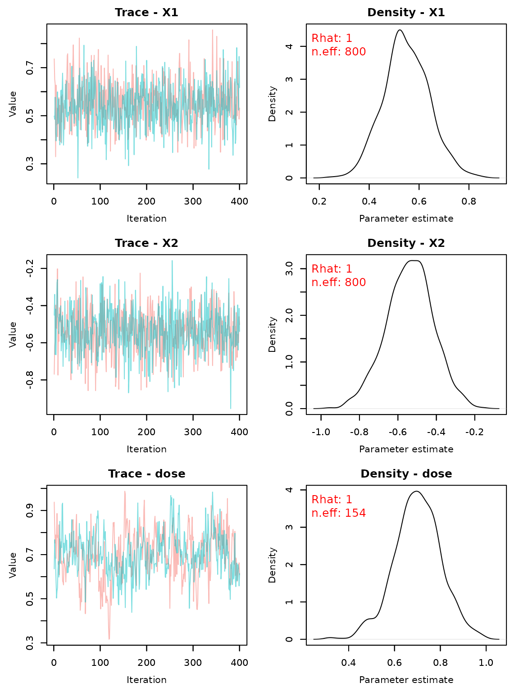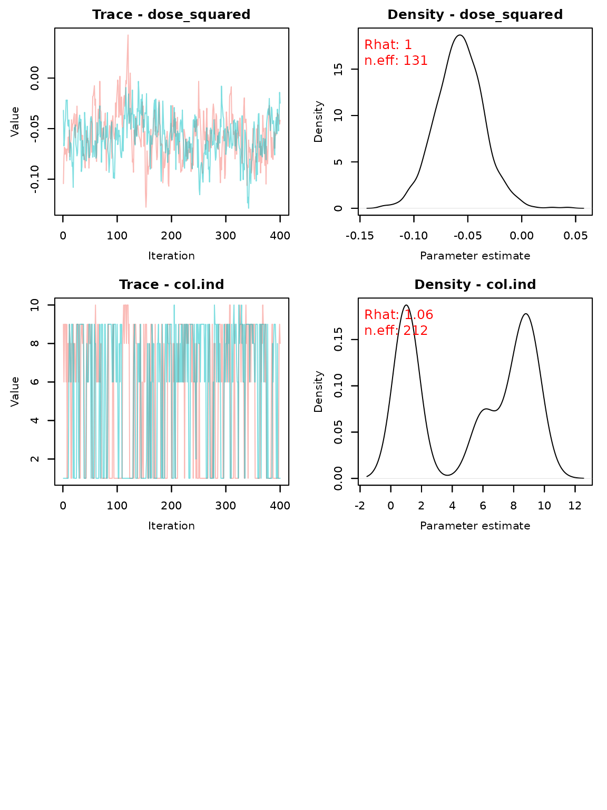

Without the quadratic term (`deg=1`):

``` r
set.seed(4401)
fit.ameras.clogit.lin <- ameras(Y.clogit~dose(V1:V10, deg=2, model="EXP")+X1+X2+
                                  strata(setnr), data=data, family="clogit", 
                                methods=c("RC", "ERC", "MCML", "FMA", "BMA"), 
                                niter.BMA = 5000, nburnin.BMA = 1000)
#> Note: BMA may require extensive computation time
#> Fitting RC
#> Fitting ERC
#> Fitting MCML
#> Fitting FMA
#> Fitting BMA
#> Defining model
#> Building model
#> Setting data and initial values
#> Running calculate on model
#>   [Note] Any error reports that follow may simply reflect missing values in model variables.
#> Checking model sizes and dimensions
#>   [Note] This model is not fully initialized. This is not an error.
#>          To see which variables are not initialized, use model$initializeInfo().
#>          For more information on model initialization, see help(modelInitialization).
#> Compiling
#>   [Note] This may take a minute.
#>   [Note] Use 'showCompilerOutput = TRUE' to see C++ compilation details.
#> Compiling
#>   [Note] This may take a minute.
#>   [Note] Use 'showCompilerOutput = TRUE' to see C++ compilation details.
#> running chain 1...
#> |-------------|-------------|-------------|-------------|
#> |-------------------------------------------------------|
#> running chain 2...
#> |-------------|-------------|-------------|-------------|
#> |-------------------------------------------------------|
```

``` r
summary(fit.ameras.clogit.lin)
#> Call:
#> ameras(formula = Y.clogit ~ dose(V1:V10, deg = 2, model = "EXP") + 
#>     X1 + X2 + strata(setnr), data = data, family = "clogit", 
#>     methods = c("RC", "ERC", "MCML", "FMA", "BMA"), nburnin.BMA = 1000, 
#>     niter.BMA = 5000)
#> 
#> Total run time: 713.1 seconds
#> 
#> Runtime in seconds by method:
#> 
#>  Method Runtime
#>      RC     0.6
#>     ERC   634.0
#>    MCML     1.9
#>     FMA     6.4
#>     BMA    70.2
#> 
#> Summary of coefficients by method:
#> 
#> data frame with 0 columns and 20 rows
#> 
#> Note: confidence intervals not yet computed. Use confint() to add them.
```

``` r
coef(fit.ameras.clogit.lin)
#>                       RC         ERC        MCML         FMA         BMA
#> X1            0.54552627  0.61917374  0.55082666  0.55011963  0.55627823
#> X2           -0.53391889 -0.51784345 -0.53546549 -0.53456800 -0.53884618
#> dose          0.68029437  0.35155174  0.69333718  0.69435478  0.69524184
#> dose_squared -0.05145934  0.03687427 -0.05581249 -0.05606825 -0.05604098
```

``` r
traceplot(fit.ameras.clogit.lin)
```

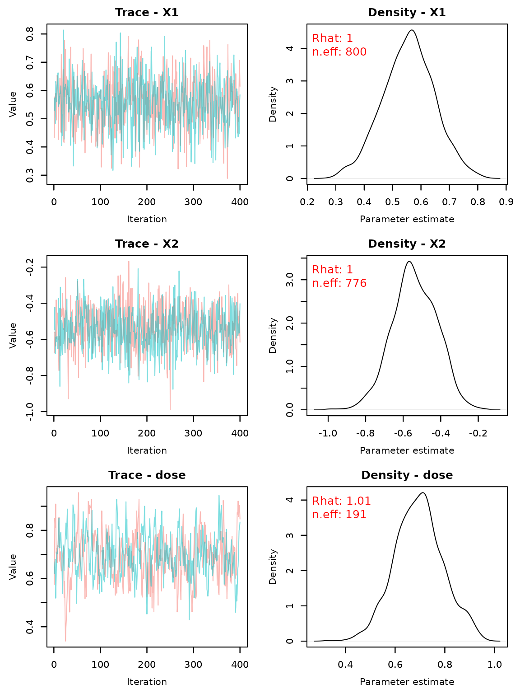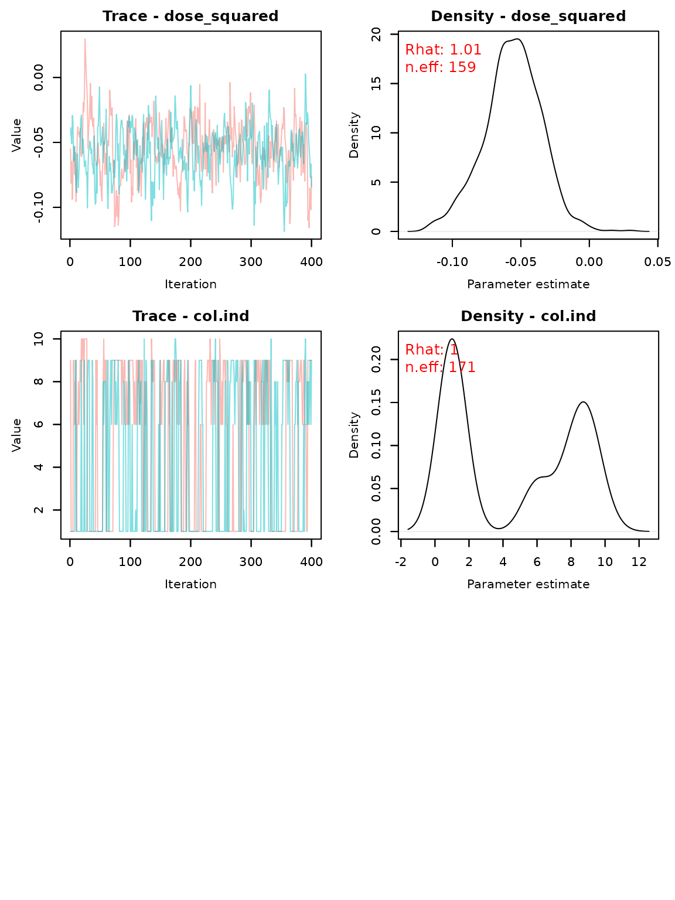
