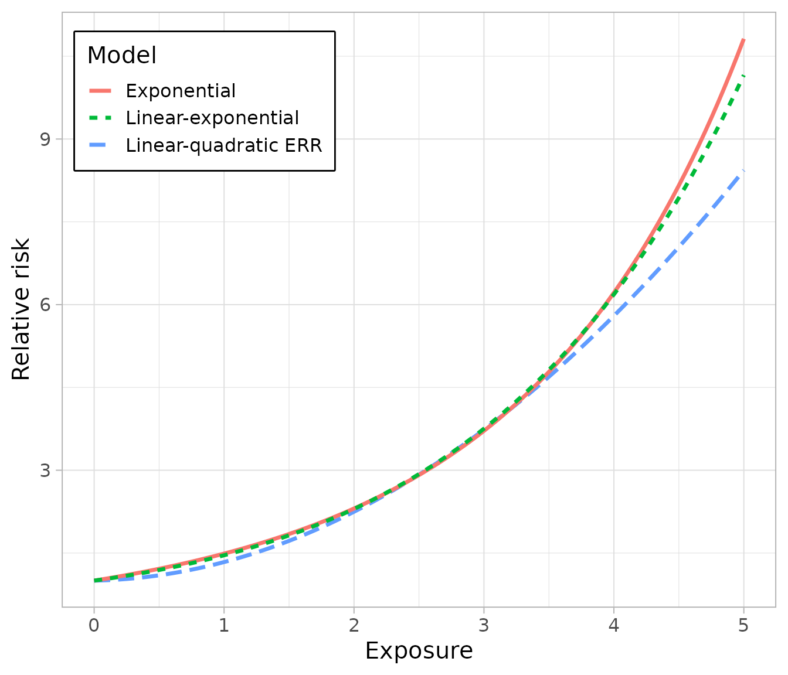

# Relative risk models

``` r
library(ameras)
#> Loading required package: nimble
#> nimble version 1.4.2 is loaded.
#> For more information on NIMBLE and a User Manual,
#> please visit https://R-nimble.org.
#> 
#> Attaching package: 'nimble'
#> The following object is masked from 'package:stats':
#> 
#>     simulate
#> The following object is masked from 'package:base':
#> 
#>     declare
library(ggplot2)
data(data, package="ameras")
```

## Introduction

For non-Gaussian families, three relative risk models for the main
exposure are supported, the usual exponential model RR_i=\exp(\beta_1
D_i+\beta_2 D_i^2+ \mathbf{M}\_i^T \mathbf{\beta}\_{m1}D_i +
\mathbf{M}\_i^T \mathbf{\beta}\_{m2} D_i^2), the linear(-quadratic)
excess relative risk (ERR) model RR_i= 1+\beta_1 D_i+\beta_2 D_i^2 +
\mathbf{M}\_i^T \mathbf{\beta\_{m1}}D_i + \mathbf{M}\_i^T
\mathbf{\beta}\_{m2}D_i^2, and the linear-exponential model RR_i=
1+(\beta_1 + \mathbf{M}\_i^T \mathbf{\beta}\_{m1}) D_i \exp\\(\beta_2+
\mathbf{M}\_i^T \mathbf{\beta}\_{m2})D_i\\. This vignette illustrates
fitting the three models using regression calibration for logistic
regression, but the same syntax applies to all other settings.

## Exponential relative risk

The usual exponential relative risk model is given by RR_i=\exp(\beta_1
D_i+\beta_2 D_i^2+ \mathbf{M}\_i^T \mathbf{\beta}\_{m1}D_i +
\mathbf{M}\_i^T \mathbf{\beta}\_{m2} D_i^2), where the quadratic and
effect modification terms are optional (not fit by setting `deg=1` and
not passing anything to `M`, respectively). This model is fit by setting
`model="EXP"` as follows:

``` r
fit.ameras.exp <- ameras(Y.binomial~dose(V1:V10, deg=2, model="EXP")+X1+X2, 
                         data=data, family="binomial", methods="RC")
#> Fitting RC
summary(fit.ameras.exp)
#> Call:
#> ameras(formula = Y.binomial ~ dose(V1:V10, deg = 2, model = "EXP") + 
#>     X1 + X2, data = data, family = "binomial", methods = "RC")
#> 
#> Total run time: 0.3 seconds
#> 
#> Runtime in seconds by method:
#> 
#>  Method Runtime
#>      RC     0.3
#> 
#> Summary of coefficients by method:
#> 
#>  Method         Term Estimate      SE
#>      RC  (Intercept) -0.94461 0.08409
#>      RC           X1  0.44552 0.07667
#>      RC           X2 -0.33376 0.09601
#>      RC         dose  0.37904 0.10388
#>      RC dose_squared  0.01943 0.02750
#> 
#> Note: confidence intervals not yet computed. Use confint() to add them.
```

## Linear excess relative risk

The linear excess relative risk model is given by RR_i=1+\beta_1
D_i+\beta_2 D_i^2+ \mathbf{M}\_i^T \mathbf{\beta}\_{m1}D_i +
\mathbf{M}\_i^T \mathbf{\beta}\_{m2} D_i^2, where again the quadratic
and effect modification terms are optional. In this case, no degree
needs to be specified. This model is fit by setting `model="ERR"` as
follows:

``` r
fit.ameras.err <- ameras(Y.binomial~dose(V1:V10, deg=2, model="ERR")+X1+X2, 
                         data=data, family="binomial", methods="RC")
#> Fitting RC
summary(fit.ameras.err)
#> Call:
#> ameras(formula = Y.binomial ~ dose(V1:V10, deg = 2, model = "ERR") + 
#>     X1 + X2, data = data, family = "binomial", methods = "RC")
#> 
#> Total run time: 0.3 seconds
#> 
#> Runtime in seconds by method:
#> 
#>  Method Runtime
#>      RC     0.3
#> 
#> Summary of coefficients by method:
#> 
#>  Method         Term Estimate      SE
#>      RC  (Intercept) -0.87359 0.09759
#>      RC           X1  0.44587 0.07672
#>      RC           X2 -0.33552 0.09610
#>      RC         dose  0.04878 0.21283
#>      RC dose_squared  0.28763 0.08100
#> 
#> Note: confidence intervals not yet computed. Use confint() to add them.
```

## Linear-exponential relative risk

The linear-exponential relative risk model is given by RR_i=
1+(\beta_1 + \mathbf{M}\_i^T \mathbf{\beta}\_{m1}) D_i \exp\\(\beta_2+
\mathbf{M}\_i^T \mathbf{\beta}\_{m2})D_i\\, where the effect
modification terms are optional. This model is fit by setting
`model="LINEXP"` as follows:

``` r
fit.ameras.linexp <- ameras(Y.binomial~dose(V1:V10, model="LINEXP")+X1+X2, 
                         data=data, family="binomial", methods="RC")
#> Fitting RC
summary(fit.ameras.linexp)
#> Call:
#> ameras(formula = Y.binomial ~ dose(V1:V10, model = "LINEXP") + 
#>     X1 + X2, data = data, family = "binomial", methods = "RC")
#> 
#> Total run time: 0.5 seconds
#> 
#> Runtime in seconds by method:
#> 
#>  Method Runtime
#>      RC     0.5
#> 
#> Summary of coefficients by method:
#> 
#>  Method             Term Estimate      SE
#>      RC      (Intercept)  -0.9326 0.08592
#>      RC               X1   0.4456 0.07668
#>      RC               X2  -0.3343 0.09603
#>      RC      dose_linear   0.3255 0.11919
#>      RC dose_exponential   0.3455 0.10814
#> 
#> Note: confidence intervals not yet computed. Use confint() to add them.
```

## Comparison between models

To compare between models, it is easiest to do so visually:

``` r
ggplot(data.frame(x=c(0, 5)), aes(x))+
  theme_light(base_size=15)+
  xlab("Exposure")+
  ylab("Relative risk")+
  labs(col="Model", lty="Model") +
  theme(legend.position = "inside", 
        legend.position.inside = c(.2,.85),
        legend.box.background = element_rect(color = "black", fill = "white", linewidth = 1))+
  stat_function(aes(col="Linear-quadratic ERR", lty="Linear-quadratic ERR" ),fun=function(x){
    1+fit.ameras.err$RC$coefficients["dose"]*x + fit.ameras.err$RC$coefficients["dose_squared"]*x^2
  }, linewidth=1.2) + 
  stat_function(aes(col="Exponential", lty="Exponential"),fun=function(x){
    exp(fit.ameras.exp$RC$coefficients["dose"]*x + fit.ameras.exp$RC$coefficients["dose_squared"]*x^2)
  }, linewidth=1.2) +
  stat_function(aes(col="Linear-exponential", lty="Linear-exponential"),fun=function(x){
    1+fit.ameras.linexp$RC$coefficients["dose_linear"]*x * exp(fit.ameras.linexp$RC$coefficients["dose_exponential"]*x)
  }, linewidth=1.2)
```


