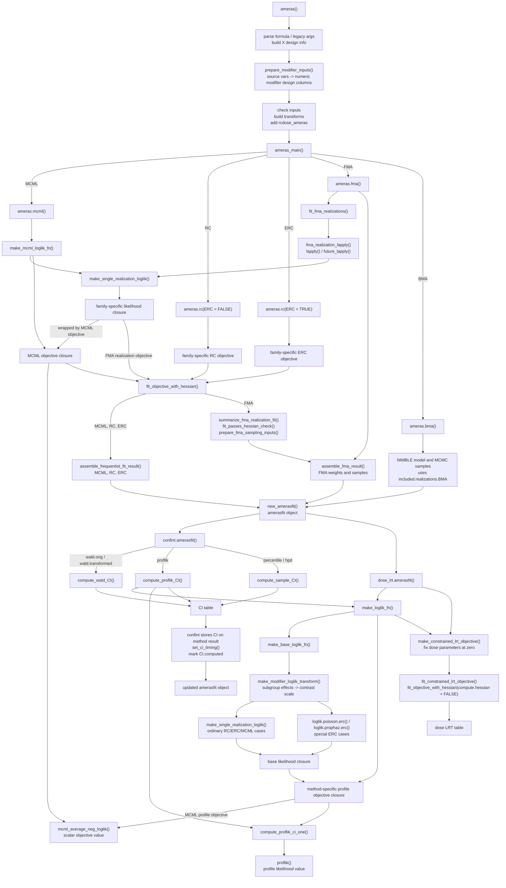

# Internal Helper Flow

This note describes how the main fitting and confidence interval helpers fit
together. It is intended for package maintainers; the functions named here are
internal implementation details, not user-facing API.

## Overview

## Fitting Path

`ameras()` handles the public interface. It parses the formula or legacy
arguments, validates inputs, constructs default transformations where needed,
adds `rcdose_ameras`, and stores enough model metadata for later methods such as
`confint()`, `residuals()`, and `plot()`. Formula right-hand-side covariates are
expanded through `build_X_design()`, which stores model-matrix design
information in `model$X_design_info`. `resolve_data()` reuses that information
so supplied data can rebuild factor, interaction, and spline basis columns
consistently when `keep.data = FALSE`. After missing-value handling and any
matched-set filtering, `warn_if_poorly_conditioned_X()` checks the fitted
covariate design for severe scaling or conditioning problems. This is a
diagnostic only; it does not alter the fitted data or coefficients.

Formula-based dose modifiers are prepared by `prepare_modifier_inputs()` after
missing-value handling and before model-specific row filtering. That helper
keeps the original modifier variables in `modifier_info$source_vars`, creates
numeric internal design columns in `modifier_info$design_vars`, and stores the
labels used for reported coefficients and intervals. This separation matters
for `keep.data = FALSE`: user-supplied data are checked against the original
source variables, then `resolve_data()` regenerates the same internal design
columns before rebuilding likelihoods.

For ordinary `modifier = ~ M` formulas, the prepared design columns are still
used in the existing reference-plus-contrast likelihood parameterization. For
subgroup-coded formulas such as `modifier = ~ 0 + M` or `modifier = ~ M - 1`,
the fitted and reported coefficients are subgroup-specific effects. The
low-level likelihoods still use the original contrast parameterization, so
`make_modifier_loglik_transform()` maps reported subgroup effects to the
equivalent contrast scale immediately before likelihood evaluation. BMA is not
yet wired for subgroup-coded modifiers and errors before fitting if that
combination is requested.

`ameras_main()` dispatches to the method-specific fitting functions:

- `ameras.mcml()` fits MCML.
- `ameras.rc(ERC = FALSE)` fits regression calibration.
- `ameras.rc(ERC = TRUE)` fits extended regression calibration.
- `ameras.fma()` fits each dose realization and performs frequentist model
  averaging.
- `ameras.bma()` builds and samples the Bayesian model averaging model.

When FMA and BMA are requested together, `ameras_main()` runs FMA first so the
methods appear in a predictable order. BMA does not currently use FMA screening
results by default; `included.realizations.BMA` controls the BMA realization
set and defaults to all dose realizations.

The main likelihood construction helper is `make_single_realization_loglik()`.
It builds a family-specific likelihood closure from raw fitting arguments. It is
used directly by FMA and indirectly by MCML and profile-likelihood
reconstruction.
In the flowchart, arrows out of `make_single_realization_loglik()` point to the
likelihood closures it returns; those closures are then wrapped or passed to the
optimizer/profile-likelihood helpers.
Leaf helper nodes such as `mcml_average_neg_loglik()` and `proflik()` represent
values computed inside their caller rather than separate downstream package
steps.

`make_mcml_loglik_fn()` wraps `make_single_realization_loglik()` for MCML. The
family likelihoods return one negative log likelihood per dose realization, and
`mcml_average_neg_loglik()` combines those values with the stabilized
log-mean-exp calculation.

`fit_objective_with_hessian()` is the shared optimizer wrapper. It normalizes
the scalar `optimize()` path and the general `optim()` path into one fit object
shape, then attaches a numeric Hessian. For general `optim()` fits, it also
stores numerical gradient diagnostics. MCML, RC/ERC, and FMA all use this
optimizer helper, but FMA disables the gradient check inside the
per-realization loop to avoid extra overhead and warning noise.

`assemble_frequentist_fit_result()` packages MCML and RC/ERC results. It applies
any transform, propagates variance through `transform.jacobian`, names
coefficients and covariance matrices, warns if `optim()` reported convergence
despite optimizer diagnostics suggesting the solution may not be fully
stationary, stores optimizer details, and preserves method-specific fields such
as `ERC`. When the Hessian is usable, that warning is based on the approximate
remaining objective improvement on both absolute and relative objective scales.
The `convergence()` method can later extract those stored gradient diagnostics
or reconstruct the same likelihood to compute them for older fitted objects.
`dose_lrt()` also reuses the fitted-object likelihood builders for RC, ERC, and
MCML. It evaluates constrained null fits by applying the fitted transformation
to nuisance parameters, fixing selected dose parameters to zero on the reported
scale, and then evaluating an otherwise identical likelihood with
`transform = NULL`. These constrained fits skip Hessian and numerical-gradient
diagnostics; their optimizer convergence codes are reported in the LRT table.

FMA uses `fit_fma_realizations()` to build and fit one likelihood per dose
realization. The realization loop goes through `fma_realization_lapply()`,
which uses `future.apply::future_lapply()` when available and otherwise falls
back to `lapply()`. `ameras()` never sets a `future::plan()` internally; users
control whether FMA runs sequentially or in parallel by setting the plan before
calling `ameras()`. Each fitted realization is summarized by
`summarize_fma_realization_fit()`, which calls `fit_passes_hessian_check()` to
screen optimizer convergence and Hessian usability before model averaging.
For Hessian-eligible realizations, `prepare_fma_sampling_inputs()` then creates
and validates the transformed or untransformed mean/covariance pair used for
FMA sampling. The summary object stores only these validated sampling inputs,
not the raw optimizer coefficients and Hessian.

`assemble_fma_result()` takes those realization summaries, reports the
realization-level exclusions, applies negligible-weight exclusions, computes
AIC weights, allocates `MFMA` samples, draws from the validated coefficient
sampling inputs, and packages the final FMA result. Keeping this assembly logic
separate makes it reusable for future manual or chunked FMA workflows without
adding exported API.

Method results store structured timing in a `timing` list with separate
`fit`, `ci`, and `total` phases. Printed runtime summaries use CPU time so they
do not count time spent while the machine is asleep. The legacy `runtime`
string is still kept for compatibility and mirrors the current total CPU time.

## Profile Likelihood Path

`confint.amerasfit()` dispatches interval calculations by type. For
profile-likelihood intervals, `compute_proflik_CI()` reconstructs the objective
function from the stored `amerasfit` object and the resolved data.

That reconstruction goes through two adapter helpers:

- `make_loglik_fn()` adds method-specific behavior. MCML averages over all dose
  realizations; RC and ERC evaluate at `rcdose_ameras`.
- `make_base_loglik_fn()` reconstructs a likelihood closure from the stored
  model metadata. Ordinary cases delegate to `make_single_realization_loglik()`.
  Poisson ERC and proportional hazards ERC stay explicit because they use
  precomputed centered dose-realization residuals.

When a fitted object used subgroup-coded modifiers, `make_base_loglik_fn()` also
recreates the modifier log-likelihood transform. That keeps profile likelihood
intervals, `dose_lrt()`, and other fitted-object diagnostics on the same
reported parameter scale as `coef()` while still evaluating the old contrast
likelihood internally.

The reconstructed likelihood is then passed into `proflik()` through
`compute_proflik_ci_one()`. For MCML profile likelihoods,
`make_loglik_fn()` reuses `mcml_average_neg_loglik()` to average over the dose
realizations.

After each method's interval calculation, `confint.amerasfit()` records the CI
timing for that method and updates the method's total runtime. When intervals
are recomputed with `force = TRUE`, the previous CI timing is replaced rather
than accumulated. The updated `amerasfit` object is returned invisibly.

## Diagnostics Data Path

For fitted objects that do not store data (`keep.data = FALSE`), diagnostic
methods reconstruct the analysis data with `resolve_data()`. That helper
validates user-supplied data, rebuilds expanded `X` columns when needed, and
regenerates formula-modifier design columns before adding the internal mean-dose
column `rcdose_ameras`.

`residuals.amerasfit()` resolves data and then delegates residual calculation
to `compute_residuals()`, which assumes the data have already been resolved.
`plot.amerasfit()` also resolves data once, then calls `compute_fitted()` and
`compute_residuals()` directly. This avoids re-validating an internally
augmented data frame as if it were fresh user input, while preserving the
reserved-column check for data supplied through public entry points.

## Special Cases

Poisson ERC and proportional hazards ERC are intentionally special in
`make_base_loglik_fn()`. They call `loglik.poisson.erc()` and
`loglik.prophaz.erc()` with precomputed `Xc` and `Kmat_diag` values. This avoids
recomputing realization-level residual variance terms during profile likelihood
evaluation.

Conditional logistic likelihoods need risk-set structures. Fitted-object
reconstruction builds those from the supplied `data`, not from
`object$model$data`, so profile likelihoods also work for objects fit with
`keep.data = FALSE` when the user supplies data to `confint()`.

Transform and likelihood arguments supplied through `...` are stored on the
fit object as `other.args`. Fitted-object likelihood reconstruction forwards
`other.args` so profile-likelihood calculations use the same transform behavior
as the original fit.

## Compiled Helpers

The risk-set and ERC correction helpers in `src/ameras.cpp` are exposed to R
through Rcpp-generated `.Call` wrappers in `R/RcppExports.R` and
`src/RcppExports.cpp`. The package registers those `.Call` entry points in
`src/ameras_init.c`.

Do not add a parallel `.C` wrapper unless there is a specific reason to keep a
second native interface. If a new `// [[Rcpp::export]]` helper is added, run
`Rcpp::compileAttributes()` and make sure the generated symbol is registered in
`src/ameras_init.c`.

## Extension Checklist

When adding or changing a family or method:

- Add or update the low-level family likelihood first.
- Teach `make_single_realization_loglik()` how to build the ordinary
  single-realization closure.
- If MCML should support the family, confirm that `make_mcml_loglik_fn()` can
  use the same closure over all dose realizations.
- If profile likelihood intervals should support the method, confirm
  `make_base_loglik_fn()` can reconstruct the objective from a fitted object.
- If the method uses `optim()` or `optimize()`, route it through
  `fit_objective_with_hessian()`.
- If the method returns MCML-like or RC-like output, package it through
  `assemble_frequentist_fit_result()`.
- If a workflow combines fitted FMA realization summaries, use
  `assemble_fma_result()` rather than duplicating the FMA weighting and sampling
  logic.
- Add focused tests for parameter names, optimizer output shape, transform
  argument forwarding, and profile-likelihood reconstruction.
