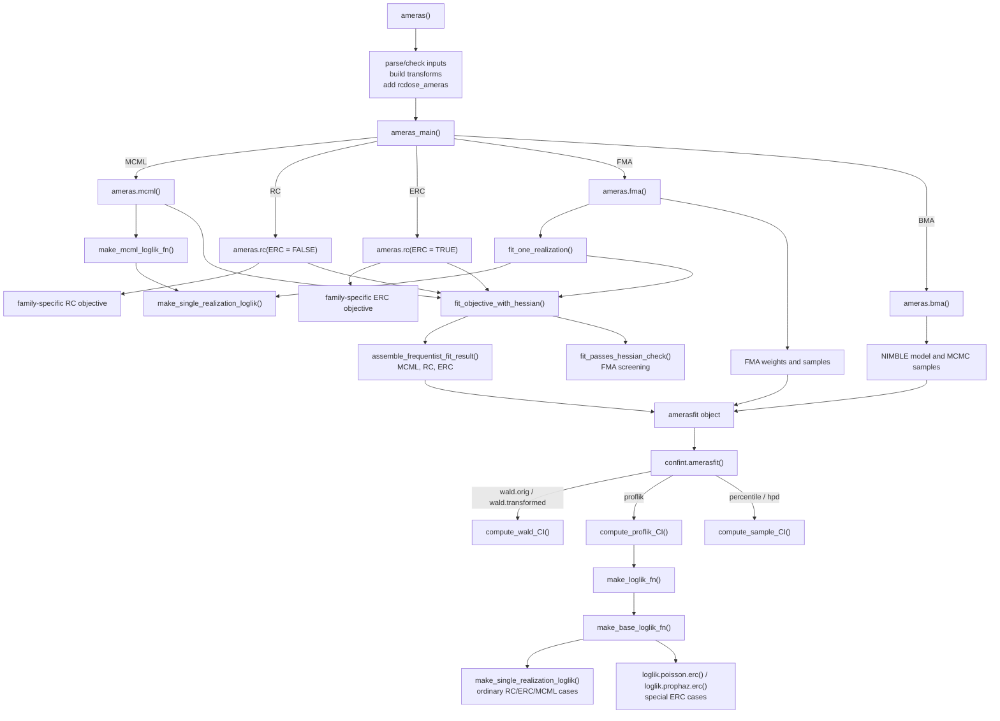

# Internal Helper Flow

This note describes how the main fitting and confidence interval helpers fit
together. It is intended for package maintainers; the functions named here are
internal implementation details, not user-facing API.

## Overview

## Fitting Path

`ameras()` handles the public interface. It parses the formula or legacy
arguments, validates inputs, constructs default transformations where needed,
adds `rcdose_ameras`, and stores enough model metadata for later methods such as
`confint()`, `residuals()`, and `plot()`.

`ameras_main()` dispatches to the method-specific fitting functions:

- `ameras.mcml()` fits MCML.
- `ameras.rc(ERC = FALSE)` fits regression calibration.
- `ameras.rc(ERC = TRUE)` fits extended regression calibration.
- `ameras.fma()` fits each dose realization and performs frequentist model
  averaging.
- `ameras.bma()` builds and samples the Bayesian model averaging model.

The main likelihood construction helper is `make_single_realization_loglik()`.
It builds a family-specific likelihood closure from raw fitting arguments. It is
used directly by FMA and indirectly by MCML and profile-likelihood
reconstruction.

`make_mcml_loglik_fn()` wraps `make_single_realization_loglik()` for MCML. The
family likelihoods return one negative log likelihood per dose realization, and
`mcml_average_neg_loglik()` combines those values with the stabilized
log-mean-exp calculation.

`fit_objective_with_hessian()` is the shared optimizer wrapper. It normalizes
the scalar `optimize()` path and the general `optim()` path into one fit object
shape, then attaches a numeric Hessian. MCML, RC/ERC, and FMA all use this
optimizer helper.

`assemble_frequentist_fit_result()` packages MCML and RC/ERC results. It applies
any transform, propagates variance through `transform.jacobian`, names
coefficients and covariance matrices, stores optimizer details, and preserves
method-specific fields such as `ERC`.

FMA uses `fit_passes_hessian_check()` after optimization to decide whether a
realization is admissible before computing model-averaging weights. This check
is stricter than `hessian_supports_vcov()` because FMA screening also requires
optimizer convergence.

## Profile Likelihood Path

`confint.amerasfit()` dispatches interval calculations by type. For
profile-likelihood intervals, `compute_proflik_CI()` reconstructs the objective
function from the stored `amerasfit` object and the resolved data.

That reconstruction goes through two adapter helpers:

- `make_loglik_fn()` adds method-specific behavior. MCML averages over all dose
  realizations; RC and ERC evaluate at `rcdose_ameras`.
- `make_base_loglik_fn()` reconstructs a likelihood closure from the stored
  model metadata. Ordinary cases delegate to `make_single_realization_loglik()`.
  Poisson ERC and proportional hazards ERC stay explicit because they use
  precomputed centered dose-realization residuals.

The reconstructed likelihood is then passed into `proflik()` through
`compute_proflik_ci_one()`.

## Special Cases

Poisson ERC and proportional hazards ERC are intentionally special in
`make_base_loglik_fn()`. They call `loglik.poisson.erc()` and
`loglik.prophaz.erc()` with precomputed `Xc` and `Kmat_diag` values. This avoids
recomputing realization-level residual variance terms during profile likelihood
evaluation.

Conditional logistic likelihoods need risk-set structures. Fitted-object
reconstruction builds those from the supplied `data`, not from
`object$model$data`, so profile likelihoods also work for objects fit with
`keep.data = FALSE` when the user supplies data to `confint()`.

Transform and likelihood arguments supplied through `...` are stored on the
fit object as `other.args`. Fitted-object likelihood reconstruction forwards
`other.args` so profile-likelihood calculations use the same transform behavior
as the original fit.

## Extension Checklist

When adding or changing a family or method:

- Add or update the low-level family likelihood first.
- Teach `make_single_realization_loglik()` how to build the ordinary
  single-realization closure.
- If MCML should support the family, confirm that `make_mcml_loglik_fn()` can
  use the same closure over all dose realizations.
- If profile likelihood intervals should support the method, confirm
  `make_base_loglik_fn()` can reconstruct the objective from a fitted object.
- If the method uses `optim()` or `optimize()`, route it through
  `fit_objective_with_hessian()`.
- If the method returns MCML-like or RC-like output, package it through
  `assemble_frequentist_fit_result()`.
- Add focused tests for parameter names, optimizer output shape, transform
  argument forwarding, and profile-likelihood reconstruction.
