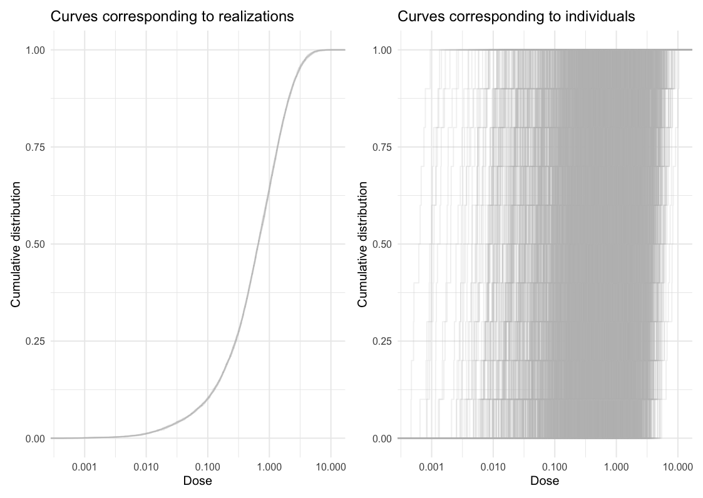
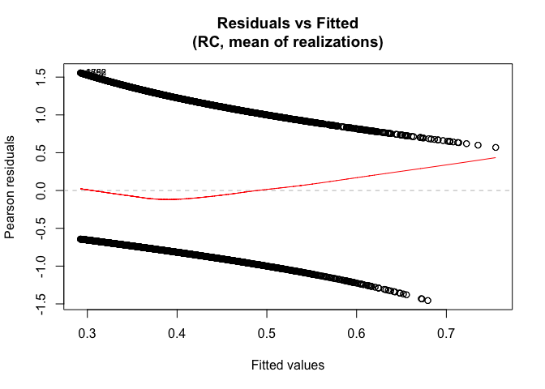
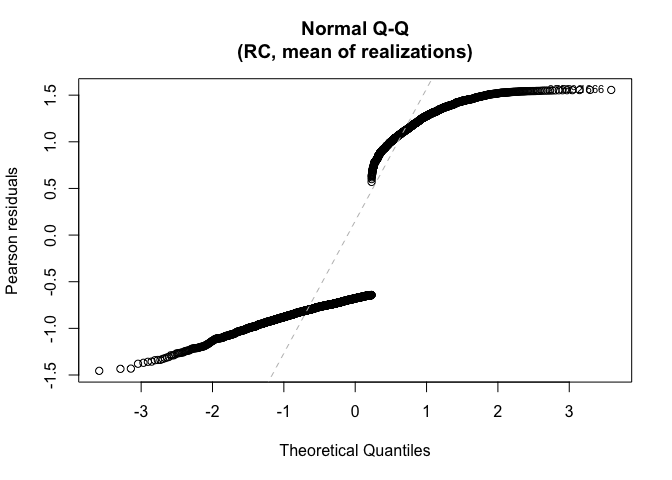

# ameras

The goal of ameras is to provide a user-friendly interface to analyze
association studies with multiple realizations of a noisy exposure using
a variety of methods. ameras supports continuous, count, binary,
multinomial, and right-censored time-to-event outcomes. For binary
outcomes, the nested case-control design is also accommodated. Besides
the common exponential relative risk model RR=\exp(\beta D) for the
exposure-outcome association with noisy exposure D, linear excess
relative risk RR=1+\beta D and linear-exponential excess relative risk
models RR=1+\beta_1 D \exp(\beta_2 D) can be used.

## Installation

To install from CRAN:

``` r

install.packages("ameras")
```

To install the development version from GitHub:

``` r

# install.packages("pak") # If pak is not already installed
pak::pak("sanderroberti/ameras")
```

## Example

This is a basic example which shows you how to fit a simple logistic
regression model. First, we visualize the dose uncertainty. In the left
panel of the plot below, the empirical cumulative distribution function
(ECDF) is plotted for each dose realization. In other words, each curve
shows one distribution of dose across individuals. The spread within
individual curves reflects the dose range across individuals, while the
spread between curves reflects between-realization variation on the
cohort level.

In the right panel, ECDFs are plotted for each individual, showing
distributions within individuals. A wide spread within individual curves
is indicative of large within-individual variation, while the spread
between curves reflects between-individual variation.

``` r

library(ameras)
#> Loading required package: nimble
#> nimble version 1.4.2 is loaded.
#> For more information on NIMBLE and a User Manual,
#> please visit https://R-nimble.org.
#> 
#> Attaching package: 'nimble'
#> The following object is masked from 'package:stats':
#> 
#>     simulate
#> The following object is masked from 'package:base':
#> 
#>     declare
data(data, package="ameras")
ecdfplot(data, paste0("V", 1:10), show.mean = FALSE)
```



Next, we apply all available methods to the data:

``` r

set.seed(12345) # For reproducibility
fit <- ameras(Y.binomial~dose(V1:V10), data, family="binomial", 
              methods=c("RC","ERC","MCML", "FMA", "BMA"))
#> Note: BMA may require extensive computation time
#> Fitting RC
#> Fitting ERC
#> Fitting MCML
#> Fitting FMA
#> Fitting BMA
#> Defining model
#> Building model
#> Setting data and initial values
#> Running calculate on model
#>   [Note] Any error reports that follow may simply reflect missing values in model variables.
#> Checking model sizes and dimensions
#>   [Note] This model is not fully initialized. This is not an error.
#>          To see which variables are not initialized, use model$initializeInfo().
#>          For more information on model initialization, see help(modelInitialization).
#> Compiling
#>   [Note] This may take a minute.
#>   [Note] Use 'showCompilerOutput = TRUE' to see C++ compilation details.
#> Compiling
#>   [Note] This may take a minute.
#>   [Note] Use 'showCompilerOutput = TRUE' to see C++ compilation details.
#> running chain 1...
#> |-------------|-------------|-------------|-------------|
#> |-------------------------------------------------------|
#> running chain 2...
#> |-------------|-------------|-------------|-------------|
#> |-------------------------------------------------------|
summary(fit)
#> Call:
#> ameras(formula = Y.binomial ~ dose(V1:V10), data = data, family = "binomial", 
#>     methods = c("RC", "ERC", "MCML", "FMA", "BMA"))
#> 
#> Total CPU runtime: 50.3 seconds
#> 
#> CPU runtime in seconds by method:
#> 
#>  Method    Fit  CI  Total
#>      RC  0.022 0.0  0.022
#>     ERC  6.926 0.0  6.926
#>    MCML  0.104 0.0  0.104
#>     FMA  0.176 0.0  0.176
#>     BMA 43.026 0.0 43.026
#> 
#> Summary of coefficients by method:
#> 
#>  Method        Term Estimate      SE Rhat   n.eff
#>      RC (Intercept)  -0.8847 0.07378   NA      NA
#>      RC        dose   0.8020 0.13751   NA      NA
#>     ERC (Intercept)  -0.8849 0.07477   NA      NA
#>     ERC        dose   0.8214 0.14304   NA      NA
#>    MCML (Intercept)  -0.8758 0.07323   NA      NA
#>    MCML        dose   0.7910 0.13644   NA      NA
#>     FMA (Intercept)  -0.8760 0.07320   NA      NA
#>     FMA        dose   0.7917 0.13656   NA      NA
#>     BMA (Intercept)  -0.8736 0.07174 1.00 1024.00
#>     BMA        dose   0.7911 0.13323 1.00  999.00
#> 
#> Note: confidence intervals not yet computed. Use confint() to add them.
```

Finally, we add confidence intervals to the `fit` object:

``` r

fit <- confint(fit, type=c("wald.orig","percentile"))
#> RC confidence intervals:
#> 
#>               lower   upper
#> (Intercept) -1.0293 -0.7401
#> dose         0.5324  1.0715
#> 
#> ERC confidence intervals:
#> 
#>               lower   upper
#> (Intercept) -1.0314 -0.7384
#> dose         0.5411  1.1018
#> 
#> MCML confidence intervals:
#> 
#>               lower   upper
#> (Intercept) -1.0193 -0.7323
#> dose         0.5236  1.0584
#> 
#> FMA confidence intervals:
#> 
#>               lower   upper
#> (Intercept) -1.0199 -0.7327
#> dose         0.5241  1.0594
#> 
#> BMA confidence intervals:
#> 
#>              lower  upper
#> (Intercept) -1.019 -0.735
#> dose         0.552  1.080
summary(fit)
#> Call:
#> ameras(formula = Y.binomial ~ dose(V1:V10), data = data, family = "binomial", 
#>     methods = c("RC", "ERC", "MCML", "FMA", "BMA"))
#> 
#> Total CPU runtime: 50.3 seconds
#> 
#> CPU runtime in seconds by method:
#> 
#>  Method    Fit    CI  Total
#>      RC  0.022 0.001  0.023
#>     ERC  6.926 0.000  6.926
#>    MCML  0.104 0.000  0.104
#>     FMA  0.176 0.010  0.186
#>     BMA 43.026 0.001 43.027
#> 
#> Summary of coefficients by method:
#> 
#>  Method        Term Estimate      SE CI.lower CI.upper Rhat   n.eff
#>      RC (Intercept)  -0.8847 0.07378  -1.0293  -0.7401   NA      NA
#>      RC        dose   0.8020 0.13751   0.5324   1.0715   NA      NA
#>     ERC (Intercept)  -0.8849 0.07477  -1.0314  -0.7384   NA      NA
#>     ERC        dose   0.8214 0.14304   0.5411   1.1018   NA      NA
#>    MCML (Intercept)  -0.8758 0.07323  -1.0193  -0.7323   NA      NA
#>    MCML        dose   0.7910 0.13644   0.5236   1.0584   NA      NA
#>     FMA (Intercept)  -0.8760 0.07320  -1.0199  -0.7327   NA      NA
#>     FMA        dose   0.7917 0.13656   0.5241   1.0594   NA      NA
#>     BMA (Intercept)  -0.8736 0.07174  -1.0185  -0.7350 1.00 1024.00
#>     BMA        dose   0.7911 0.13323   0.5520   1.0798 1.00  999.00
```

For visual model diagnostics using residuals, use
[`plot()`](https://rdrr.io/r/graphics/plot.default.html). For example,
for regression calibration:

``` r

plot(fit, methods="RC")
```



See the vignettes for additional details on model fitting, confidence
intervals, transformations, effect modification, standard analyses with
one dose realization, manual FMA, and parallel FMA.
